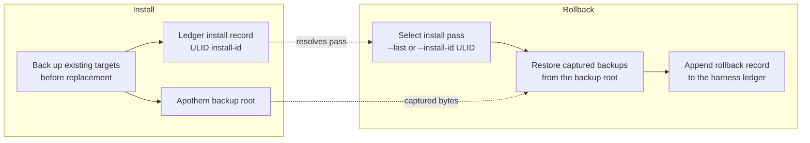

{/* SPDX-License-Identifier: MIT */}

## Fluxo de instalação

```mermaid
flowchart TD
    accTitle: Apothem install workflow
    accDescr: Top-down flowchart of the apothem install command from CLI invocation through adapter lookup, profile load, adapter install call, native config write, and final apothem verify check.
    A[apothem install --harness X] --> B[Resolve adapter through registry]
    B --> C[Load and validate profile YAML<br/>before writes]
    C --> D[Adapter.install(profile, project)]
    D --> E[Write native config and support cohorts]
    E --> F[apothem verify --harness X]
    F --> G{All checks pass?}
    G -- yes --> H[Done]
    G -- no --> I[Report failures]
```

## Fluxo de atualização

Em `apothem update --harness X`:

1. Carrega e valida `~/.config/apothem/profile.yaml` ou `--profile PATH`.
2. Resolve o harness selecionado ou `all` através do registro central.
3. Valida o plano completo de materialização antes da primeira escrita.
4. Chama `Adapter.update(profile, project=...)`.
5. Relata os resultados criados, atualizados, inalterados, ignorados, com aviso e com erro.

## Fluxo de desinstalação

Em `apothem uninstall --harness X`:

1. Chama `Adapter.uninstall()`.
2. O adaptador remove apenas os arquivos que escreveu; o perfil compartilhado YAML
   e os arquivos não relacionados escritos pelo operador permanecem intocados.

## Resolução de escopo

Cada adaptador escreve na sua própria raiz de instalação fixa: o diretório pessoal
do usuário para os adaptadores de escopo de usuário e o caminho local do projeto
para os adaptadores de escopo de projeto. A CLI não expõe uma flag `--scope`; os
adaptadores de escopo de projeto exigem `--project <path>`. Cada destino é
documentado em `site/content/docs/harnesses/<harness>.mdx`.

## Tratamento de erros

As operações de instalação/atualização validam antes de escrever, fazem backup dos
destinos correspondentes existentes antes da substituição, e mesclam apenas as
entradas-filhas gerenciadas pelo Apothem nos diretórios de descoberta
compartilhados. `--dry-run` executa a mesma validação e retorna resultados
ignorados ou inalterados sem criar diretórios ou arquivos.

## Reversibility (backup and rollback)

Every install pass is reversible. Replaced bytes are captured into the Apothem
backup root and the pass is recorded in the harness ledger under a ULID
install id; [`apothem rollback`](/docs/cli-reference/rollback) selects a
recorded pass and restores those captured backups.


