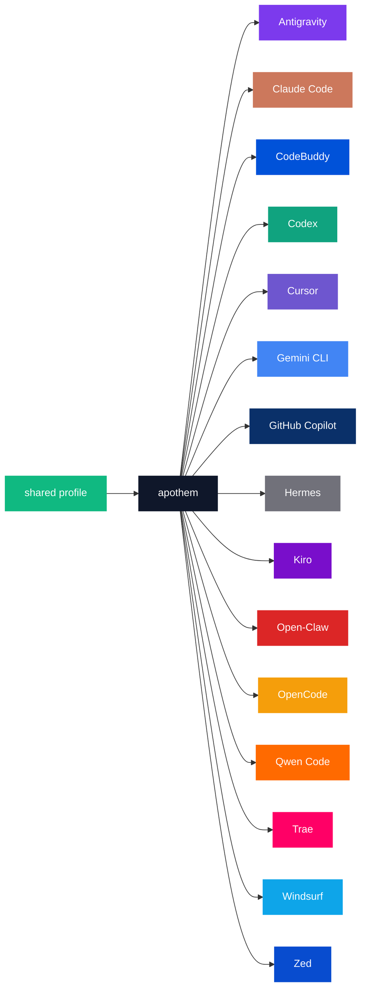

{/* SPDX-License-Identifier: MIT */}

As enumerações canônicas de nome-de-marca × código-de-cor abaixo estão envoltas em uma cerca `text` para preservar os identificadores literais por ferramenta exigidos pelo propósito de catálogo da paleta.

## Núcleo do Apothem

| Token | Claro | Escuro | Uso |
|---|---|---|---|
| `apothem-hub` | `#0F172A` | `#F1F5F9` | O nó central de distribuição ("apothem") em cada diagrama de arquitetura e o hub central do símbolo do Apothem. |
| `shared-profile` | `#10B981` | `#34D399` | O perfil fonte-de-verdade que alimenta o núcleo do apothem. |

## Paleta das ferramentas

Quinze das dezessete ferramentas são coloridas para combinar com sua
identidade de marca principal. As duas restantes — `glm` e `kimi-code` — ainda
não têm uma cor de marca definida; suas linhas são adicionadas assim que a cor
de marca a montante for definida, conforme a etapa de propagação em
[Atualizações](#updates).

```text
| Token             | Light     | Dark      | Source                                                                                                                                              |
|-------------------|-----------|-----------|-----------------------------------------------------------------------------------------------------------------------------------------------------|
| `antigravity`     | `#7C3AED` | `#9F67FF` | Google Antigravity deep-purple.                                                                                                                     |
| `claude-code`     | `#CC785C` | `#E89378` | Anthropic terracotta-orange.                                                                                                                        |
| `codebuddy`       | `#0052D9` | `#5E8EF7` | Tencent CodeBuddy blue.                                                                                                                             |
| `codex`           | `#10A37F` | `#19C796` | OpenAI signature teal.                                                                                                                              |
| `cursor`          | `#6E56CF` | `#9B85E3` | Cursor brand purple.                                                                                                                                |
| `gemini-cli`      | `#4285F4` | `#6BA4F7` | Google blue (primary); the Apothem mark renders the node with all four Google brand hues `#4285F4` / `#34A853` / `#FBBC04` / `#EA4335`.             |
| `github-copilot`  | `#0A3069` | `#5B8FE3` | GitHub Mona deep-blue.                                                                                                                              |
| `hermes`          | `#71717A` | `#A1A1AA` | Community silver-grey.                                                                                                                              |
| `kiro`            | `#790ECB` | `#A862DD` | Kiro violet.                                                                                                                                        |
| `open-claw`       | `#DC2626` | `#F87171` | Community red-orange.                                                                                                                               |
| `opencode`        | `#F59E0B` | `#FBBF24` | Community amber.                                                                                                                                    |
| `qwen-code`       | `#FF6A00` | `#FF8C40` | Alibaba Qwen orange.                                                                                                                                |
| `trae`            | `#FF0066` | `#FF599C` | ByteDance Trae magenta.                                                                                                                             |
| `windsurf`        | `#0EA5E9` | `#38BDF8` | Windsurf sky-blue.                                                                                                                                  |
| `zed`             | `#084CCF` | `#5E8BE0` | Zed Industries blue.                                                                                                                                |
```

## Justificativa dos nomes

- **`apothem-hub`** — o centro geométrico que o nome evoca (o apótema de um polígono regular aponta para dentro, em direção ao seu núcleo).
- **`shared-profile`** — a fonte a montante, distinta da cor de qualquer ferramenta isolada para que se leia como a seta de "entrada" em cada diagrama.
- **Tokens por ferramenta** espelham o slug da ferramenta usado em toda a base de código (`harnesses/<slug>/`, a chave do ponto de entrada, o argumento `--harness <slug>` da CLI). Uma palavra por conceito; a mesma string em todos os lugares.

## Uso do Mermaid



## Acessibilidade

Cada token de modo claro atende ao contraste WCAG 2.2 AA contra texto branco (≥4,5 : 1) onde o contraste permite sem distorcer a cor de marca. Quando a cor de marca nativa de uma ferramenta fica abaixo do limiar AA contra texto branco por si só (notadamente a família âmbar / laranja e a família azul-celeste / verde-azulado de tokens enumerada acima), os diagramas que precisam de contraste WCAG AA de texto-sobre-cor usam a **variante de modo escuro** (o tom realçado) como preenchimento do diagrama para que o texto branco se leia com clareza. A coluna de modo escuro é calibrada para essa finalidade: cada token de modo escuro supera o AA contra texto branco.

## Atualizações

A paleta é atualizada somente quando uma ferramenta ratifica uma mudança de marca a montante. As mudanças de marca por ferramenta se propagam atomicamente por `site/app/global.css`, esta página e cada máster SVG afetado em `assets/src/`.
