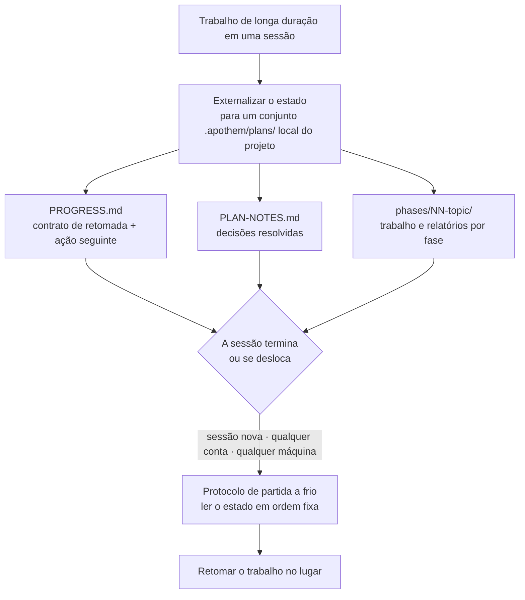

{/* SPDX-License-Identifier: MIT */}

A maior parte do trabalho de programação assistida vive e morre dentro de uma
única conversa. Você fecha o chat, troca de máquina ou faz login em outra conta,
e o fio do que estava fazendo se perde — a próxima sessão começa do zero, sem
memória das decisões que você já tomou.

O Apothem inverte isso. Para o trabalho de longa duração e em várias etapas, ele
externaliza seu **estado de trabalho completo** para um conjunto `.apothem/plans/`
local do projeto (com `.plans/` mantido como um fallback de retrocompatibilidade
suportado): arquivos que ficam no seu repositório, não dentro do histórico de
nenhum chat na nuvem. O estado é o artefato durável; a sessão é descartável.

## A ideia central

Um conjunto de planos em `<project-root>/.apothem/plans/{suite}/` carrega duas coisas que
tornam uma sessão substituível:

- **Um contrato de retomada.** O `PROGRESS.md` registra a fase e o estado das
  tarefas atuais, a ação seguinte precisa, as convenções vigentes, as decisões já
  resolvidas e os arquivos exatos que a próxima sessão deve ler.
- **Um protocolo de partida a frio.** Uma sessão nova lê esses arquivos em uma
  ordem fixa e reconstrói o panorama completo antes de fazer qualquer trabalho —
  sem precisar de histórico de conversa.

Como esse estado está nos arquivos do seu projeto, uma sessão nova em **qualquer
conta ou máquina** apontada para o mesmo projeto retoma o trabalho no lugar. Nada
fica trancado dentro de uma única transcrição de chat. Essa é a propriedade que
faz o trabalho estruturado, em larga escala e de vários dias — grandes corpora,
migrações longas, grandes passagens de revisão — sobreviver a limites que de
outro modo o encerrariam.

## O que é, com precisão

Dito com exatidão para que a garantia fique clara:

- **É** estado externalizado para arquivos mais um protocolo de retomada a frio.
  O trabalho é retomado porque o estado vive nos arquivos do seu projeto,
  independente de qualquer sessão, conta ou máquina.
- **Não é** um serviço automático de sincronização entre contas. O Apothem não
  empurra por conta própria o estado dos seus planos entre contas — os arquivos
  viajam do jeito que os arquivos do seu projeto já viajam (controle de versão,
  um checkout compartilhado, um diretório sincronizado). O que o Apothem garante
  é que, onde quer que os arquivos do projeto cheguem, uma sessão nova pode
  retomar a partir deles.

## Por que isso importa

Quanto mais longo e maior o trabalho, mais uma única conversa se torna um
fardo. Uma reforma de vários dias ou uma varredura por uma base de código grande
sobreviverá a qualquer sessão: as janelas de contexto são compactadas, as sessões
expiram, as máquinas mudam. Ao tratar os próprios arquivos do projeto como a
fonte de verdade para o trabalho em andamento, o Apothem torna o trabalho
resistente aos três limites: sessão, conta e máquina.

## Onde o estado vive

| Artefato | Local | Contém |
|----------|----------|-------|
| Conjunto de planos | `<project-root>/.apothem/plans/{suite}/` | Uma unidade autônoma de trabalho em andamento |
| Contrato de retomada | `<suite>/PROGRESS.md` | Estado de fase/tarefa, ação seguinte, convenções, manifesto de arquivos críticos |
| Registro de decisões | `<suite>/PLAN-NOTES.md` | Decisões resolvidas, nunca perguntadas de novo |
| Trabalho por fase | `<suite>/phases/NN-topic/` | As tarefas da fase e seu relatório |

A árvore de planos é ignorada pelo controle de versão por meio do trecho canônico
de `.gitignore` do Apothem, de modo que o estado dos planos permanece local por
padrão. Para levar o trabalho em andamento entre máquinas ou contas de forma
deliberada, mova o conjunto `.apothem/plans/` (com `.plans/` mantido como
fallback) do mesmo jeito que move qualquer outro arquivo do projeto.

## Relacionado

- **[Níveis de seriedade](/docs/concepts/seriousness-tiers)** — como a governança
  e a disciplina de externalização de estado escalam conforme o engajamento.
- **[A canalização de comandos](/docs/pipeline)** — as etapas de `/plan` que criam
  e fazem avançar um conjunto de planos.

## Recommended Next Step

**Leia [Níveis de seriedade](/docs/concepts/seriousness-tiers)** para ver como a
disciplina de externalização escala de um experimento rápido até um esforço de
vários dias que cruza limites.
