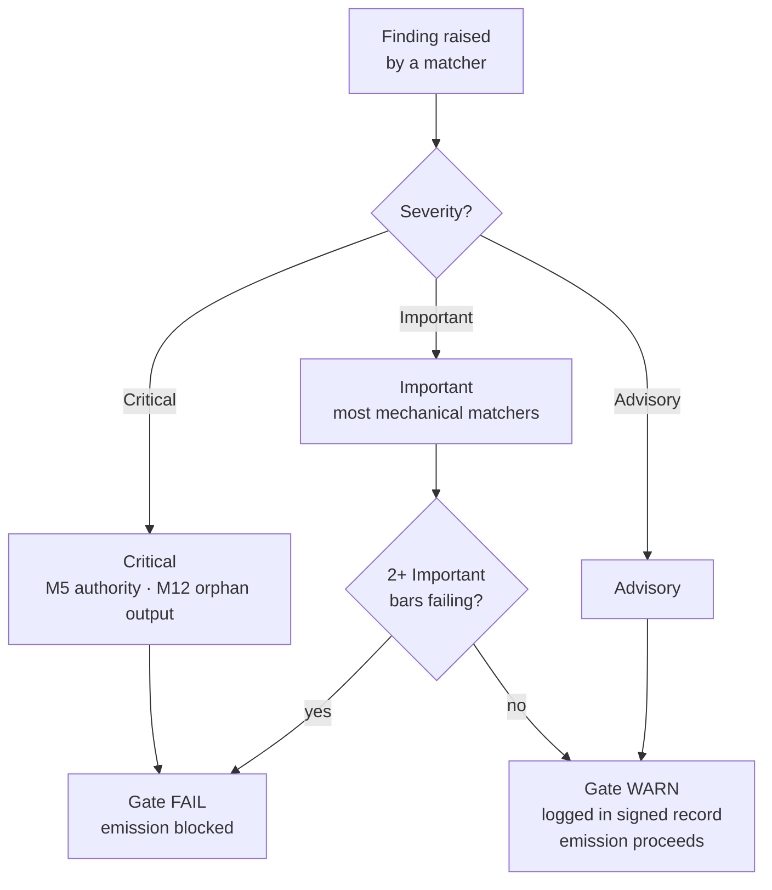

{/* SPDX-License-Identifier: MIT */}

## Os quinze pontos

| Ponto | ID | Mandato | Classe de verificação | Falha → ação |
|---|---|---|---|---|
| 1 | M1 | Agnosticismo quanto ao projeto anfitrião | Raciocinada | Revisar para corresponder às convenções do anfitrião |
| 2 | M2 | Disciplina editorial (registro de divulgação) | Mecânica | Adicionar marcadores de divulgação |
| 3 | M3 | Dez dimensões de qualidade | Raciocinada | Revisar nas dimensões que falham |
| 4 | M4 | Autoaplicação (bloco de registro assinado presente) | Mecânica | Registrar o bloco de registro assinado |
| 5 | M5 | Princípio de autoridade (sem identidade / endpoint / segredo fabricados) | Mecânica | Encaminhar à consulta |
| 6 | M6 | Incorporação de expertise (lacunas trazidas à tona) | Raciocinada | Trazer as lacunas à tona; citar refinamentos |
| 7 | M7 | Anotação de opções (marcador de recomendação + justificativa) | Mecânica | Anotar os conjuntos de opções |
| 8 | M8 | Definitividade (sem hesitação na prosa prescritiva) | Mecânica | Promover as hesitações a condicionais |
| 9 | M9 | Alavancagem visual (temas estruturais carregam diagramas) | Raciocinada | Criar / atualizar o diagrama |
| 10 | M10 | Vinculação bidirecional (ponteiros recíprocos fechados) | Mecânica | Fechar as meias-arestas |
| 11 | M11 | Sprints ágeis (Objetivo / Backlog / DoR / DoD / Revisão / Retrospectiva) | Raciocinada | Reestruturar como sprints |
| 12 | M12 | Relatórios de fase e disposição canônica | Mecânica | Criar o resumo; realocar para a disposição canônica |
| 13 | M13 | Ofício de código (linter / formatador / verificador de tipos; número mágico; bare-except) | Mecânica | Revisar conforme as regras de ofício de código por linguagem |
| 14 | M14 | Sistemicidade (declara ascendentes / descendentes / pares / aplicadores) | Raciocinada | Declarar; indexar nos registros |
| 15 | M15 | Pronto para produção (testes + documentação + CHANGELOG + commit conforme + CI em verde + estabilidade semver) | Mecânica | Adicionar as superfícies ausentes |

## Escada de severidade

| Severidade | Efeito sobre o portão |
|---|---|
| **Crítica** | Portão FAIL — emissão bloqueada incondicionalmente |
| **Importante** | Portão FAIL quando 2+ pontos Importantes falham simultaneamente |
| **Consultiva** | Portão WARN — registrado no bloco assinado; não bloqueia a emissão |

A maioria dos comparadores da fração mecânica tem como padrão **Importante**. M5 (autoridade — segredos, endpoints fabricados) e M12 (saídas órfãs) são **Críticos**.



## Comparadores da fração mecânica

A fração mecânica vive em [`src/apothem/conformity/*_grep.py`](https://github.com/ahmed-g-gad/apothem/tree/main/src/apothem/conformity), orquestrada por [`src/apothem/conformity/gate.py`](https://github.com/ahmed-g-gad/apothem/blob/main/src/apothem/conformity/gate.py).

| Comparador | Ponto | Função |
|---|---|---|
| `hedging_grep.py` | M8 | Detecta vocabulário hesitante na prosa prescritiva |
| `option_annotation_grep.py` | M7 | Verifica o marcador `**Recommended**` + a justificativa nos conjuntos de opções |
| `user_confirm_grep.py` | M5 | Bloqueia os marcadores de posição `<USER-CONFIRM:…>` da emissão |
| `binding_reciprocity_grep.py` | M10 | Detecta meias-arestas em `## Bindings (§0.j five-direction)` |
| `orphan_output_grep.py` | M12 | Sinaliza artefatos sem consumidor / sem entrada de índice / sem atribuição de produtor |
| `bare_except_grep.py` | M13 | Detecta `except:` / `except Exception:` sem comentário justificativo |
| `magic_number_grep.py` | M13 | Detecta literais numéricos na lógica de negócio |
| `commented_out_code_grep.py` | M13 | Detecta blocos de código comentados |
| `file_header_grep.py` | M13 | Verifica a presença do cabeçalho de licença SPDX de uma única linha |
| `frontmatter_grep.py` | M14 | Verifica os campos de frontmatter obrigatórios nos quatro diretórios de diretivas canônicos listados abaixo |
| `semver_stability_grep.py` | M15 | Detecta mudanças disruptivas na API pública sem um incremento de versão MAJOR |
| `production_ready_pr_grep.py` | M15 | Verifica a disciplina do mesmo conjunto de mudanças (testes + documentação + CHANGELOG) |
| `secret_leak_grep.py` | M15 | Detecta segredos / credenciais codificados de forma fixa |
| `unpinned_action_grep.py` | M15 | Verifica que as GitHub Actions estão fixadas a um commit SHA |
| `always_on_budget_grep.py` | teto de orçamento | Limita o corpo das regras sempre ativas a 500 tokens substantivos |

## Executar o portão

Em um harness instalado, o portão é executado automaticamente: o
`settings.json` do Claude Code o conecta como um hook `PreToolUse` que
invoca a cópia materializada em `~/.claude/.apothem/support/conformity/gate.py`
antes de cada Write/Edit. A partir de um checkout de fonte, a forma de
módulo executa o mesmo código:

```shell
# Despacho de arquivo único (imita o hook PreToolUse):
echo '{"tool_input": {"file_path": "path/to/file", "content": "..."}}' \
    | python -m apothem.conformity.gate --hook

# Varredura composta pelo repositório:
python -m apothem.conformity.gate --sweep src/ site/content/docs/ rules/
```

Veja [Executar o portão de conformidade](/docs/usage/conformity-gate) para o procedimento completo.

## Referência

- [Registro do portão de pré-emissão](/docs/governance/pre-emission-gate-registry) — definições canônicas dos pontos
- [Registro de conformidade externa](/docs/governance/outward-conformity-registry) — semântica detalhada de M1-M15
- [Mandatos transversais](/docs/governance/cross-cutting-mandates) — fonte de verdade dos mandatos
- [Disciplina de desempenho](https://github.com/ahmed-g-gad/apothem/blob/main/src/apothem/rules/performance-discipline.md) — orçamentos de tempo de execução por classe
