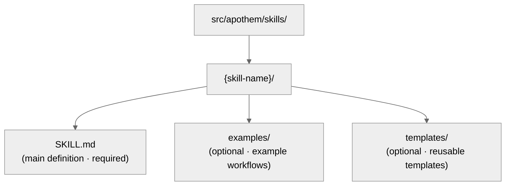

{/* SPDX-License-Identifier: MIT */}

Este guia ajuda os desenvolvedores a manter e estender o ecossistema do Apothem com
padrões de qualidade SOTA.

## Referência rápida: tipos de artefato

O ecossistema do Apothem contém cinco tipos de artefato, cada um com propósitos
específicos e requisitos de frontmatter.

| Artefato | Caminho | Propósito | Quando criar |
| -------- | ---- | ------- | -------------- |
| **Regra** | `src/apothem/rules/*.md` | Mandato comportamental ou diretiva operacional | Novo princípio, política ou mandato de governança estabelecido |
| **Comando** | `src/apothem/commands/*.md` | Comando de barra (`/command-name`) para fluxos de trabalho complexos | Novo fluxo de trabalho de usuário em múltiplos passos |
| **Auxiliar** | diretório de auxiliares (`*.md` por arquivo) | Definição persistente de trabalhador delegado para tarefas paralelas | Nova tarefa especializada recorrente (auditoria, exploração, verificação de qualidade) |
| **Skill** | `src/apothem/skills/{name}/SKILL.md` | Técnica reutilizável com sinal de detecção | Novo padrão de técnica reutilizável e detectável |
| **Hook** | `src/apothem/hooks/` + `settings.json` | Validação acionada por evento ou gerenciamento de estado | Novo evento de ciclo de vida ou necessidade de validação |

## Contrato do adaptador de ferramenta

Os fatos de identidade e capacidade da ferramenta residem em
`src/apothem/lib/harness_registry.py`. Uma mudança de ferramenta só está completa quando
estas superfícies concordam:

| Superfície | Atualização necessária |
| --- | --- |
| Linha do registro | ID público, chave do pacote, ponto de entrada, escopo, formato de saída, caminhos-alvo, caminhos de docs, arquivo de capacidade, pin de padrão, testes de fixture, chave de package-data, fontes de template e status de capacidade. |
| Pacote do adaptador | `__init__.py`, `install.py`, `update.py`, `uninstall.py`, `verify.py`; adicione `materializer.py` apenas quando a ferramenta renderiza um arquivo de configuração nativo. |
| Manifesto de propagação | Caminhos de template e de conjuntos para adaptadores apoiados em manifesto. |
| Capacidades | `src/apothem/harnesses/<package>/capabilities.yml` com cada capacidade obrigatória e a justificativa para estados não suportados ou pendentes de descoberta. |
| Pin de convenção | `STANDARD-CONVENTION-PIN.md` com URL do fornecedor, data do snapshot, nome de arquivo/esquema canônico, referência de evidência e justificativa de capacidade não suportada. |
| Testes | Paridade de registro, teste de fixture do adaptador, linha de install-plan golden, comportamento dry-run/sem gravação, idempotência e cobertura de package-data. |
| Docs | Página de referência da ferramenta, página de comparação, notas de capacidade/MCP e exemplos que usam placeholders fictícios. |

Adaptadores de escopo de projeto devem definir `requires_project = True`, aceitar
`project: Path | None` nos métodos de ciclo de vida e rejeitar raízes de projeto
ausentes ou inseguras antes das gravações. Adaptadores de escopo de usuário devem manter os caminhos sob
a raiz de configuração de usuário documentada da ferramenta.

## Política de fixture golden

`tests/fixtures/harness-golden-plans.json` registra a forma pública do install-plan
para todas as dezessete ferramentas do registro: ID público, modo de materialização, caminho do
conjunto/template de origem e caminho-alvo normalizado sob `<ROOT>`. Quando o comportamento de
alvo do registro, do manifesto ou do template muda intencionalmente, atualize o fixture
golden no mesmo commit da mudança de origem para que o diff mostre o delta de comportamento.

## Validação antes da gravação

O driver de instalação compartilhado valida cada origem e alvo antes da primeira
gravação. Ele rejeita origens de manifesto ausentes, travessia de alvo, caminhos-alvo
fora da raiz selecionada e cruzamentos de symlink. Dry-runs executam a mesma
validação e retornam resultados estruturados `skipped` ou `unchanged` sem
criar arquivos.

## Redação e dados de exemplo

Os diagnósticos de perfil redigem campos com formato de token, segredo, senha, credencial, chave de API,
chave privada, autorização, auth e cabeçalho. A documentação, fixtures, exemplos e
trechos JSON usam `example.invalid`, `Example User`,
`example-user` e placeholders óbvios em vez de segredos ou
contas pessoais que pareçam reais.

## Antes de escrever: o esquema canônico

**Todos os artefatos devem seguir o esquema em `site/content/docs/reference/artifact-schema.mdx`.** Isso é
inegociável.

- Leia `site/content/docs/reference/artifact-schema.mdx` § "Schema" para o seu tipo de artefato
- Copie os campos obrigatórios
- Preencha os valores obrigatórios
- Adicione campos opcionais conforme necessário

## Verificação rápida do frontmatter

Todo frontmatter de artefato deve passar nestas verificações:

```yaml
✓ Sintaxe YAML válida (use ferramentas: `yamllint` ou `ConvertFrom-Yaml` do PowerShell onde disponível)
✓ Todos os campos obrigatórios presentes (conforme o esquema do tipo de artefato)
✓ name: usa kebab-case
✓ version: semântica MAJOR.MINOR.PATCH
✓ updated: data ISO 8601 (YYYY-MM-DD)
✓ description: linha única, não vazia
✓ scope: enum válido (always-on|path-filtered|other)
✓ portability: enum válido (`universal` | `universal-with-windows-caveats` | `unix-only` | `windows-only`)
✓ Sem erros de digitação nos nomes dos campos — devem corresponder exatamente ao esquema canônico
✓ Campos opcionais usam valores de enum corretos
```

## Convenções de nomenclatura

### Nomes de artefato (kebab-case)

- **Regras:** `operational-mandates`, `clean-room-generation`, `context-management`
- **Comandos:** `plan-execute`, `plan-spec`, `plan-generate`
- **Auxiliares:** `codebase-explorer`, `convention-auditor`, `quality-gate`
- **Skills:** `plan-suite`, `ecosystem-audit`

Padrão: minúsculas, hífens entre palavras, sem espaços ou sublinhados.

### Nomenclatura de arquivos

- **Regras:** `{name}.md`
- **Comandos:** `{name}.md`
- **Auxiliares:** `{name}.md`
- **Skills:** Dentro da pasta `src/apothem/skills/{name}/SKILL.md` (capitalização exata: `SKILL.md`)
- **Hooks:** Dentro da pasta `src/apothem/hooks/`. Todos os manipuladores de evento são Python. Todo
  comando de hook do `settings.json` usa a forma exec (`python` mais `args`) para invocar
  `-m apothem.hooks.dispatch <event> [<message-name>]` ou
  `-m apothem.conformity.gate --hook`. `dispatch.py` roteia `SessionStart` para
  `session_start_bootstrap.main()` e
  todo outro evento da lista permitida para `emit_hook_context.main()`. Os únicos stubs de shell
  permitidos sob `src/apothem/hooks/` ou `scripts/` são os quatro arquivos de localizador + bootstrap
  (`find-python.{ps1,sh}`, `bootstrap.{ps1,sh}`); qualquer outro arquivo `.ps1` /
  `.sh` reprova na verificação de higiene de `scripts/dev/validate_hooks.py`.

### Referências cruzadas

Ao referenciar outros artefatos, use nomes exatos:

- Regras: `"operational-mandates"` (valor do campo name)
- Comandos: `/plan-execute` (com barra para docs humanas; sem barra no código)
- Auxiliares: `codebase-explorer` (valor do campo name)
- Skills: `plan-suite` (valor do campo name)

Nunca use caminhos de arquivo ou nomes truncados na prosa.

## Portabilidade: Windows vs. Unix

Todo artefato deve declarar explicitamente seu status de portabilidade.

### Universal (padrão)

- Funciona de forma idêntica no Windows, macOS e Linux
- Sem suposições de shell
- Caminhos usam barras normais (`/`)
- Sem caminhos absolutos fixos
- Sem sintaxe PowerShell específica do Windows

```yaml
portability: "universal"
```

### Universal com ressalvas no Windows

- Universal em hosts POSIX; a ressalva nomeada se aplica à variante de plataforma Windows declarada no conteúdo
- Documente a ressalva explicitamente no conteúdo
- Exemplo: "Symlinks não suportados no Windows antes do Win 10"

```yaml
portability: "universal-with-windows-caveats"
```

Documente a ressalva em uma nota imediatamente após o título.

### Apenas Unix / Apenas Windows

- Explicitamente restrito a uma plataforma
- Raro no Apothem — a maioria deve ser universal
- Use apenas se recursos específicos de plataforma forem essenciais

```yaml
portability: "unix-only"
```

Documente o motivo na primeira seção da regra.

## Escopo: Always-On vs. Path-Filtered

### Always-On

A regra se aplica em todos os lugares.

```yaml
scope: "always-on"
```

### Path-Filtered

A regra se aplica condicionalmente com base no caminho do arquivo.

```yaml
scope: "path-filtered"
pathFilter: "**/*.py, **/*.toml"
```

O `pathFilter` usa padrões glob (mesmo formato do `.gitignore`). Quando um arquivo
corresponde ao filtro, a regra é ativada.

## Semântica de versão

Todo artefato carrega sua própria versão semântica (`MAJOR.MINOR.PATCH`):

- **PATCH** — correções de digitação, formatação, atualização de link, edições somente em comentários. Comportamento inalterado.
- **MINOR** — mudanças aditivas não disruptivas: novas seções opcionais, anti-padrões adicionais, novos campos de frontmatter opcionais, novos exemplos. Consumidores existentes continuam a funcionar sem alteração.
- **MAJOR** — mudanças disruptivas de esquema ou contrato: seções removidas, campos renomeados, comportamento alterado de uma diretiva existente, mudanças que exigem adaptação de artefatos downstream.

Exemplos:

- `vX.Y.Z` → `vX.Y.(Z+1)` (PATCH: correção de digitação)
- `vX.Y.Z` → `vX.(Y+1).0` (MINOR: adicionada nova entrada de Anti-Padrões)
- `vX.Y.Z` → `v(X+1).0.0` (MAJOR: contrato declarado estável)
- `vX.Y.Z` → `v(X+1).0.0` (MAJOR: removido campo obrigatório de frontmatter)

Incremente `version` e `updated` juntos a cada edição que muda o comportamento. Anexe uma
linha correspondente ao `CHANGELOG.md` de nível de ecossistema para lançamentos que agrupam
mudanças de artefato.

## Quando editar um artefato

### Regras

- Trate a estrutura Obrigatório/Opcional como estrutural — reestruturá-la
  reverbera por todo artefato dependente (incremento MAJOR necessário).
- Refine Anti-Padrões, exemplos de Escalonamento de Seriedade e citações conforme
  o entendimento se aprofunda (incremento MINOR).
- Capture a justificativa de qualquer mudança estrutural no arquivo de tópico de memória
  relevante.

### Comandos

- A forma do argumento faz parte do contrato público — quebre-a apenas com intenção
  explícita e propague a mudança a todo chamador (incremento MAJOR).
- Mantenha os passos do fluxo de trabalho e os contratos de retorno enxutos e atualizados.
- Documente sequenciamentos de passos não óbvios inline.

### Auxiliares

- Mantenha `disallowedTools` mínimo-mas-adequado; documente a justificativa quando ela
  mudar.
- Refine Princípios Operacionais e Contratos de Retorno conforme o papel do auxiliar
  amadurece (incremento MINOR).
- Acompanhe mudanças de capacidade inline para que os chamadores possam recalibrar expectativas.

### Skills

- Mantenha os passos de Procedimento e os Exemplos sincronizados com a realidade.
- Os sinais de detecção devem refletir a fraseologia real do usuário no uso atual.
- Divida uma skill assim que ela ultrapassar ~150 linhas (consulte
  `auto-memory.md` § Topic File Management).

## Passo a passo: adicionando uma nova regra

### 1. Avalie a ortogonalidade

Esta regra se sobrepõe a regras existentes? Pesquise `src/apothem/rules/` por conteúdo relacionado.

Se a sobreposição for >50%, considere estender uma regra existente. Consulte
`persistent-conventions-vigilance.md` § Artifact Evolution.

### 2. Escreva o conteúdo

Siga a estrutura:

- Título: `# Rule: {Title}`
- Seção de Propósito
- Obrigações / Diretivas centrais (numeradas, vinculadas)
- Tabela de Escalonamento de Seriedade (sempre obrigatória)
- Seção de Anti-Padrões
- Seção de Aplicação

### 3. Crie o frontmatter

Use o esquema de `site/content/docs/reference/artifact-schema.mdx` § Schema: Rules. Defina:

- `name:` identificador kebab-case
- `version:` `"X.Y.Z"` (inicial)
- `updated:` data de hoje em ISO 8601
- `scope:` `always-on` ou `path-filtered`
- `portability:` `universal` (ou com ressalvas, se necessário)
- `implements:` Liste os mandatos CM/TM/CP que esta regra cobre

Exemplo:

```yaml
---
name: "my-new-rule"
description: "Brief one-liner"
pathFilter: ""
alwaysApply: true
---
```

### 4. Atualize o CLAUDE.md

Adicione a entrada à tabela do registro `§7.2 Rules`:

```markdown
| My New Rule | `src/apothem/rules/my-new-rule.md` | Always-on | CM-5/CM-21 |
```

Mantenha a ordem alfabética dentro da tabela.

### 5. Anexe ao CHANGELOG.md

Adicione uma linha sob a seção `### Added` do próximo lançamento descrevendo a nova regra.

### 6. Execute a validação

Invoque a skill `ecosystem-audit` para verificar a nova regra, focando na área de regras:

```text
Invoke the ecosystem-audit skill with --focus rules --fix
```

Verifique que nenhum erro foi reportado para a sua nova regra.

## Passo a passo: adicionando um novo comando

Comandos são comandos de barra como `/plan-spec`, `/plan-execute`, `/security-audit`, etc.

### 1. Determine o papel

Comandos **nunca** devem ser chamados pelo runtime do harness isoladamente. Eles são
fluxos de trabalho acionados pelo usuário. Pergunte:

- Este é um fluxo de trabalho que o usuário digita `/command-name`?
- Ele orquestra múltiplos passos?
- Ele pode atingir timeout ou exigir entrada do usuário no meio da execução?

Se "não" para qualquer uma destas, provavelmente é uma skill, não um comando.

### 2. Crie o arquivo

Caminho: `src/apothem/commands/{name}.md`

Frontmatter (de `site/content/docs/reference/artifact-schema.mdx` § Schema: Commands):

```yaml
---
name: "my-command"
version: "X.Y.Z"
updated: "2026-04-20"
description: "What this command does"
argument-hint: "[path/to/input] [--flag VALUE]"
disable-model-invocation: true
portability: "universal"
allowed-tools: "*"
---
```

Sempre defina `disable-model-invocation: true` para comandos.

### 3. Escreva o conteúdo

Estrutura:

- Título: `# /{name} — Human-Readable Title`
- Seção de Papel (quem executa isto)
- Instruções de alto nível
- Seção de Fluxo de trabalho com passos
- Contrato de retorno / formato de saída

### 4. Atualize o CLAUDE.md e o CHANGELOG.md

Linha de registro em `§7.1 Commands`; linha de CHANGELOG sob a seção `### Added` do próximo lançamento.

### 5. Valide

Invoque a skill `ecosystem-audit`, focando em comandos:

```text
Invoke the ecosystem-audit skill with --focus commands --fix
```

## Passo a passo: adicionando um novo auxiliar

Auxiliares são definições persistentes de trabalhador delegado para trabalho paralelo.

### 1. Identifique o padrão

Este auxiliar se encaixa em um dos padrões de equipe listados abaixo?

- Equipe de Pesquisa: somente leitura, coleta de informações
- Equipe de Auditoria: verificação, checagens de consistência
- Equipe de Implementação: mudanças de código paralelas
- Equipe de Qualidade: lint, teste, verificação de tipos, segurança
- Equipe de Documentação: atualizações de docs
- Outro: tarefa especializada

### 2. Crie o arquivo

Caminho:

```text
src/apothem/agents/{name}.md
```

Frontmatter:

```yaml
---
name: "my-helper"
version: "X.Y.Z"
updated: "2026-04-20"
description: "What this helper specializes in"
tools: "Read, Glob, Grep, Bash"
disallowedTools: "Write, Edit"
maxTurns: 15
effort: "high"
permissionMode: "default"
memory: false
portability: "universal"
---
```

### 3. Escreva o conteúdo

Seções:

- Princípios Operacionais (somente leitura, baseado em evidências, vereditos binários, exaustivo)
- Fluxo de trabalho (passos numerados)
- Contrato de Retorno (máx. de tokens, estrutura, campos obrigatórios)

### 4. Atualize o CLAUDE.md e o CHANGELOG.md

Linha de registro em `§7.3 Helpers`; linha de CHANGELOG sob a seção `### Added` do próximo lançamento.

### 5. Teste

Implante o auxiliar em um cenário real e verifique que ele funciona conforme documentado.

## Passo a passo: adicionando uma nova skill

Skills são técnicas reutilizáveis e detectáveis.

### 1. Identifique a reutilizabilidade

Antes de escrever uma skill:

- Você viu este problema/técnica 3+ vezes?
- É detectável? (Um padrão de solicitação do usuário a sinaliza?)
- Você consegue codificá-la de forma reprodutível?

Se as três respostas forem sim, escreva uma skill.

### 2. Crie a estrutura



### 3. Escreva o SKILL.md

Frontmatter:

```yaml
---
name: "skill-name"
version: "X.Y.Z"
updated: "2026-04-20"
description: "What this skill teaches"
archetype: "workflow-template"
userInvocable: true | false
disable-model-invocation: true | false
allowed-tools: "Read, Glob, Grep"
argument-hint: "[args]"               # optional; if userInvocable
effort: "max"                          # optional
---
```

Estrutura de conteúdo:

- Propósito
- Quando usar esta skill
- Pré-requisitos
- Procedimento passo a passo
- Erros comuns
- Exemplos

### 4. Atualize o CLAUDE.md e o CHANGELOG.md

Linha de registro em `§7.5 Skills`; linha de CHANGELOG sob a seção `### Added` do próximo lançamento.

### 5. Valide

Invoque a skill `ecosystem-audit`, focando em skills:

```text
Invoke the ecosystem-audit skill with --focus skills --fix
```

## Checklist de validação antes de commitar

- [ ] O frontmatter passa na verificação de sintaxe YAML
- [ ] Todos os campos obrigatórios presentes conforme o esquema
- [ ] O campo `name` usa kebab-case
- [ ] `version` é semântica (`MAJOR.MINOR.PATCH`) e foi incrementada se o comportamento mudou
- [ ] `updated` corresponde à data de hoje para qualquer artefato que você tocou
- [ ] Campo `portability` definido e válido
- [ ] O CHANGELOG.md carrega a mudança na categoria apropriada sob a seção do próximo lançamento
- [ ] Sem referências internas de plano (conformidade com CM-7)
- [ ] As referências cruzadas são consistentes com outros artefatos
- [ ] Novo artefato registrado no registro do CLAUDE.md
- [ ] Artefato testado (se aplicável)
- [ ] A skill `ecosystem-audit` roda sem erros
- [ ] O conteúdo segue as convenções estruturais (formato de título, seções, etc.)

## Referenciando outros artefatos

Use estas convenções exatas:

### Referenciar uma regra

```markdown
See `src/apothem/rules/operational-mandates.md` or shorthand: the Operational Mandates rule.
In prose: ... per CM-1–10 (Operational Mandates rule) ...
```

### Referenciar um comando

```markdown
See `/plan-execute` command. Or: Run `/plan-execute`.
In prose: The `/plan-execute` command handles phase execution.
```

### Referenciar um auxiliar

```markdown
Deploy the `codebase-explorer` delegated worker.
In prose: The codebase-explorer worker finds patterns.
```

### Referenciar uma skill

```markdown
Use the `plan-suite` skill.
In prose: The plan-suite skill provides the Master Plan Suite template.
```

### Referenciar seções do CLAUDE.md

```markdown
See CLAUDE.md § 7.2 (Rules registry).
Or: Section 4 (Seriousness-Scaled Governance).
```

## Lint e formatação

Todos os artefatos usam:

- **Markdown:** GFM (GitHub Flavored Markdown)
- **YAML:** compatível com YAML 1.2
- **Finais de linha:** LF (estilo Unix)
- **Codificação:** UTF-8
- **Largura de linha:** quebra suave em 100 caracteres para conteúdo (sem quebras rígidas)

Use o formatador / linter `Ruff` para arquivos Python. Para Markdown, use
`prettier` ou equivalente.

## Auditoria do ecossistema: executando a validação

Duas superfícies de validação complementares cobrem o ecossistema:

**Verificável por máquina (validadores Python)** — execute antes de cada commit:

```bash
python scripts/dev/validate_hooks.py       # Hook structure + Python-only hygiene
python scripts/dev/validate_ecosystem.py   # Full tree + frontmatter + delegated hook checks
python scripts/dev/chaos_pass.py           # Adversarial sweep across configured hooks
pytest tests                                    # Unit tests for the hook runtime
```

**Orientada pelo harness** — para auditorias de referência cruzada, narrativa e convenção:

```bash
/ecosystem-audit --focus all --fix
```

Isto roda em paralelo:

- **Auditoria de estrutura:** Precisão do registro, existência de arquivos, validade do frontmatter
- **Auditoria de artefatos:** Referências cruzadas, cobertura de mandatos, ordenação do pipeline
- **Auditoria de memória:** Alegações dos arquivos de memória vs. estado do sistema de arquivos

Saída esperada: `PASS` com zero achados em ambas as superfícies.

Se `FINDINGS` forem reportados:

- Revise a severidade de cada achado (Crítico / Importante / Consultivo)
- Trate itens Críticos imediatamente
- Planeje itens Importantes para o próximo ciclo
- Considere itens Consultivos para a próxima iteração

---

## Dúvidas?

Consulte:

- Esquema de frontmatter: `site/content/docs/reference/artifact-schema.mdx`
- Ciclo de vida de artefatos: `src/apothem/rules/persistent-conventions-vigilance.md` § Artifact Evolution
- Mandatos operacionais: `src/apothem/rules/operational-mandates.md` CM-1–10
- Referência da suíte de planos: `src/apothem/skills/plan-suite/master-template.md`
- Notas de lançamento: `CHANGELOG.md`
