{/* SPDX-License-Identifier: MIT */}

Это инструкции уровня репозитория для многоработниковых сред выполнения
ассистентов (платформы оркестрации, диспетчеры, автономные
платформы) при работе в этом репозитории. Они обязательны и
поставляются с каждым опубликованным чекаутом. Они согласованы с
[`AGENTS.md`](https://github.com/ahmed-g-gad/apothem/blob/main/AGENTS.md),
[`CLAUDE.md`](https://github.com/ahmed-g-gad/apothem/blob/main/CLAUDE.md)
и инструкциями уровня проекта для других поддерживаемых поверхностей
ассистентов; там, где поверхности пересекаются по общей
дисциплине (Дисциплина планов, Заголовки файлов, обработка неоднозначности,
именование, антипаттерны, модальная иерархия), они семантически эквивалентны, а
`AGENTS.md` является каноническим голосом проекта.

## Контекст проекта

Этот репозиторий — экосистема инструментов разработчика, в которой размещена
конфигурация среды выполнения ассистента: делегированные
работники, slash-команды, навыки, хуки, стили вывода, строка состояния,
интеграция MCP, настройки, JSON-схемы, валидаторы, тесты и документация. Он
поддерживается единственным автором. Раскладка на диске точно отражает раскладку
среды выполнения. Делегированные работники в этом репозитории не хранят
состояние вне опубликованного дерева; опубликованное дерево является каноническим
артефактом.

## Конвенции работников

Многоработниковый запуск в этом репозитории следует трём конвенциям:

- **У ролей есть имена.** Каждый делегированный работник в многоработниковом
  запуске несёт идентификатор роли (kebab-case, описательный:
  `codebase-explorer`, `convention-auditor`, `quality-gate`,
  `memory-auditor`). Обобщённые имена ролей (`worker`, `helper`) запрещены.
- **Контракты возврата явны.** Каждый вызов работника задаёт ожидаемую форму
  возврата — структурированное резюме, максимальный бюджет токенов, обязательные
  поля, формулировку режима отказа. Диспетчер отклоняет некорректно
  сформированные возвраты, а не молча запрашивает повторно.
- **Общее состояние — это файловая система.** Делегированные работники не
  разделяют память через границу диспетчеризации. Состояние, нужное двум
  работникам, проходит через именованный файл под опубликованным деревом (или
  каталог `.apothem/plans/` проекта для рабочего состояния в процессе выполнения согласно
  *Дисциплине планов*; устаревшее дерево `.plans/` переносится через `apothem migrate-workspace`).
  {/* [Machine-seeded — pending review] */}

Когда задача работника многошаговая, рабочий след работника записывается в
`<project-root>/.apothem/plans/YYYY-MM-DD--<slug>.md` согласно *Дисциплине планов*;
диспетчер читает план, чтобы координировать нижестоящих работников. Планы никогда
не коммитятся в git.

## Заголовки файлов

Каждый применимый новый файл, который генерирует ассистент, **ДОЛЖЕН** начинаться
с канонического однострочного заголовка лицензии SPDX согласно
[`site/content/docs/reference/authorship-header.mdx`](/docs/reference/authorship-header),
в варианте, соответствующем типу файла. Побайтово точный фикстур заголовка
находится в
[`src/apothem/schemas/authorship-header.txt`](https://github.com/ahmed-g-gad/apothem/blob/main/src/apothem/schemas/authorship-header.txt).

Чтобы добавить заголовок, ассистент вызывает канонический инжектор:

```bash
python scripts/inject-header.py --mode fix-in-place <path>
```

Инжектор идемпотентен и определяет вариант из пути. Заголовок **освобождён** для
классов, перечисленных в
[`src/apothem/schemas/header-exceptions.txt`](https://github.com/ahmed-g-gad/apothem/blob/main/src/apothem/schemas/header-exceptions.txt) —
LICENSE, JSON-файлы, lock-файлы, сгенерированные файлы, vendored-содержимое,
эфемериды `.audit/`, эфемериды `<project-root>/.apothem/plans/`, пустые маркеры,
двоичные файлы.

## Дисциплина планов

Ассистент **НЕ ДОЛЖЕН** генерировать код, скрипты или прозу, которые пишут в
каталог конфигурации окружения или любое другое глобальное место для планов.
Артефакты планирования — планы координации многих работников, стратегии
рефакторинга, журналы отладки, заметки исследования — существуют исключительно в
`<project-root>/.apothem/plans/` (канонический каталог планов; устаревшее дерево `<project-root>/.plans/` переносится через `apothem migrate-workspace`).
{/* [Machine-seeded — pending review] */}

Каталог `<project-root>/.apothem/plans/` (и устаревший `<project-root>/.plans/`) **gitignore**-нут согласно каноническому
{/* [Machine-seeded — pending review] */}
фрагменту `.gitignore`, задокументированному в
[`site/content/docs/reference/plans-discipline.mdx`](/docs/reference/plans-discipline).
Планы **НИКОГДА НЕ ДОЛЖНЫ** коммититься в git-историю проекта. Планы проходят
состояния жизненного цикла **draft → in-progress → converged** (повысить до ADR)
**→ abandoned / superseded**, записываемые в поле `status:` frontmatter каждого

```mermaid
%% provenance: hand-authored %%
%% verified: 2026-07-06 %%
%% cross-reference: the plan status: lifecycle described above; CLAUDE.md Plans Discipline %%
stateDiagram-v2
    accTitle: Apothem plan lifecycle states
    accDescr: A plan's frontmatter status field moves from draft to in-progress to converged, where a converged plan is promoted to an ADR. From draft or in-progress a plan may instead be abandoned; an in-progress or converged plan may be superseded. Abandoned and superseded are terminal.
    state "in-progress" as inprogress
    [*] --> draft
    draft --> inprogress
    inprogress --> converged
    converged --> [*]: promote to ADR
    draft --> abandoned
    inprogress --> abandoned
    inprogress --> superseded
    converged --> superseded
    abandoned --> [*]
    superseded --> [*]
```

плана. Имена файлов планов следуют `YYYY-MM-DD--<kebab-case-slug>.md`.



Когда промежуточный вывод ассистента — многошаговая координация (структуры
разбивки работ, назначения ролей, упорядочивание диспетчеризации), вывод
маршрутизируется в новый файл `<project-root>/.apothem/plans/YYYY-MM-DD--<slug>.md`, а не
в транскрипт чата или сообщение коммита.

## Обработка неоднозначности

Когда ассистент не уверен в значении, которое иначе пришлось бы выдумать, он **НЕ
ДОЛЖЕН** молча его фабриковать. Ответ ассистента несёт либо структурированную
диспетчеризацию вопроса оператору обратно к человеку (где это поддерживает среда
выполнения), либо чётко помеченный комментарий `# TODO(clarify): ...` в
сгенерированном артефакте. Оба являются эквивалентом канала структурированного
запроса на многоработниковой поверхности: пересматриваемая, никогда не безмолвная
запись о том, что предположение было отложено на усмотрение человека.

При неуверенности ассистент **НИКОГДА НЕ ДОЛЖЕН** фабриковать следующие классы
данных — идентичность, направление области действия, предпочтение
(форматтер / линтер / тестовый фреймворк / провайдер CI там, где хост не
ратифицировал ни одного), безопасность, именование (новая конвенция, вводимая
там, где у хоста её нет), инфраструктура (эндпоинты, хосты, порты, регионы, имена
очередей, имена таблиц), закрепления версий. В каждом из этих случаев правильный
ответ — поверхность, эквивалентная запросу, и никогда не правдоподобно
выглядящая заглушка, которая компилируется.

## Запрещённые паттерны

Следующее запрещено в коде, прозе и сообщениях коммитов, сгенерированных
ассистентом:

- **Маркетинговые прилагательные** — `powerful`, `seamless`, `robust`,
  `industry-leading`, `cutting-edge`, `world-class`. Запрещены в артефактах,
  обращённых к пользователю, если они не подкреплены конкретно измерением или
  цитатой в непосредственной близости.
- **Уклончивый наполнитель** — `basically`, `kind of`, `in some sense`,
  `more or less`. Запрещён в директивном тексте. Там, где неопределённость
  подлинна, изложите её точно.
- **Отладочный мусор** — `print()`, `console.log`, `eprintln!`,
  `fmt.Println`, оставленные в закоммиченном коде в качестве импровизированного
  отладочного вывода.
- **Жёстко закодированные пути домашнего каталога пользователя** —
  `/home/<user>/...`, `/Users/<user>/...`, `C:\Users\<user>\...`. Используйте
  `${HOME}`, `~`, `pathlib.Path.home()` или подстановку во время установки.
- **Секреты в коммитах** — никогда. Pre-commit-хуки это блокируют; ассистент их
  не обходит.
- **Записи под `<project-root>/.apothem/plans/`, достигающие git** — никогда. Каталог
  gitignore-нут.
- **Противоречие `AGENTS.md`** — когда этот файл пересекается с `AGENTS.md` по
  общей дисциплине, оба семантически эквивалентны. Переопределение, специфичное
  для поверхности, требует встроенного маркера
  `<!-- coherence-override: <claim-id> -->`, сопряжённого с Записью архитектурного
  решения (ADR), отслеживаемой в реестре проектирования проекта. Поверхность
  каталога ADR ещё предстоит выпустить; пока она не появится, переопределения
  ссылаются на встроенный маркер плюс обоснование во frontmatter ассистента.

## Именование

Файлы / папки используют **kebab-case**; канонические исключения в верхнем
регистре для `AGENTS.md`, `CLAUDE.md`, `README.md`, `LICENSE`, `CHANGELOG.md`,
`SECURITY.md`, `CODE_OF_CONDUCT.md`, `CONTRIBUTING.md` и немногих файлов верхнего
уровня целиком в верхнем регистре, которых требуют их соответствующие конвенции.

Коммиты следуют **Conventional Commits**: `type(scope): subject` в повелительном
наклонении и с темой менее 72 символов. Теги релизов следуют **Семантическому
версионированию**: `vMAJOR.MINOR.PATCH`. Ветки следуют `type/short-description`.

## Модальная иерархия

Директивная проза использует модальную иерархию **RFC 2119**: `MUST`,
`MUST NOT`, `SHOULD`, `SHOULD NOT`, `MAY`. Контракты возврата несут ту же
иерархию при выражении требований (например, поле возврата, гласящее «это поле
MUST быть непустой строкой»).

## Формат вывода

Код, сгенерированный ассистентом, несёт:

- Задокументированную публичную поверхность — каждая публичная функция / класс /
  модуль имеет docstring или комментарий-заголовок, указывающий предусловия,
  постусловия и режимы отказа.
- Типы там, где язык их поддерживает (подсказки типов Python; типы TypeScript на
  каждом экспорте; типы возврата Go; типы Rust повсюду).
- Тесты там, где существуют тестовые подмостки.
- Канонический однострочный заголовок лицензии SPDX в начале файла.
- Отсутствие закомментированного кода.

Сообщения коммитов, сгенерированные ассистентом, следуют Conventional Commits с
телом, объясняющим, *почему* изменение было сделано. Строки темы в повелительном
наклонении и остаются менее 72 символов.

## Контрольный список проверки

Прежде чем выводы многоработниковой диспетчеризации будут приняты для слияния —
будь рецензент человеком или нижестоящим работником проверки — проверьте каждое:

- Канонический однострочный заголовок лицензии SPDX присутствует в начале каждого
  применимого нового файла.
- Все имена файлов в kebab-case (с каноническими исключениями в верхнем регистре).
- Ни один файл под `<project-root>/.apothem/plans/` не подготовлен к коммиту; ни один путь
  не ссылается на каталог конфигурации окружения как на цель записи.
- Ни одно утверждение в diff не противоречит `AGENTS.md`.
- Локальные валидаторы проходят зелёными.
- Каждый введённый комментарий `TODO(clarify): ...` либо разрешён, либо явно
  отложен с обоснованием.
- Нет маркетинговых прилагательных, нет уклончивого наполнителя, нет отладочного
  мусора, нет жёстко закодированных путей домашнего каталога пользователя, нет
  секретов в diff.
- Сообщения коммитов — Conventional Commits с темами в повелительном наклонении
  менее 72 символов.

## Указатели

- [`AGENTS.md`](https://github.com/ahmed-g-gad/apothem/blob/main/AGENTS.md) —
  канонический голос проекта; каждое общее утверждение в этом файле отражает
  утверждение там.
- [`CLAUDE.md`](https://github.com/ahmed-g-gad/apothem/blob/main/CLAUDE.md) —
  зеркало Claude Code.
- [`site/content/docs/reference/plans-discipline.mdx`](/docs/reference/plans-discipline) —
  полный справочник по Дисциплине планов.
- [`site/content/docs/reference/authorship-header.mdx`](/docs/reference/authorship-header) —
  полный справочник по заголовку авторства.
- [`tests/fixtures/multi-surface-claims.yaml`](https://github.com/ahmed-g-gad/apothem/blob/main/tests/fixtures/multi-surface-claims.yaml) —
  список утверждений, по которому этот файл проверяется валидатором
  `multi-surface-coherence`.
