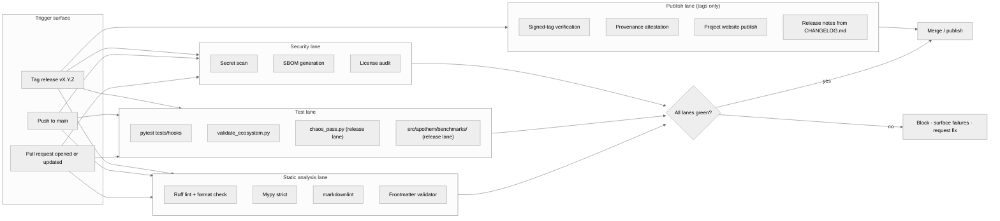

{/* SPDX-License-Identifier: MIT */}

**Структурная карта рабочего процесса сборки · валидации · публикации, который
контролирует каждое изменение в экосистеме Apothem.** Этот документ
устанавливает поверхность визуализации; конкретные файлы рабочего процесса
GitHub Actions и инструментарий релизов появляются позже, в рамках установки
готовности к продакшену.

## Форма конвейера

## Роли дорожек

- **Дорожка статического анализа** — быстрая обратная связь. Ruff покрывает стиль
  Python и тщательно подобранный набор правил; mypy навязывает дисциплину типов
  в режиме strict; markdownlint следит за поверхностью документации; валидатор
  frontmatter контролирует соответствие схеме артефактов для правил, навыков,
  делегированных работников и команд.
- **Дорожка тестов** — `pytest tests/hooks` прогоняет среду выполнения hook'ов
  против полной матрицы событий; `validate_ecosystem.py` — основной структурный
  шлюз для межартефактной согласованности; `chaos_pass.py` и набор бенчмарков
  по классам под `src/apothem/benchmarks/` активируются на дорожке релизов, чтобы
  ловить деградацию при ухудшенных входных данных и регрессии бюджета времени
  выполнения.
- **Дорожка безопасности** — сканирование секретов ловит случайно
  закоммиченные учётные данные; генерация SBOM и аудиты лицензий контролируют
  поверхность цепочки поставок для любой установки готовности к продакшену.
- **Дорожка публикации** — выполняется только на релизах с тегами. Проверка
  подписанного тега подтверждает происхождение релизной ветки; сайт проекта
  публикуется из `site/dist/` в цель GitHub Pages; заметки о релизе выводятся из
  формата Keep-A-Changelog файла `CHANGELOG.md`.

## Конкретная конфигурация

Фактические файлы рабочего процесса (`.github/workflows/ci.yml`,
`.github/workflows/release.yml` и т. д.) устанавливаются во время построения
экосистемы готовности к продакшену. Эта диаграмма определяет каноническую
форму, которую отражает каждая будущая конфигурация.

## Авторитетные перекрёстные ссылки

- `pyproject.toml` — источник истины для конфигурации Ruff / mypy / pytest.
- `scripts/dev/validate_ecosystem.py` — основной межартефактный шлюз.
- `scripts/dev/validate_hooks.py` — структурная валидация, специфичная для hook'ов.
- `scripts/dev/chaos_pass.py` — состязательный проход по каждому настроенному hook'у.
- `src/apothem/benchmarks/` — верификаторы бюджета времени выполнения по классам.
- `site/content/docs/developer-guide.mdx` — рабочий процесс контрибьютора, ориентированный на оператора.
- `CHANGELOG.md` — источник заметок о релизе.
