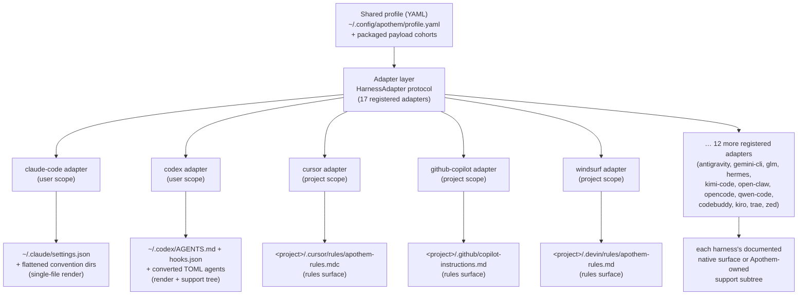

{/* SPDX-License-Identifier: MIT */}

Apothem использует единый профиль YAML, проверенный по схеме, как семантический
источник истины и выводит каждую специфичную для окружения поверхность установки
через классы-адаптеры, реализующие протокол `HarnessAdapter`. Каждый адаптер
пишет в задокументированное окружением расположение пользователя или проекта и
использует собственные пути поддержки Apothem только тогда, когда у окружения нет
соответствующего нативного примитива.

## Зачем нужна абстракция адаптера

Каждое окружение говорит на своём диалекте конфигурации: одно хочет файл настроек
JSON, другое — каталог файлов правил `.mdc`, третье — единый файл инструкций
Markdown. Если бы Apothem жёстко закодировал эти знания в CLI, каждое окружение
протекало бы своими допущениями в ядро, и добавление окружения означало бы
синхронное изменение логики установки, обновления, удаления и проверки.

Шаблон адаптера переворачивает это. Ядро знает только протокол `HarnessAdapter` —
небольшой контракт из методов жизненного цикла. Диалект каждого окружения живёт
внутри одного самодостаточного подпакета, который реализует контракт. Ядро просит
адаптер *установить*, не зная, означает ли это рендеринг файла JSON, запись
каталога правил или закладку дерева поддержки. Новые окружения присоединяются,
удовлетворяя протокол и регистрируя точку входа; в ядре ничего не меняется. Это
структурная причина, по которой Apothem остаётся независимым от хоста — абстракция
является границей, которая не даёт специфичным для окружения знаниям
распространяться.

## Форма адаптера

Адаптеры делятся на две формы материализации, обе видны в реестре:

- **Рендереры одного файла** транслируют поля профиля в один нативный для
  окружения файл конфигурации. Адаптер Claude Code, например, всегда пишет
  `~/.claude/settings.json` из общего профиля и уплощает каталоги конвенций
  Apothem (`agents/`, `rules/`, `skills/`, …) рядом с ним.
- **Адаптеры поверхности правил и дерева поддержки** распространяют когорту
  полезной нагрузки Apothem в задокументированное окружением расположение правил,
  преобразуя когорты в нативный формат там, где он существует, и паркуя остальное
  под собственным поддеревом поддержки Apothem, на которое ссылается нативный
  якорь. Адаптер Cursor пишет единственный
  `.cursor/rules/apothem-rules.mdc` в предоставленный корень проекта и доставляет
  только поверхность правил.

Данный адаптер относится к **области пользователя** (пишет под домашним каталогом)
или к **области проекта** (требует `--project <path>` и пишет внутри этого дерева);
реестр фиксирует, какой именно.

## Текущая топология адаптеров



Разворачивание веером от центра к краям — это архитектура, которую кодирует имя
проекта: один профиль в ядре, каждое окружение на равном расстоянии вдоль своего
собственного адаптера.

## Определение протокола

```python
from pathlib import Path
from typing import Protocol

class HarnessAdapter(Protocol):
    name: str
    output_path: Path

    def install(self, profile: dict[str, object]) -> object:
        ...

    def update(self, profile: dict[str, object]) -> object:
        ...

    def uninstall(self) -> None:
        ...

    def is_installed(self) -> bool:
        ...

    def verify(self) -> bool:
        ...
```

Адаптеры области проекта могут дополнительно принимать `project: Path | None` в
методах жизненного цикла и предоставлять `resolve_output_path(project)`. CLI
передаёт `--project PATH` только тем адаптерам, чья сигнатура метода это
принимает.

## Регистрация точки входа

Адаптеры регистрируются через группу точек входа setuptools `apothem.harnesses`:

```toml
[project.entry-points."apothem.harnesses"]
cursor = "apothem.harnesses.cursor:CursorAdapter"
```

Центральный реестр в `src/apothem/lib/harness_registry.py` фиксирует точные
семнадцать публичных идентификаторов, точки входа, пути документации, целевые
пути, требования к данным пакета, состояния возможностей и пути закрепления
стандартной конвенции. CLI загружает адаптеры через этот реестр вместо повторного
обнаружения фактов о продукте в каждой команде.

## Сопоставление профиля с нативным форматом

Каждый адаптер реализует логику трансляции, подходящую для его окружения:

```
YAML profile + payload cohort    Harness-native surface
-----------------------------    ----------------------
identity / preferences       --> native config fields or rendered instruction context
commands/*.md                --> native commands or SKILL.md folders
rules/*.md                   --> native rules where supported, otherwise support trees
hooks/messages/*.md          --> native hooks where supported, otherwise support trees
agents/*.md                  --> native agent formats where supported
skills/*/SKILL.md            --> native skill folders where supported
```

Неподдерживаемые и ожидающие обнаружения ячейки возможностей становятся
структурированными предупреждениями перед записью. Они не проецируются молча на
вымышленные поверхности поставщиков.

## Добавление нового адаптера

См. [Написание адаптера окружения](/docs/examples/authoring-a-harness-adapter)
для пошагового руководства.
