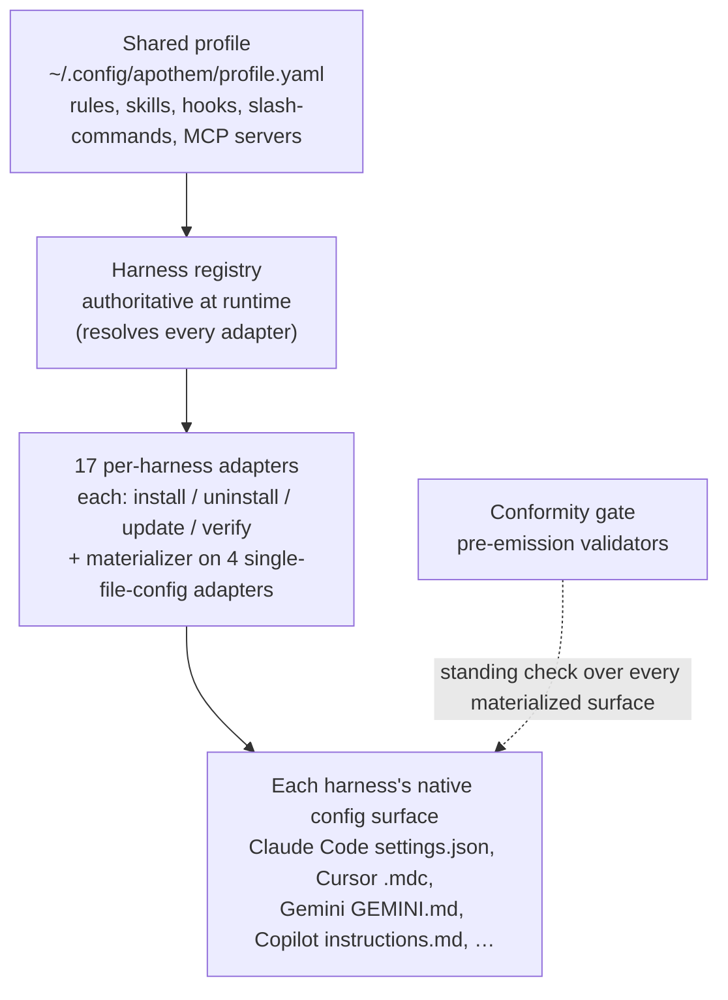

{/* SPDX-License-Identifier: MIT */}

Apothem построен вокруг одной идеи: единый общий профиль управления,
материализуемый адаптером для каждого harness в нативный формат конфигурации
каждого harness. В этом разделе
рассматриваются структурные части — протокол адаптера, схема профиля, компоновка
дерева исходного кода и рабочий процесс установки, связывающий их воедино.

## Обзор системы

С первого взгляда Apothem — это единый конвейер: единый общий профиль поступает
в реестр harness, который разрешает каждый адаптер harness; каждый адаптер
материализует нативную поверхность конфигурации своего harness, а постоянная
проверка соответствия проверяет каждую материализованную поверхность.

## Страницы

| Страница | Описание |
|------|-------------|
| [Абстракция адаптера harness](/docs/architecture/harness-adapter-abstraction) | Протокол `HarnessAdapter` — как адаптеры преобразуют общий профиль в нативную конфигурацию платформы. |
| [Схема общего профиля](/docs/architecture/shared-profile-schema) | Профиль YAML, подкреплённый схемой, в `~/.config/apothem/profile.yaml` или `--profile PATH`. |
| [Компоновка исходного кода](/docs/architecture/source-layout) | Почему Apothem использует компоновку `src/` и как организовано дерево. |
| [Рабочий процесс установки](/docs/architecture/installation-workflow) | Как `apothem install`, `update` и `uninstall` работают от начала до конца. |
| [Делегированные работники](/docs/architecture/agents) | Инструкции уровня репозитория для многоработных сред выполнения, работающих в этом репозитории. |
| [Самодостаточная среда выполнения](/docs/architecture/self-contained-runtime) | Как движок Apothem запускается из любого checkout — внутренние зависимости, модель вызова PYTHONPATH=src и bootstrap дерева плагина. |
| [Стратегия внутреннего встраивания зависимостей](/docs/architecture/vendoring-strategy) | Какие сторонние пакеты Apothem встраивает внутрь под src/apothem/_vendor/, какие остаются системными предварительными требованиями и как обновляются внутренние копии. |
| [Контракт упаковки когорт](/docs/architecture/cohort-packaging-contract) | Стабильный, потребляемый ниже по потоку контракт для упаковки когорт и манифестов плагинов — перечислить когорты и разрешить их нативные цели по окружениям без повторного выведения сопоставления. |
| [Диаграмма конвейера CI/CD](/docs/architecture/cicd-pipeline) | Визуальная карта и разбивка по дорожкам этапов рабочего процесса сборки, тестирования, lint, безопасности и публикации, которые контролируют каждое изменение кода и каждый релиз. |
