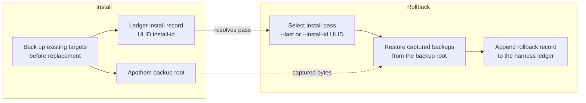

{/* SPDX-License-Identifier: MIT */}

## Поток установки

```mermaid
flowchart TD
    accTitle: Apothem install workflow
    accDescr: Top-down flowchart of the apothem install command from CLI invocation through adapter lookup, profile load, adapter install call, native config write, and final apothem verify check.
    A[apothem install --harness X] --> B[Resolve adapter through registry]
    B --> C[Load and validate profile YAML<br/>before writes]
    C --> D[Adapter.install(profile, project)]
    D --> E[Write native config and support cohorts]
    E --> F[apothem verify --harness X]
    F --> G{All checks pass?}
    G -- yes --> H[Done]
    G -- no --> I[Report failures]
```

## Поток обновления

При `apothem update --harness X`:

1. Загружает и проверяет `~/.config/apothem/profile.yaml` или `--profile PATH`.
2. Разрешает выбранный harness или `all` через центральный реестр.
3. Проверяет полный план материализации перед первой записью.
4. Вызывает `Adapter.update(profile, project=...)`.
5. Сообщает о результатах: создано, обновлено, без изменений, пропущено, предупреждение и ошибка.

## Поток удаления

При `apothem uninstall --harness X`:

1. Вызывает `Adapter.uninstall()`.
2. Адаптер удаляет только те файлы, которые он записал; общий профиль YAML и
   несвязанные файлы, написанные оператором, остаются нетронутыми.

## Разрешение области

Каждый адаптер пишет в свой собственный фиксированный корень установки: домашний
каталог пользователя для адаптеров с областью пользователя и локальный путь
проекта для адаптеров с областью проекта. CLI не предоставляет флаг `--scope`;
адаптеры с областью проекта требуют `--project <path>`. Каждое место назначения
задокументировано в `site/content/docs/harnesses/<harness>.mdx`.

## Обработка ошибок

Операции установки/обновления выполняют проверку перед записью, создают резервную
копию существующих совпадающих целей перед заменой и объединяют только дочерние
записи, управляемые Apothem, в общих каталогах обнаружения. `--dry-run` выполняет
ту же проверку и возвращает результаты «пропущено» или «без изменений», не создавая
каталогов или файлов.

## Reversibility (backup and rollback)

Every install pass is reversible. Replaced bytes are captured into the Apothem
backup root and the pass is recorded in the harness ledger under a ULID
install id; [`apothem rollback`](/docs/cli-reference/rollback) selects a
recorded pass and restores those captured backups.


