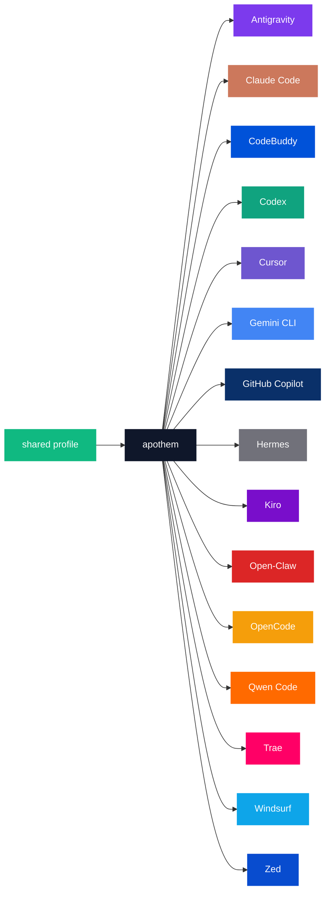

{/* SPDX-License-Identifier: MIT */}

Канонические перечисления имя-бренда × код-цвета ниже заключены в ограждение `text`, чтобы сохранить дословные идентификаторы по окружениям, которых требует каталоговое назначение палитры.

## Ядро Apothem

| Токен | Светлый | Тёмный | Применение |
|---|---|---|---|
| `apothem-hub` | `#0F172A` | `#F1F5F9` | Центральный узел распределения («apothem») в каждой архитектурной диаграмме и центральный концентратор знака Apothem. |
| `shared-profile` | `#10B981` | `#34D399` | Профиль-источник-истины, питающий ядро apothem. |

## Палитра окружений

Пятнадцать из семнадцати окружений окрашены в соответствии со своей основной
фирменной идентичностью. Оставшиеся два — `glm` и `kimi-code` — пока не имеют
определённого фирменного цвета; их строки добавляются, как только фирменный цвет
задаётся вышестоящим источником, согласно шагу распространения в разделе
[Обновления](#updates).

```text
| Token             | Light     | Dark      | Source                                                                                                                                              |
|-------------------|-----------|-----------|-----------------------------------------------------------------------------------------------------------------------------------------------------|
| `antigravity`     | `#7C3AED` | `#9F67FF` | Google Antigravity deep-purple.                                                                                                                     |
| `claude-code`     | `#CC785C` | `#E89378` | Anthropic terracotta-orange.                                                                                                                        |
| `codebuddy`       | `#0052D9` | `#5E8EF7` | Tencent CodeBuddy blue.                                                                                                                             |
| `codex`           | `#10A37F` | `#19C796` | OpenAI signature teal.                                                                                                                              |
| `cursor`          | `#6E56CF` | `#9B85E3` | Cursor brand purple.                                                                                                                                |
| `gemini-cli`      | `#4285F4` | `#6BA4F7` | Google blue (primary); the Apothem mark renders the node with all four Google brand hues `#4285F4` / `#34A853` / `#FBBC04` / `#EA4335`.             |
| `github-copilot`  | `#0A3069` | `#5B8FE3` | GitHub Mona deep-blue.                                                                                                                              |
| `hermes`          | `#71717A` | `#A1A1AA` | Community silver-grey.                                                                                                                              |
| `kiro`            | `#790ECB` | `#A862DD` | Kiro violet.                                                                                                                                        |
| `open-claw`       | `#DC2626` | `#F87171` | Community red-orange.                                                                                                                               |
| `opencode`        | `#F59E0B` | `#FBBF24` | Community amber.                                                                                                                                    |
| `qwen-code`       | `#FF6A00` | `#FF8C40` | Alibaba Qwen orange.                                                                                                                                |
| `trae`            | `#FF0066` | `#FF599C` | ByteDance Trae magenta.                                                                                                                             |
| `windsurf`        | `#0EA5E9` | `#38BDF8` | Windsurf sky-blue.                                                                                                                                  |
| `zed`             | `#084CCF` | `#5E8BE0` | Zed Industries blue.                                                                                                                                |
```

## Обоснование именования

- **`apothem-hub`** — геометрический центр, который вызывает в памяти название (апофема правильного многоугольника направлена внутрь, к его ядру).
- **`shared-profile`** — источник выше по потоку, отличающийся от цвета любого отдельного окружения, чтобы он читался как стрелка «входа» в каждой диаграмме.
- **Токены по окружениям** отражают slug окружения, используемый по всей кодовой базе (`harnesses/<slug>/`, ключ точки входа, аргумент `--harness <slug>` CLI). Одно слово на понятие; одна и та же строка везде.

## Использование Mermaid



## Доступность

Каждый токен светлого режима соответствует контрасту WCAG 2.2 AA на фоне белого текста (≥4,5 : 1) там, где контраст это позволяет без искажения фирменного цвета. Когда нативный фирменный цвет окружения сам по себе опускается ниже порога AA на фоне белого текста (особенно семейство янтарных / оранжевых токенов и семейство небесно-голубых / бирюзовых токенов, перечисленных выше), диаграммы, которым нужен контраст WCAG AA текст-на-цвете, используют **вариант тёмного режима** (приподнятый оттенок) в качестве заливки диаграммы, чтобы белый текст читался чётко. Столбец тёмного режима откалиброван именно для этой цели: каждый токен тёмного режима проходит AA на фоне белого текста.

## Обновления

Палитра обновляется только тогда, когда окружение ратифицирует изменение бренда выше по потоку. Изменения бренда по окружениям распространяются атомарно через `site/app/global.css`, эту страницу и каждый затронутый SVG-мастер в `assets/src/`.
