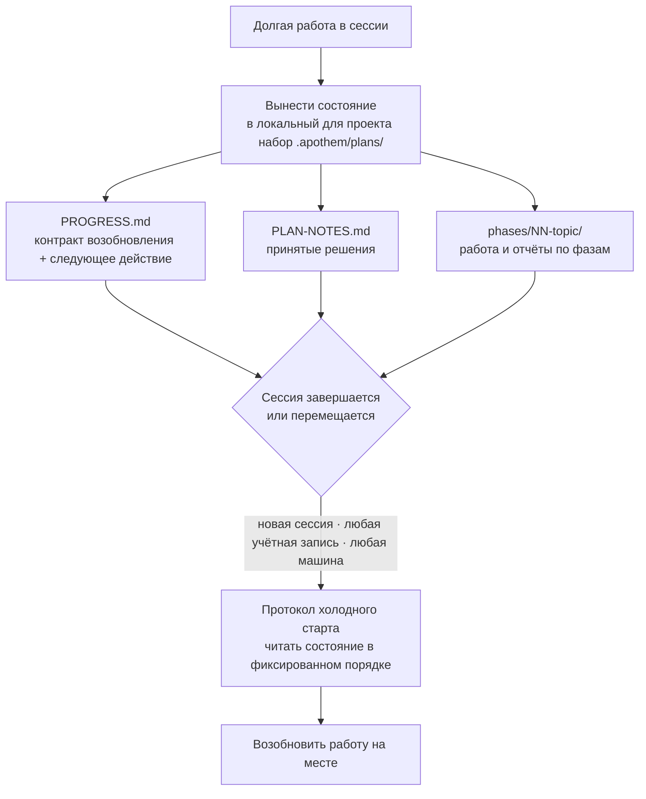

{/* SPDX-License-Identifier: MIT */}

Бо́льшая часть работы по программированию с поддержкой ассистента живёт и
умирает внутри одного разговора. Закрываете чат, переходите на другую машину или
входите под другой учётной записью — и нить того, что вы делали, теряется:
следующая сессия начинается с холодного старта, без памяти о решениях, которые вы
уже приняли.

Apothem переворачивает это. Для долгой многошаговой работы он выносит своё
**полное рабочее состояние** в локальный для проекта набор `.apothem/plans/` (`.plans/` остаётся поддерживаемым резервным вариантом для обратной совместимости) — это файлы,
которые лежат в вашем репозитории, а не внутри истории какого-либо облачного
чата. Состояние — это долговечный артефакт; сессия одноразова.

## Основная идея

Набор планов в `<project-root>/.apothem/plans/{suite}/` несёт две вещи, которые делают
сессию заменяемой:

- **Контракт возобновления.** `PROGRESS.md` фиксирует текущую фазу и статус
  задач, точное следующее действие, действующие соглашения, уже принятые решения
  и точные файлы, которые должна прочитать следующая сессия.
- **Протокол холодного старта.** Свежая сессия читает эти файлы в фиксированном
  порядке и заново восстанавливает полную картину, прежде чем выполнять любую
  работу, — история разговора не требуется.

Поскольку это состояние находится в файлах вашего проекта, свежая сессия на
**любой учётной записи или машине**, нацеленная на тот же проект, подхватывает
работу на месте. Ничто не заперто внутри одной расшифровки чата. Это и есть то
свойство, которое позволяет структурированной, масштабной, многодневной работе —
большим корпусам, длинным миграциям, обширным проходам ревью — пережить границы,
которые иначе её бы завершили.

## Что это, если точно

Сформулировано точно, чтобы гарантия была ясна:

- **Это** вынесенное в файлы состояние плюс протокол возобновления с холодного
  старта. Работа возобновляется, потому что состояние живёт в файлах вашего
  проекта, независимо от любой сессии, учётной записи или машины.
- **Это не** служба автоматической синхронизации между учётными записями. Apothem
  не переносит сам по себе состояние ваших планов между учётными записями — файлы
  путешествуют так же, как уже путешествуют файлы вашего проекта (контроль версий,
  общий checkout, синхронизируемый каталог). Apothem гарантирует, что куда бы ни
  попали файлы проекта, свежая сессия сможет возобновиться из них.

## Почему это важно

Чем длиннее и крупнее работа, тем больше один разговор становится обузой.
Многодневная переработка или проход по большой кодовой базе переживёт любую
отдельную сессию: окна контекста сжимаются, сессии истекают по времени, машины
меняются. Рассматривая сами файлы проекта как источник истины для незавершённой
работы, Apothem делает работу устойчивой ко всем трём границам: сессии, учётной
записи и машине.

## Где живёт состояние

| Артефакт | Расположение | Содержит |
|----------|----------|-------|
| Набор планов | `<project-root>/.apothem/plans/{suite}/` | Одну самодостаточную единицу незавершённой работы |
| Контракт возобновления | `<suite>/PROGRESS.md` | Статус фазы/задачи, следующее действие, соглашения, манифест критичных файлов |
| Журнал решений | `<suite>/PLAN-NOTES.md` | Принятые решения, никогда не спрашиваемые повторно |
| Работа по фазам | `<suite>/phases/NN-topic/` | Задачи фазы и её отчёт |

Дерево планов исключено из контроля версий каноническим фрагментом `.gitignore`
от Apothem, поэтому состояние планов по умолчанию остаётся локальным. Чтобы
намеренно перенести незавершённую работу между машинами или учётными записями,
переместите набор `.apothem/plans/` так же, как вы перемещаете любой другой файл проекта.

## Связанное

- **[Уровни серьёзности](/docs/concepts/seriousness-tiers)** — как управление и
  дисциплина выноса состояния масштабируются под вовлечённость.
- **[Конвейер команд](/docs/pipeline)** — этапы `/plan`, которые создают и
  продвигают набор планов.

## Recommended Next Step

**Прочитайте [Уровни серьёзности](/docs/concepts/seriousness-tiers)**, чтобы
увидеть, как дисциплина выноса масштабируется от быстрого эксперимента до
многодневного усилия, пересекающего границы.
