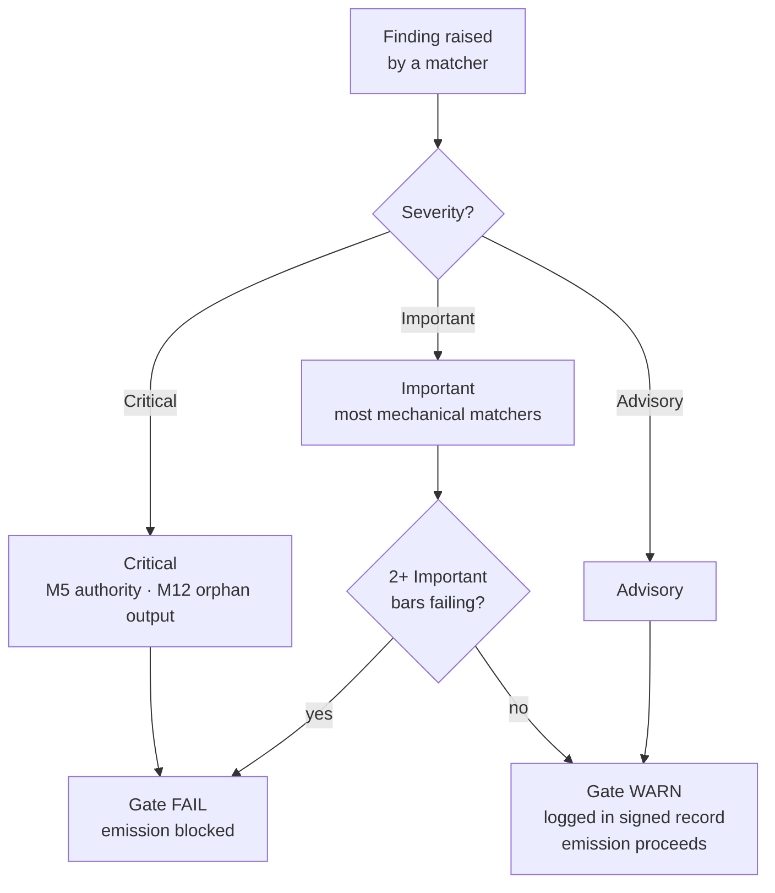

{/* SPDX-License-Identifier: MIT */}

## Пятнадцать пунктов

| Пункт | ID | Мандат | Класс проверки | Отказ → действие |
|---|---|---|---|---|
| 1 | M1 | Агностицизм к проекту-хосту | Рассуждательная | Переработать для соответствия конвенциям хоста |
| 2 | M2 | Редакторская дисциплина (реестр раскрытия) | Механическая | Добавить маркеры раскрытия |
| 3 | M3 | Десять измерений качества | Рассуждательная | Переработать по проваленным измерениям |
| 4 | M4 | Самоприменение (подписанная запись ворот присутствует) | Механическая | Зафиксировать блок подписанной записи |
| 5 | M5 | Принцип авторитета (без выдуманной идентичности / конечной точки / секрета) | Механическая | Направить на запрос |
| 6 | M6 | Внедрение экспертизы (выявленные пробелы) | Рассуждательная | Выявить пробелы; процитировать уточнения |
| 7 | M7 | Аннотация вариантов (маркер рекомендации + обоснование) | Механическая | Аннотировать наборы вариантов |
| 8 | M8 | Определённость (без уклончивостей в предписывающей прозе) | Механическая | Возвести уклончивости до условных ветвей |
| 9 | M9 | Визуальный рычаг (структурные предметы несут диаграммы) | Рассуждательная | Создать / обновить диаграмму |
| 10 | M10 | Двунаправленное связывание (взаимные обратные указатели замкнуты) | Механическая | Замкнуть полурёбра |
| 11 | M11 | Гибкие спринты (Цель / Бэклог / DoR / DoD / Ревью / Ретроспектива) | Рассуждательная | Реструктурировать как спринты |
| 12 | M12 | Отчётность по фазам и каноническая компоновка | Механическая | Создать сводку; переместить в каноническую компоновку |
| 13 | M13 | Ремесло кода (линтер / форматтер / проверка типов; магическое число; bare-except) | Механическая | Переработать по правилам ремесла кода для каждого языка |
| 14 | M14 | Системность (объявляет восходящие / нисходящие / равноправные / принуждающие) | Рассуждательная | Объявить; индексировать в реестрах |
| 15 | M15 | Готовность к продакшену (тесты + документация + CHANGELOG + соответствующий коммит + зелёный CI + стабильность semver) | Механическая | Добавить недостающие поверхности |

## Лестница серьёзности

| Серьёзность | Эффект на ворота |
|---|---|
| **Критическая** | Ворота FAIL — эмиссия заблокирована безусловно |
| **Важная** | Ворота FAIL, когда 2+ важных пункта проваливаются одновременно |
| **Совещательная** | Ворота WARN — записывается в подписанную запись; не блокирует эмиссию |

Большинство сопоставителей механической доли по умолчанию **Важные**. M5 (авторитет — секреты, выдуманные конечные точки) и M12 (осиротевшие выходы) — **Критические**.



## Сопоставители механической доли

Механическая доля живёт в [`src/apothem/conformity/*_grep.py`](https://github.com/ahmed-g-gad/apothem/tree/main/src/apothem/conformity), оркеструемом через [`src/apothem/conformity/gate.py`](https://github.com/ahmed-g-gad/apothem/blob/main/src/apothem/conformity/gate.py).

| Сопоставитель | Пункт | Функция |
|---|---|---|
| `hedging_grep.py` | M8 | Обнаруживает уклончивую лексику в предписывающей прозе |
| `option_annotation_grep.py` | M7 | Проверяет маркер `**Recommended**` + обоснование на наборах вариантов |
| `user_confirm_grep.py` | M5 | Блокирует заполнители `<USER-CONFIRM:…>` от эмиссии |
| `binding_reciprocity_grep.py` | M10 | Обнаруживает полурёбра в `## Bindings (§0.j five-direction)` |
| `orphan_output_grep.py` | M12 | Помечает артефакты без потребителя / без записи указателя / без атрибуции производителя |
| `bare_except_grep.py` | M13 | Обнаруживает `except:` / `except Exception:` без обосновывающего комментария |
| `magic_number_grep.py` | M13 | Обнаруживает числовые литералы в бизнес-логике |
| `commented_out_code_grep.py` | M13 | Обнаруживает закомментированные блоки кода |
| `file_header_grep.py` | M13 | Проверяет наличие однострочного заголовка лицензии SPDX |
| `frontmatter_grep.py` | M14 | Проверяет обязательные поля frontmatter в четырёх канонических директориях директив, перечисленных ниже |
| `semver_stability_grep.py` | M15 | Обнаруживает ломающие изменения публичного API без повышения версии MAJOR |
| `production_ready_pr_grep.py` | M15 | Проверяет дисциплину одного набора изменений (тесты + документация + CHANGELOG) |
| `secret_leak_grep.py` | M15 | Обнаруживает жёстко закодированные секреты / учётные данные |
| `unpinned_action_grep.py` | M15 | Проверяет закрепление GitHub Actions за commit SHA |
| `always_on_budget_grep.py` | потолок бюджета | Ограничивает тело всегда активных правил 500 содержательными token |

## Запуск ворот

На установленном harness ворота запускаются автоматически:
`settings.json` Claude Code подключает их как хук `PreToolUse`, который
вызывает материализованную копию по адресу `~/.claude/.apothem/support/conformity/gate.py`
перед каждым Write/Edit. Из исходного checkout модульная форма приводит в
движение тот же код:

```shell
# Диспетчеризация одного файла (имитирует хук PreToolUse):
echo '{"tool_input": {"file_path": "path/to/file", "content": "..."}}' \
    | python -m apothem.conformity.gate --hook

# Составной обход по репозиторию:
python -m apothem.conformity.gate --sweep src/ site/content/docs/ rules/
```

См. [Запуск ворот соответствия](/docs/usage/conformity-gate) для полной процедуры.

## Справочник

- [Реестр ворот предэмиссии](/docs/governance/pre-emission-gate-registry) — канонические определения пунктов
- [Реестр внешнего соответствия](/docs/governance/outward-conformity-registry) — подробная семантика M1-M15
- [Сквозные мандаты](/docs/governance/cross-cutting-mandates) — источник истины для мандатов
- [Дисциплина производительности](https://github.com/ahmed-g-gad/apothem/blob/main/src/apothem/rules/performance-discipline.md) — бюджеты времени выполнения по классам
