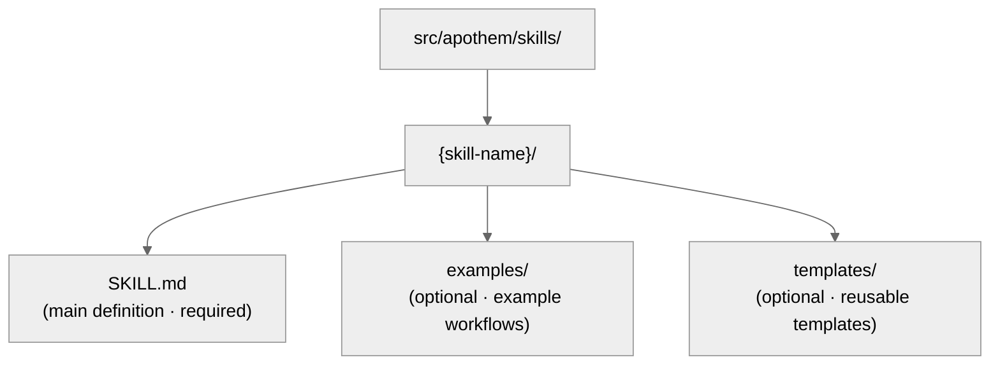

{/* SPDX-License-Identifier: MIT */}

Это руководство помогает разработчикам сопровождать и расширять экосистему Apothem
с соблюдением стандартов качества SOTA.

## Краткий справочник: типы артефактов

Экосистема Apothem содержит пять типов артефактов, каждый со своим назначением и
требованиями к фронтматтеру.

| Артефакт | Путь | Назначение | Когда создавать |
| -------- | ---- | ------- | -------------- |
| **Правило** | `src/apothem/rules/*.md` | Поведенческий мандат или операционная директива | Установлен новый принцип, политика или мандат управления |
| **Команда** | `src/apothem/commands/*.md` | Слеш-команда (`/command-name`) для сложных рабочих процессов | Новый многошаговый пользовательский рабочий процесс |
| **Помощник** | каталог помощников (`*.md` на файл) | Постоянное определение делегированного исполнителя для параллельных задач | Новая повторяющаяся специализированная задача (аудит, исследование, проверка качества) |
| **Навык** | `src/apothem/skills/{name}/SKILL.md` | Переиспользуемая методика с сигналом обнаружения | Новый обнаруживаемый, переиспользуемый шаблон методики |
| **Хук** | `src/apothem/hooks/` + `settings.json` | Проверка или управление состоянием по событию | Новое событие жизненного цикла или потребность в проверке |

## Контракт адаптера среды

Идентичность и факты о возможностях среды находятся в
`src/apothem/lib/harness_registry.py`. Изменение среды завершено только тогда, когда
эти поверхности согласованы:

| Поверхность | Требуемое обновление |
| --- | --- |
| Строка реестра | Публичный ID, ключ пакета, точка входа, область, формат вывода, целевые пути, пути документации, файл возможностей, стандартный пин, фикстурные тесты, ключ данных пакета, источники шаблонов и статусы возможностей. |
| Пакет адаптера | `__init__.py`, `install.py`, `update.py`, `uninstall.py`, `verify.py`; добавляйте `materializer.py`, только когда среда рендерит нативный файл конфигурации. |
| Манифест распространения | Пути шаблонов и групп для адаптеров на основе манифеста. |
| Возможности | `src/apothem/harnesses/<package>/capabilities.yml` с каждой требуемой возможностью и обоснованием для неподдерживаемых или ожидающих обнаружения состояний. |
| Пин соглашения | `STANDARD-CONVENTION-PIN.md` с URL вендора, датой снимка, каноническим именем файла/схемой, ссылкой на доказательство и обоснованием неподдерживаемых возможностей. |
| Тесты | Паритет реестра, фикстурный тест адаптера, эталонная строка плана установки, поведение dry-run/без-записи, идемпотентность и покрытие данных пакета. |
| Документация | Справочная страница среды, страница сравнения, заметки по возможностям/MCP и примеры, использующие вымышленные заполнители. |

Адаптеры уровня проекта должны устанавливать `requires_project = True`, принимать
`project: Path | None` в методах жизненного цикла и отвергать отсутствующие или
небезопасные корни проекта до записи. Адаптеры пользовательского уровня должны
держать пути под документированным корнем пользовательской конфигурации среды.

## Политика эталонных фикстур

`tests/fixtures/harness-golden-plans.json` записывает публичную форму плана установки
для всех семнадцати сред реестра: публичный ID, режим материализации, путь к
исходной группе/шаблону и нормализованный целевой путь под `<ROOT>`. Когда поведение
реестра, манифеста или целевого шаблона меняется намеренно, обновляйте эталонную
фикстуру в том же коммите, что и изменение исходного кода, чтобы дифф показывал
дельту поведения.

## Проверка перед записью

Общий драйвер установки проверяет каждый источник и цель перед первой записью. Он
отвергает отсутствующие источники манифеста, обход цели, целевые пути за пределами
выбранного корня и пересечения симлинков. Прогоны dry-run выполняют ту же проверку и
возвращают структурированные результаты `skipped` или `unchanged` без создания
файлов.

## Сокрытие и пример данных

Диагностика профиля сокрывает поля вида token, secret, password, credential, API
key, private key, authorization, auth и поля в форме заголовков. Документация,
фикстуры, примеры и фрагменты JSON используют `example.invalid`, `Example User`,
`example-user` и очевидные заполнители вместо похожих на настоящие секретов или
личных аккаунтов.

## Прежде чем писать: каноническая схема

**Все артефакты должны следовать схеме в `site/content/docs/reference/artifact-schema.mdx`.** Это
не подлежит обсуждению.

- Прочтите `site/content/docs/reference/artifact-schema.mdx` § «Schema» для вашего типа артефакта
- Скопируйте обязательные поля
- Заполните обязательные значения
- Добавьте опциональные поля по необходимости

## Быстрая проверка фронтматтера

Фронтматтер каждого артефакта должен пройти эти проверки:

```yaml
✓ Valid YAML syntax (use tools: `yamllint` or PowerShell `ConvertFrom-Yaml` where available)
✓ All mandatory fields present (per schema for artifact type)
✓ name: uses kebab-case
✓ version: semantic MAJOR.MINOR.PATCH
✓ updated: ISO 8601 date (YYYY-MM-DD)
✓ description: single-line, non-empty
✓ scope: valid enum (always-on|path-filtered|other)
✓ portability: valid enum (`universal` | `universal-with-windows-caveats` | `unix-only` | `windows-only`)
✓ No typos in field names — must match canonical schema exactly
✓ Optional fields use correct enum values
```

## Соглашения об именовании

### Имена артефактов (kebab-case)

- **Правила:** `operational-mandates`, `clean-room-generation`, `context-management`
- **Команды:** `plan-execute`, `plan-spec`, `plan-generate`
- **Помощники:** `codebase-explorer`, `convention-auditor`, `quality-gate`
- **Навыки:** `plan-suite`, `ecosystem-audit`

Шаблон: строчные буквы, дефисы между словами, без пробелов и подчёркиваний.

### Именование файлов

- **Правила:** `{name}.md`
- **Команды:** `{name}.md`
- **Помощники:** `{name}.md`
- **Навыки:** Внутри папки `src/apothem/skills/{name}/SKILL.md` (точный регистр: `SKILL.md`)
- **Хуки:** Внутри папки `src/apothem/hooks/`. Все обработчики событий — на Python.
  Каждая команда хука в `settings.json` использует exec-форму (`python` плюс `args`)
  для вызова `-m apothem.hooks.dispatch <event> [<message-name>]` или
  `-m apothem.conformity.gate --hook`. `dispatch.py` направляет `SessionStart` в
  `session_start_bootstrap.main()` и каждое другое разрешённое событие в
  `emit_hook_context.main()`. Единственные shell-обёртки, разрешённые под
  `src/apothem/hooks/` или `scripts/`, — это четыре файла локатора + начальной
  загрузки (`find-python.{ps1,sh}`, `bootstrap.{ps1,sh}`); любой другой файл `.ps1` /
  `.sh` проваливает проверку гигиены `scripts/dev/validate_hooks.py`.

### Перекрёстные ссылки

При ссылке на другие артефакты используйте точные имена:

- Правила: `"operational-mandates"` (значение поля name)
- Команды: `/plan-execute` (со слешем для документации для людей; без слеша в коде)
- Помощники: `codebase-explorer` (значение поля name)
- Навыки: `plan-suite` (значение поля name)

Никогда не используйте пути к файлам или усечённые имена в прозе.

## Переносимость: Windows и Unix

Каждый артефакт должен явно объявлять свой статус переносимости.

### Универсальный (по умолчанию)

- Работает одинаково в Windows, macOS и Linux
- Без предположений об оболочке
- Пути используют прямые слеши (`/`)
- Без жёстко заданных абсолютных путей
- Без специфичного для Windows синтаксиса PowerShell

```yaml
portability: "universal"
```

### Универсальный с оговорками для Windows

- Универсален среди POSIX-хостов; названная оговорка применяется к варианту платформы Windows, объявленному в содержимом
- Документируйте оговорку явно в содержимом
- Пример: «Симлинки не поддерживаются в Windows до Win 10»

```yaml
portability: "universal-with-windows-caveats"
```

Документируйте оговорку в примечании сразу после заголовка.

### Только Unix / Только Windows

- Явно ограничен одной платформой
- Редко в Apothem — большинство должно быть универсальным
- Используйте только если платформо-специфичные возможности существенны

```yaml
portability: "unix-only"
```

Документируйте причину в первом разделе правила.

## Область: всегда-включено или фильтрация по пути

### Всегда-включено

Правило применяется везде.

```yaml
scope: "always-on"
```

### Фильтрация по пути

Правило применяется условно на основе пути файла.

```yaml
scope: "path-filtered"
pathFilter: "**/*.py, **/*.toml"
```

`pathFilter` использует glob-шаблоны (тот же формат, что и `.gitignore`). Когда файл
соответствует фильтру, правило активируется.

## Семантика версий

Каждый артефакт несёт собственную семантическую версию (`MAJOR.MINOR.PATCH`):

- **PATCH** — исправления опечаток, форматирование, обновление ссылок, правки только в комментариях. Поведение не изменилось.
- **MINOR** — аддитивные несломанные изменения: новые опциональные разделы, дополнительные антипаттерны, новые опциональные поля фронтматтера, новые примеры. Существующие потребители продолжают работать без изменений.
- **MAJOR** — ломающие изменения схемы или контракта: удалённые разделы, переименованные поля, изменённое поведение существующей директивы, изменения, требующие адаптации нижестоящих артефактов.

Примеры:

- `vX.Y.Z` → `vX.Y.(Z+1)` (PATCH: исправление опечатки)
- `vX.Y.Z` → `vX.(Y+1).0` (MINOR: добавлена новая запись Антипаттерны)
- `vX.Y.Z` → `v(X+1).0.0` (MAJOR: контракт объявлен стабильным)
- `vX.Y.Z` → `v(X+1).0.0` (MAJOR: удалено обязательное поле фронтматтера)

Повышайте `version` и `updated` вместе при каждой правке, меняющей поведение.
Добавляйте соответствующую строку в `CHANGELOG.md` уровня экосистемы для выпусков,
объединяющих изменения артефактов.

## Когда редактировать артефакт

### Правила

- Считайте структуру Обязательно/Опционально несущей — её перестройка отражается на
  каждом зависимом артефакте (требуется повышение MAJOR).
- Уточняйте Антипаттерны, примеры Масштабирования по серьёзности и цитаты по мере
  углубления понимания (повышение MINOR).
- Фиксируйте обоснование любого структурного изменения в соответствующем файле темы
  памяти.

### Команды

- Форма аргументов — часть публичного контракта — ломайте её только с явным
  намерением и распространяйте изменение на каждого вызывающего (повышение MAJOR).
- Держите шаги рабочего процесса и контракты возврата сжатыми и актуальными.
- Документируйте неочевидную последовательность шагов прямо в тексте.

### Помощники

- Держите `disallowedTools` минимальным-но-достаточным; документируйте обоснование
  при его изменении.
- Уточняйте Операционные принципы и Контракты возврата по мере созревания роли
  помощника (повышение MINOR).
- Отслеживайте сдвиги возможностей прямо в тексте, чтобы вызывающие могли
  пересчитать ожидания.

### Навыки

- Держите шаги Процедуры и Примеры синхронизированными с реальностью.
- Сигналы обнаружения должны отражать реальные формулировки пользователей в текущем
  использовании.
- Разбивайте навык, как только он пересекает ~150 строк (см.
  `auto-memory.md` § Topic File Management).

## Пошагово: добавление нового правила

### 1. Оцените ортогональность

Перекрывается ли это правило с существующими правилами? Поищите в
`src/apothem/rules/` связанный контент.

Если перекрытие >50%, рассмотрите расширение существующего правила. См.
`persistent-conventions-vigilance.md` § Artifact Evolution.

### 2. Напишите содержание

Следуйте структуре:

- Заголовок: `# Rule: {Title}`
- Раздел Purpose
- Obligations / Core directives (нумерованные, связанные)
- Таблица Seriousness Scaling (всегда обязательна)
- Раздел Anti-Patterns
- Раздел Enforcement

### 3. Создайте фронтматтер

Используйте схему из `site/content/docs/reference/artifact-schema.mdx` § Schema: Rules. Установите:

- `name:` идентификатор kebab-case
- `version:` `"X.Y.Z"` (начальная)
- `updated:` сегодняшняя дата в ISO 8601
- `scope:` `always-on` или `path-filtered`
- `portability:` `universal` (или с оговорками при необходимости)
- `implements:` Перечислите мандаты CM/TM/CP, которые покрывает это правило

Пример:

```yaml
---
name: "my-new-rule"
description: "Brief one-liner"
pathFilter: ""
alwaysApply: true
---
```

### 4. Обновите CLAUDE.md

Добавьте запись в таблицу реестра `§7.2 Rules`:

```markdown
| My New Rule | `src/apothem/rules/my-new-rule.md` | Always-on | CM-5/CM-21 |
```

Поддерживайте алфавитный порядок внутри таблицы.

### 5. Допишите в CHANGELOG.md

Добавьте строку в раздел `### Added` следующего выпуска, описывающую новое правило.

### 6. Запустите проверку

Вызовите навык `ecosystem-audit`, чтобы проверить новое правило, сфокусировавшись на
области правил:

```text
Invoke the ecosystem-audit skill with --focus rules --fix
```

Убедитесь, что для вашего нового правила не сообщено об ошибках.

## Пошагово: добавление новой команды

Команды — это слеш-команды вроде `/plan-spec`, `/plan-execute`, `/security-audit` и т. д.

### 1. Определите роль

Команды **никогда** не предназначены для изолированного вызова средой выполнения
harness. Это рабочие процессы, запускаемые пользователем.
Спросите:

- Это рабочий процесс, который пользователь набирает как `/command-name`?
- Оркеструет ли он несколько шагов?
- Может ли он завершиться по таймауту или требовать ввода пользователя в середине исполнения?

Если «нет» на что-либо из этого — это, вероятно, навык, а не команда.

### 2. Создайте файл

Путь: `src/apothem/commands/{name}.md`

Фронтматтер (из `site/content/docs/reference/artifact-schema.mdx` § Schema: Commands):

```yaml
---
name: "my-command"
version: "X.Y.Z"
updated: "2026-04-20"
description: "What this command does"
argument-hint: "[path/to/input] [--flag VALUE]"
disable-model-invocation: true
portability: "universal"
allowed-tools: "Read, Glob, Grep"
---
```

Всегда устанавливайте `disable-model-invocation: true` для команд.

### 3. Напишите содержание

Структура:

- Заголовок: `# /{name} — Human-Readable Title`
- Раздел Role (кто это исполняет)
- Высокоуровневые инструкции
- Раздел Workflow с шагами
- Контракт возврата / формат вывода

### 4. Обновите CLAUDE.md и CHANGELOG.md

Строка реестра в `§7.1 Commands`; строка CHANGELOG в разделе `### Added` следующего выпуска.

### 5. Проверьте

Вызовите навык `ecosystem-audit`, сфокусировавшись на командах:

```text
Invoke the ecosystem-audit skill with --focus commands --fix
```

## Пошагово: добавление нового помощника

Помощники — это постоянные определения делегированных исполнителей для параллельной
работы.

### 1. Определите шаблон

Подходит ли этот помощник под один из командных шаблонов, перечисленных ниже?

- Research Team: только чтение, сбор информации
- Audit Team: проверка, контроль согласованности
- Implementation Team: параллельные изменения кода
- Quality Team: линтинг, тесты, проверка типов, безопасность
- Documentation Team: обновления документации
- Other: специализированная задача

### 2. Создайте файл

Путь:

```text
src/apothem/agents/{name}.md
```

Фронтматтер:

```yaml
---
name: "my-helper"
version: "X.Y.Z"
updated: "2026-04-20"
description: "What this helper specializes in"
tools: "Read, Glob, Grep, Bash"
disallowedTools: "Write, Edit"
maxTurns: 15
effort: "high"
permissionMode: "default"
memory: false
portability: "universal"
---
```

### 3. Напишите содержание

Разделы:

- Operating Principles (только чтение, на основе доказательств, бинарные вердикты, исчерпывающе)
- Workflow (нумерованные шаги)
- Return Contract (макс. токены, структура, обязательные поля)

### 4. Обновите CLAUDE.md и CHANGELOG.md

Строка реестра в `§7.3 Helpers`; строка CHANGELOG в разделе `### Added` следующего выпуска.

### 5. Протестируйте

Разверните помощника в реальном сценарии и убедитесь, что он работает как
задокументировано.

## Пошагово: добавление нового навыка

Навыки — это переиспользуемые, обнаруживаемые методики.

### 1. Определите переиспользуемость

Прежде чем писать навык:

- Видели ли вы эту задачу/методику 3+ раза?
- Обнаруживаема ли она? (Сигнализирует ли о ней шаблон запроса пользователя?)
- Можете ли вы кодифицировать её воспроизводимо?

Если на все три «да», напишите навык.

### 2. Создайте структуру



### 3. Напишите SKILL.md

Фронтматтер:

```yaml
---
name: "skill-name"
version: "X.Y.Z"
updated: "2026-04-20"
description: "What this skill teaches"
archetype: "workflow-template"
userInvocable: true | false
disable-model-invocation: true | false
allowed-tools: "Read, Glob, Grep"
argument-hint: "[args]"               # optional; if userInvocable
---
```

Структура содержания:

- Purpose
- When to Use This Skill
- Prerequisites
- Step-by-Step Procedure
- Common Mistakes
- Examples

### 4. Обновите CLAUDE.md и CHANGELOG.md

Строка реестра в `§7.5 Skills`; строка CHANGELOG в разделе `### Added` следующего выпуска.

### 5. Проверьте

Вызовите навык `ecosystem-audit`, сфокусировавшись на навыках:

```text
Invoke the ecosystem-audit skill with --focus skills --fix
```

## Контрольный список проверки перед коммитом

- [ ] Фронтматтер проходит проверку синтаксиса YAML
- [ ] Все обязательные поля присутствуют согласно схеме
- [ ] Поле `name` использует kebab-case
- [ ] `version` семантическая (`MAJOR.MINOR.PATCH`) и повышена, если поведение изменилось
- [ ] `updated` соответствует сегодняшней дате для любого артефакта, который вы тронули
- [ ] Поле `portability` задано и корректно
- [ ] CHANGELOG.md несёт изменение в соответствующей категории под разделом следующего выпуска
- [ ] Нет ссылок на внутренние элементы плана (соответствие CM-7)
- [ ] Перекрёстные ссылки согласованы с другими артефактами
- [ ] Новый артефакт зарегистрирован в реестре CLAUDE.md
- [ ] Артефакт протестирован (если применимо)
- [ ] Навык `ecosystem-audit` запускается без ошибок
- [ ] Содержание следует структурным соглашениям (формат заголовка, разделы и т. д.)

## Ссылки на другие артефакты

Используйте эти точные соглашения:

### Ссылка на правило

```markdown
See `src/apothem/rules/operational-mandates.md` or shorthand: the Operational Mandates rule.
In prose: ... per CM-1–10 (Operational Mandates rule) ...
```

### Ссылка на команду

```markdown
See `/plan-execute` command. Or: Run `/plan-execute`.
In prose: The `/plan-execute` command handles phase execution.
```

### Ссылка на помощника

```markdown
Deploy the `codebase-explorer` delegated worker.
In prose: The codebase-explorer worker finds patterns.
```

### Ссылка на навык

```markdown
Use the `plan-suite` skill.
In prose: The plan-suite skill provides the Master Plan Suite template.
```

### Ссылка на разделы CLAUDE.md

```markdown
See CLAUDE.md § 7.2 (Rules registry).
Or: Section 4 (Seriousness-Scaled Governance).
```

## Линтинг и формат

Все артефакты используют:

- **Markdown:** GFM (GitHub Flavored Markdown)
- **YAML:** Совместимый с YAML 1.2
- **Окончания строк:** LF (стиль Unix)
- **Кодировка:** UTF-8
- **Ширина строки:** Мягкий перенос на 100 символах для содержания (без жёстких переносов)

Используйте форматировщик / линтер `Ruff` для файлов Python. Для Markdown используйте
`prettier` или эквивалент.

## Аудит экосистемы: запуск проверки

Две взаимодополняющие поверхности проверки покрывают экосистему:

**Машинно-проверяемые (валидаторы Python)** — запускайте перед каждым коммитом:

```bash
python scripts/dev/validate_hooks.py       # Hook structure + Python-only hygiene
python scripts/dev/validate_ecosystem.py   # Full tree + frontmatter + delegated hook checks
python scripts/dev/chaos_pass.py           # Adversarial sweep across configured hooks
pytest tests                                    # Unit tests for the hook runtime
```

**Управляемые harness** — для аудита перекрёстных ссылок,
повествования и соглашений:

```bash
/ecosystem-audit --focus all --fix
```

Это запускается параллельно:

- **Аудит структуры:** Точность реестра, существование файлов, корректность фронтматтера
- **Аудит артефактов:** Перекрёстные ссылки, покрытие мандатов, порядок конвейера
- **Аудит памяти:** Утверждения в файлах памяти против состояния файловой системы

Ожидаемый вывод: `PASS` с нулём находок от обеих поверхностей.

Если сообщено о `FINDINGS`:

- Просмотрите серьёзность каждой находки (Critical / Important / Advisory)
- Решайте элементы Critical немедленно
- Планируйте элементы Important на следующий цикл
- Рассмотрите элементы Advisory на следующей итерации

---

## Вопросы?

Обратитесь к:

- Схема фронтматтера: `site/content/docs/reference/artifact-schema.mdx`
- Жизненный цикл артефактов: `src/apothem/rules/persistent-conventions-vigilance.md` § Artifact Evolution
- Операционные мандаты: `src/apothem/rules/operational-mandates.md` CM-1–10
- Справочник по набору планов: `src/apothem/skills/plan-suite/master-template.md`
- Заметки о выпуске: `CHANGELOG.md`
