{/* SPDX-License-Identifier: MIT */}

这些是面向多工作者助手运行时（编排平台、调度器、自主助手平台）在本仓库中运行时的仓库范围指令。它们是强制性的，并随每次发布的检出一同发布。它们与
[`AGENTS.md`](https://github.com/ahmed-g-gad/apothem/blob/main/AGENTS.md)、
[`CLAUDE.md`](https://github.com/ahmed-g-gad/apothem/blob/main/CLAUDE.md)
以及面向其他受支持助手面的项目范围指令保持一致；当这些面在共享准则（计划准则、文件头、歧义处理、命名、禁止模式、模态层级）上重叠时，它们在语义上等价，而 `AGENTS.md` 是项目的权威声音。

## 项目背景

本仓库是一个托管助手运行时配置的开发工具生态系统：委派工作者、斜杠命令、技能、钩子、输出样式、状态行、MCP 集成、设置、JSON 模式、校验器、测试和文档。它由单一作者维护。磁盘上的布局精确镜像运行时布局。本仓库中的委派工作者不会在发布树之外存储状态；发布树即权威制品。

## 工作者约定

本仓库中的一次多工作者运行遵循三条约定：

- **角色都有命名。** 多工作者运行中的每一个委派工作者都带有角色标识符（kebab-case，描述性的：
  `codebase-explorer`、`convention-auditor`、`quality-gate`、
  `memory-auditor`）。禁止使用通用角色名（`worker`、`helper`）。
- **返回契约是显式的。** 每次工作者调用都指定预期的返回形状——结构化摘要、最大 token 预算、必需字段、失败模式措辞。调度器拒绝格式错误的返回，而不是静默地重新提示。
- **共享状态即文件系统。** 委派工作者不跨调度边界共享内存。两个工作者都需要的状态通过发布树下的命名文件流转（或者，对于进行中的工作状态，按照*计划准则*经由项目的
  `.apothem/plans/` 目录；旧版 `.plans/` 树通过 `apothem migrate-workspace` 迁移）。
  {/* [Machine-seeded — pending review] */}

当一个工作者的任务是多步骤时，该工作者的工作痕迹按照*计划准则*记录在
`<project-root>/.apothem/plans/YYYY-MM-DD--<slug>.md` 中；调度器读取该计划来协调下游工作者。计划绝不提交到 git。

## 文件头

助手生成的每个适用新文件**必须**以规范的单行 SPDX 许可证头开始，遵循
[`site/content/docs/reference/authorship-header.mdx`](/docs/reference/authorship-header)，使用与文件类型相匹配的变体。逐字节精确的头部固件位于
[`src/apothem/schemas/authorship-header.txt`](https://github.com/ahmed-g-gad/apothem/blob/main/src/apothem/schemas/authorship-header.txt)。

要添加该头部，助手调用规范的注入器：

```bash
python scripts/inject-header.py --mode fix-in-place <path>
```

该注入器是幂等的，并从路径检测变体。该头部对于
[`src/apothem/schemas/header-exceptions.txt`](https://github.com/ahmed-g-gad/apothem/blob/main/src/apothem/schemas/header-exceptions.txt) 中枚举的类别是**豁免**的——LICENSE、JSON 文件、锁文件、生成的文件、vendored 内容、
`.audit/` 临时文件、`<project-root>/.apothem/plans/` 临时文件、空标记、二进制文件。

## 计划准则

助手**绝不能**生成向工具配置目录或任何其他全局计划位置写入的代码、脚本或散文。规划制品——多工作者协调计划、重构策略、调试日志、探索笔记——仅存放于 `<project-root>/.apothem/plans/`（规范的计划目录；旧版 `<project-root>/.plans/` 树通过 `apothem migrate-workspace` 迁移）。
{/* [Machine-seeded — pending review] */}

`<project-root>/.apothem/plans/` 目录（以及旧版 `<project-root>/.plans/`）按照
[`site/content/docs/reference/plans-discipline.mdx`](/docs/reference/plans-discipline) 中记录的规范 `.gitignore` 片段被 **gitignore**。
{/* [Machine-seeded — pending review] */}计划**绝不能**提交到项目的 git 历史。计划经历生命周期状态 **draft → in-progress → converged**（提升为 ADR）**→ abandoned / superseded**，记录在每个计划的 frontmatter `status:` 字段中。计划文件名遵循

```mermaid
%% provenance: hand-authored %%
%% verified: 2026-07-06 %%
%% cross-reference: the plan status: lifecycle described above; CLAUDE.md Plans Discipline %%
stateDiagram-v2
    accTitle: Apothem plan lifecycle states
    accDescr: A plan's frontmatter status field moves from draft to in-progress to converged, where a converged plan is promoted to an ADR. From draft or in-progress a plan may instead be abandoned; an in-progress or converged plan may be superseded. Abandoned and superseded are terminal.
    state "in-progress" as inprogress
    [*] --> draft
    draft --> inprogress
    inprogress --> converged
    converged --> [*]: promote to ADR
    draft --> abandoned
    inprogress --> abandoned
    inprogress --> superseded
    converged --> superseded
    abandoned --> [*]
    superseded --> [*]
```

`YYYY-MM-DD--<kebab-case-slug>.md`。



当助手的中间输出是多步骤协调（工作分解结构、角色分配、调度排序）时，该输出路由到一个新的
`<project-root>/.apothem/plans/YYYY-MM-DD--<slug>.md` 文件，而非聊天记录或提交消息。

## 歧义处理

当助手对一个本来必须臆造的值不确定时，它**绝不能**静默编造。助手的回应要么携带一个面向人类的结构化询问调度（在运行时支持时），要么在生成的制品中携带一个清晰标记的
`# TODO(clarify): ...` 注释。两者都是多工作者面上结构化询问通道的等价物：一份可审查、绝不静默的记录，表明某个假设被推迟交由人类决定。

不确定时，助手**绝不能**编造以下数据类别——身份、范围方向、偏好（formatter / linter / 测试框架 / CI 提供商，在宿主尚未批准其一时）、安全性、命名（在宿主没有约定时引入新约定）、基础设施（端点、主机、端口、区域、队列名、表名）、版本固定。在以上每一种情况中，正确的回应都是一个询问等价的面，而绝不是一个能编译通过、看似合理的占位符。

## 禁止模式

以下内容在助手生成的代码、散文和提交消息中是被禁止的：

- **营销形容词**——`powerful`、`seamless`、`robust`、
  `industry-leading`、`cutting-edge`、`world-class`。在用户可见制品中禁止使用，除非紧邻处有测量或引用具体佐证。
- **含糊填充语**——`basically`、`kind of`、`in some sense`、
  `more or less`。在指令文本中禁止。当不确定性真实存在时，请精确地陈述它。
- **调试残留**——`print()`、`console.log`、`eprintln!`、
  `fmt.Println` 作为临时调试输出留在已提交的代码中。
- **硬编码的用户主目录路径**——`/home/<user>/...`、
  `/Users/<user>/...`、`C:\Users\<user>\...`。使用 `${HOME}`、`~`、
  `pathlib.Path.home()` 或安装期替换。
- **提交中的密钥**——绝不可以。预提交钩子会拦截此类情形；助手不绕过它们。
- **`<project-root>/.apothem/plans/` 下的写入触及 git**——绝不可以。该目录被 gitignore。
- **与 `AGENTS.md` 相矛盾**——当本文件在共享准则上与
  `AGENTS.md` 重叠时，两者在语义上等价。特定于本面的覆盖需要一个内联
  `<!-- coherence-override: <claim-id> -->` 标记，并配以在项目设计登记册中跟踪的架构决策记录（ADR）。ADR 目录面尚在筹备中；在它落地之前，覆盖须在助手的 frontmatter 中引用该内联标记加上理由。

## 命名

文件 / 文件夹使用 **kebab-case**；对 `AGENTS.md`、`CLAUDE.md`、`README.md`、`LICENSE`、`CHANGELOG.md`、`SECURITY.md`、
`CODE_OF_CONDUCT.md`、`CONTRIBUTING.md` 以及其各自约定所要求的少数全大写顶层文件，存在规范的大写例外。

提交遵循 **Conventional Commits**：`type(scope): subject`，使用祈使语气且主题少于 72 个字符。发布标签遵循 **语义化版本**：`vMAJOR.MINOR.PATCH`。分支遵循
`type/short-description`。

## 模态层级

指令性散文使用 **RFC 2119** 模态层级：`MUST`、
`MUST NOT`、`SHOULD`、`SHOULD NOT`、`MAY`。返回契约在表达要求时携带相同的层级（例如，某返回字段陈述"此字段 MUST 为非空字符串"）。

## 输出格式

助手生成的代码携带：

- 一个有文档的公共面——每个公共函数 / 类 / 模块都有陈述前置条件、后置条件和失败模式的文档字符串或头部注释。
- 在语言支持的地方使用类型（Python 类型提示；每个导出的 TypeScript 类型；Go 返回类型；Rust 全程类型）。
- 在存在测试脚手架的地方提供测试。
- 文件头部的规范单行 SPDX 许可证头。
- 没有被注释掉的代码。

助手生成的提交消息遵循 Conventional Commits，并附有解释*为何*做出该更改的正文。主题行使用祈使语气，并保持在 72 个字符以内。

## 评审清单

在一次多工作者调度的输出被接受合并之前——无论评审者是人类还是下游评审工作者——逐项核实：

- 规范的单行 SPDX 许可证头出现在每个适用新文件的头部。
- 所有文件名都是 kebab-case（含规范的大写例外）。
- 没有 `<project-root>/.apothem/plans/` 下的文件被暂存以提交；没有路径将工具配置目录作为写入目标引用。
- diff 中没有任何声明与 `AGENTS.md` 相矛盾。
- 本地校验器运行通过。
- 引入的每个 `TODO(clarify): ...` 注释要么已解决，要么已带理由显式推迟。
- 没有营销形容词、没有含糊填充语、没有调试残留、没有硬编码的用户主目录路径、diff 中没有密钥。
- 提交消息是 Conventional Commits，主题使用祈使语气且少于 72 个字符。

## 指引

- [`AGENTS.md`](https://github.com/ahmed-g-gad/apothem/blob/main/AGENTS.md) ——
  权威的项目声音；本文件中的每个共享声明都镜像那里的一个声明。
- [`CLAUDE.md`](https://github.com/ahmed-g-gad/apothem/blob/main/CLAUDE.md) ——
  Claude Code 镜像。
- [`site/content/docs/reference/plans-discipline.mdx`](/docs/reference/plans-discipline) —— 完整的计划准则参考。
- [`site/content/docs/reference/authorship-header.mdx`](/docs/reference/authorship-header) —— 完整的作者头参考。
- [`tests/fixtures/multi-surface-claims.yaml`](https://github.com/ahmed-g-gad/apothem/blob/main/tests/fixtures/multi-surface-claims.yaml) ——
  本文件经 `multi-surface-coherence` 校验器对照验证的声明列表。
