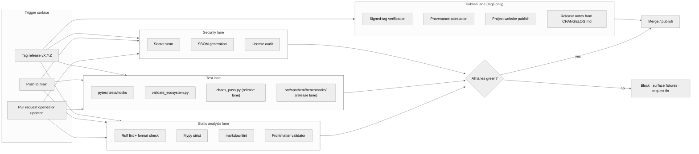

{/* SPDX-License-Identifier: MIT */}

**门控 Apothem 生态系统每次变更的构建 · 校验 · 发布工作流的结构性映射。**
本文档安装可视化表面；具体的 GitHub Actions 工作流文件与发布工具随后落地于
生产就绪安装之下。

## 流水线形态

## 泳道职责

- **静态分析泳道** —— 快速反馈。Ruff 覆盖 Python 风格与一套精选规则集；
  mypy 以 strict 强制类型纪律；markdownlint 约束文档表面；frontmatter
  校验器为规则、技能、委派工作者与命令门控工件 schema 合规性。
- **测试泳道** —— `pytest tests/hooks` 针对完整事件矩阵演练 hook 运行时；
  `validate_ecosystem.py` 是跨工件一致性的主要结构门控；`chaos_pass.py`
  与 `src/apothem/benchmarks/` 下的按类基准套件在发布泳道上激活，以捕捉
  在降级输入下的退化与运行时预算回归。
- **安全泳道** —— 密钥扫描捕获意外提交的凭据；SBOM 生成与许可证审计为任何
  生产就绪安装门控供应链表面。
- **发布泳道** —— 仅在打标签的发布上运行。签名标签验证确认发布分支的来源；
  项目网站从 `site/dist/` 发布到 GitHub Pages 目标;发布说明派生自
  `CHANGELOG.md` Keep-A-Changelog 格式。

## 具体配置

实际的工作流文件（`.github/workflows/ci.yml`、`.github/workflows/release.yml`
等）在生产就绪生态系统建设期间安装。本图定义每个未来配置都遵循的规范形态。

## 权威交叉引用

- `pyproject.toml` —— Ruff / mypy / pytest 配置的真相来源。
- `scripts/dev/validate_ecosystem.py` —— 主要的跨工件门控。
- `scripts/dev/validate_hooks.py` —— hook 专属的结构校验。
- `scripts/dev/chaos_pass.py` —— 对每个已配置 hook 的对抗性扫描。
- `src/apothem/benchmarks/` —— 按类的运行时预算校验器。
- `site/content/docs/developer-guide.mdx` —— 面向操作者的贡献者工作流。
- `CHANGELOG.md` —— 发布说明来源。
