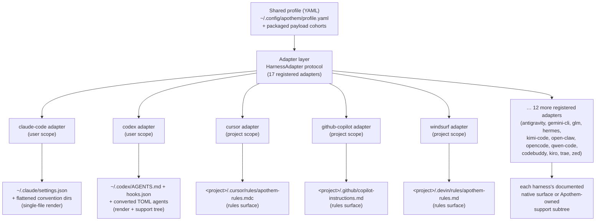

{/* SPDX-License-Identifier: MIT */}

Apothem 使用一份经模式校验的 YAML 配置文件作为语义层面的权威来源，
并通过实现 `HarnessAdapter` 协议的适配器类，派生出每个harness专属的安装面。
每个适配器写入该harness所记录的用户位置或项目位置，
仅当该harness没有匹配的原生原语时，才使用 Apothem 自有的支持路径。

## 为何需要适配器抽象

每个harness都说着不同的配置方言：一个想要 JSON 设置文件，
另一个想要一目录的 `.mdc` 规则文件，第三个想要一份单一的 Markdown 指令
文件。如果 Apothem 把这些知识硬编码进 CLI，每个harness都会把它的假设
泄漏进核心，而新增一个harness就意味着要同步改动安装、更新、卸载和校验
逻辑。

适配器模式将其反转。核心只知道 `HarnessAdapter`
协议——一份由生命周期方法组成的小型契约。每个harness的方言都驻留在
一个自包含的子包内，由它实现该契约。核心请求一个适配器去*安装*，
而不必知道这究竟意味着渲染一个 JSON
文件、写入一个规则目录，还是铺设一棵支持树。新的harness
通过满足该协议并注册一个入口点而加入；核心中无需任何改动。这正是 Apothem
保持宿主无关的结构性原因——该抽象就是那道边界，
它阻止harness专属的知识扩散开来。

## 适配器的形态

适配器分为两种物化形态，两者在注册表中皆可见：

- **单文件渲染器**将配置文件字段转译为一份harness原生的
  配置文件。例如，Claude Code 适配器总是从共享配置文件写出
  `~/.claude/settings.json`，并将 Apothem
  约定目录（`agents/`、`rules/`、`skills/`、……）摊平铺设在它旁边。
- **规则面与支持树适配器**将 Apothem 载荷
  cohort 传播到该harness所记录的规则位置，在存在原生格式时把 cohort 转换为
  原生格式，而把其余部分停放在一棵从原生锚点引用的
  Apothem 自有支持子树下。Cursor
  适配器把单个 `.cursor/rules/apothem-rules.mdc` 写入所提供的
  项目根目录，仅交付规则面。

某个给定的适配器要么是**用户作用域**（写入主目录之下），要么是
**项目作用域**（需要 `--project <path>` 并写入该目录树内部）；
注册表记录了它属于哪一种。

## 当前适配器拓扑



由中心向边缘的扇出，正是项目名称所编码的架构：一份
配置文件居于核心，每个harness都沿着各自的适配器处于等距之外。

## 协议定义

```python
from pathlib import Path
from typing import Protocol

class HarnessAdapter(Protocol):
    name: str
    output_path: Path

    def install(self, profile: dict[str, object]) -> object:
        ...

    def update(self, profile: dict[str, object]) -> object:
        ...

    def uninstall(self) -> None:
        ...

    def is_installed(self) -> bool:
        ...

    def verify(self) -> bool:
        ...
```

项目作用域适配器还可以在生命周期方法上额外接受 `project: Path | None`，
并暴露 `resolve_output_path(project)`。CLI 仅向方法签名接受
`--project PATH` 的适配器传入该参数。

## 入口点注册

适配器通过 `apothem.harnesses` setuptools 入口点分组进行注册：

```toml
[project.entry-points."apothem.harnesses"]
cursor = "apothem.harnesses.cursor:CursorAdapter"
```

位于 `src/apothem/lib/harness_registry.py` 的中央注册表记录了精确的
十七个公开 ID、入口点、文档路径、目标路径、包数据
要求、能力状态以及标准约定固定路径。CLI
通过该注册表加载适配器，而不是在每个命令中重新发现产品事实。

## 配置文件到原生的映射

每个适配器实现与其harness相适配的转译逻辑：

```
YAML profile + payload cohort    Harness-native surface
-----------------------------    ----------------------
identity / preferences       --> native config fields or rendered instruction context
commands/*.md                --> native commands or SKILL.md folders
rules/*.md                   --> native rules where supported, otherwise support trees
hooks/messages/*.md          --> native hooks where supported, otherwise support trees
agents/*.md                  --> native agent formats where supported
skills/*/SKILL.md            --> native skill folders where supported
```

不受支持和待发现的能力单元会在写入前变成结构化警告。
它们不会被静默地投射进臆造的供应商面。

## 添加新适配器

参见[编写harness适配器](/docs/examples/authoring-a-harness-adapter)
获取分步指南。
