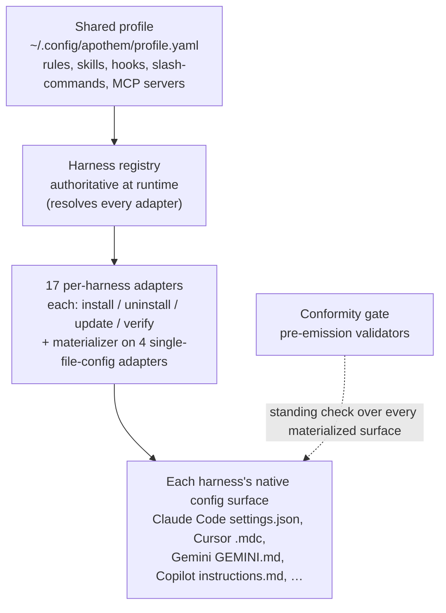

{/* SPDX-License-Identifier: MIT */}

Apothem 围绕一个核心理念构建：一份共享的治理配置档案，由每个环境对应的适配器
物化为各助手运行时的原生配置格式。本节讲解其结构组件——适配器协议、配置档案
模式、源代码树布局，以及将它们串联起来的安装工作流。

## 系统概览

一目了然，Apothem 就是一条流水线：一份共享配置档案输入环境注册表，注册表解析每个
环境对应的适配器；每个适配器将其环境的原生配置面物化，并由一道常驻的一致性门禁
检查每一个已物化的面。

## 页面

| 页面 | 描述 |
|------|-------------|
| [环境适配器抽象](/docs/architecture/harness-adapter-abstraction) | `HarnessAdapter` 协议——适配器如何将共享配置档案转换为平台原生配置。 |
| [共享配置档案模式](/docs/architecture/shared-profile-schema) | 位于 `~/.config/apothem/profile.yaml` 或 `--profile PATH` 的由模式支撑的 YAML 配置档案。 |
| [源代码布局](/docs/architecture/source-layout) | 为何 Apothem 采用 `src/` 布局，以及代码树的组织方式。 |
| [安装工作流](/docs/architecture/installation-workflow) | `apothem install`、`update` 和 `uninstall` 如何端到端工作。 |
| [委派工作者](/docs/architecture/agents) | 面向在本仓库中运行的多工作者运行时的仓库范围指令。 |
| [自包含运行时](/docs/architecture/self-contained-runtime) | Apothem 的引擎如何从任意检出运行——内联依赖、PYTHONPATH=src 调用模型，以及插件树引导。 |
| [依赖内联策略](/docs/architecture/vendoring-strategy) | Apothem 在 src/apothem/_vendor/ 下内联哪些第三方包、哪些保留为系统前置条件，以及内联副本如何刷新。 |
| [Cohort 打包契约](/docs/architecture/cohort-packaging-contract) | 用于 cohort 打包与插件清单的稳定、可供下游消费的契约——枚举 cohort 并解析其每个harness的原生目标，而无需重新推导映射。 |
| [CI/CD 流水线图](/docs/architecture/cicd-pipeline) | 门控每次代码变更与发布的构建、测试、lint、安全与发布工作流阶段的可视化映射与泳道分解。 |
