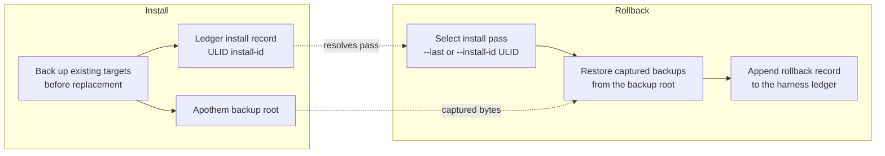

{/* SPDX-License-Identifier: MIT */}

## 安装流程

```mermaid
flowchart TD
    accTitle: Apothem install workflow
    accDescr: Top-down flowchart of the apothem install command from CLI invocation through adapter lookup, profile load, adapter install call, native config write, and final apothem verify check.
    A[apothem install --harness X] --> B[Resolve adapter through registry]
    B --> C[Load and validate profile YAML<br/>before writes]
    C --> D[Adapter.install(profile, project)]
    D --> E[Write native config and support cohorts]
    E --> F[apothem verify --harness X]
    F --> G{All checks pass?}
    G -- yes --> H[Done]
    G -- no --> I[Report failures]
```

## 更新流程

执行 `apothem update --harness X` 时：

1. 加载并验证 `~/.config/apothem/profile.yaml` 或 `--profile PATH`。
2. 通过中央注册表解析所选 harness 或 `all`。
3. 在首次写入之前验证完整的物化计划。
4. 调用 `Adapter.update(profile, project=...)`。
5. 报告已创建、已更新、未更改、已跳过、警告和错误的结果。

## 卸载流程

执行 `apothem uninstall --harness X` 时：

1. 调用 `Adapter.uninstall()`。
2. 适配器仅移除它写入的文件；共享配置档案 YAML 和
   无关的、由操作者编写的文件不会被触及。

## 范围解析

每个适配器都写入自己固定的安装根目录：用户范围适配器写入用户主目录，
项目范围适配器写入项目本地。CLI 不暴露
`--scope` 标志；项目范围适配器需要 `--project <path>`。每个
目标位置都记录在
`site/content/docs/harnesses/<harness>.mdx`。

## 错误处理

安装/更新操作会在写入前进行验证，在替换前备份现有的匹配
目标，并且只在共享发现目录中合并由 Apothem 管理的子条目。`--dry-run` 执行相同的验证，
返回已跳过或未更改的结果，而不创建任何目录或文件。

## Reversibility (backup and rollback)

Every install pass is reversible. Replaced bytes are captured into the Apothem
backup root and the pass is recorded in the harness ledger under a ULID
install id; [`apothem rollback`](/docs/cli-reference/rollback) selects a
recorded pass and restores those captured backups.


