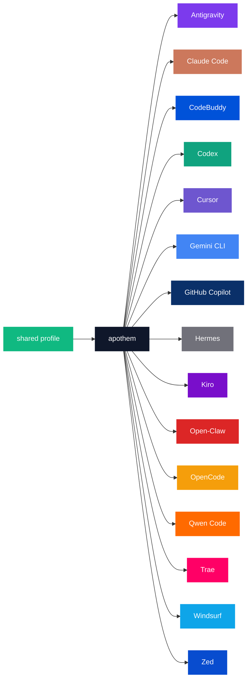

{/* SPDX-License-Identifier: MIT */}

下方规范的品牌名称 × 颜色码枚举包裹在 `text` 围栏中，以保留调板目录用途所要求的逐工具逐字标识符。

## Apothem 核心

| 令牌 | 浅色 | 深色 | 用途 |
|---|---|---|---|
| `apothem-hub` | `#0F172A` | `#F1F5F9` | 每张架构图中的中央分发节点（"apothem"），以及 Apothem 标识的中央枢纽。 |
| `shared-profile` | `#10B981` | `#34D399` | 馈入 apothem 核心的事实来源配置档案。 |

## 工具调板

十七个工具中的十五个按其主品牌识别色着色。其余两个 —— `glm` 与
`kimi-code` —— 尚未定义品牌色；一旦上游品牌色确定，就会按 [更新](#updates)
下的传播步骤补上它们的行。

```text
| Token             | Light     | Dark      | Source                                                                                                                                              |
|-------------------|-----------|-----------|-----------------------------------------------------------------------------------------------------------------------------------------------------|
| `antigravity`     | `#7C3AED` | `#9F67FF` | Google Antigravity deep-purple.                                                                                                                     |
| `claude-code`     | `#CC785C` | `#E89378` | Anthropic terracotta-orange.                                                                                                                        |
| `codebuddy`       | `#0052D9` | `#5E8EF7` | Tencent CodeBuddy blue.                                                                                                                             |
| `codex`           | `#10A37F` | `#19C796` | OpenAI signature teal.                                                                                                                              |
| `cursor`          | `#6E56CF` | `#9B85E3` | Cursor brand purple.                                                                                                                                |
| `gemini-cli`      | `#4285F4` | `#6BA4F7` | Google blue (primary); the Apothem mark renders the node with all four Google brand hues `#4285F4` / `#34A853` / `#FBBC04` / `#EA4335`.             |
| `github-copilot`  | `#0A3069` | `#5B8FE3` | GitHub Mona deep-blue.                                                                                                                              |
| `hermes`          | `#71717A` | `#A1A1AA` | Community silver-grey.                                                                                                                              |
| `kiro`            | `#790ECB` | `#A862DD` | Kiro violet.                                                                                                                                        |
| `open-claw`       | `#DC2626` | `#F87171` | Community red-orange.                                                                                                                               |
| `opencode`        | `#F59E0B` | `#FBBF24` | Community amber.                                                                                                                                    |
| `qwen-code`       | `#FF6A00` | `#FF8C40` | Alibaba Qwen orange.                                                                                                                                |
| `trae`            | `#FF0066` | `#FF599C` | ByteDance Trae magenta.                                                                                                                             |
| `windsurf`        | `#0EA5E9` | `#38BDF8` | Windsurf sky-blue.                                                                                                                                  |
| `zed`             | `#084CCF` | `#5E8BE0` | Zed Industries blue.                                                                                                                                |
```

## 命名理据

- **`apothem-hub`**——名称所唤起的几何中心（正多边形的边心距指向其核心）。
- **`shared-profile`**——上游源头，与任何单一工具色彩有别，因此在每张图中读起来都像是"输入"箭头。
- **逐工具令牌**镜像贯穿代码库使用的工具 slug（`harnesses/<slug>/`、入口点键、CLI 的 `--harness <slug>` 参数）。一个概念一个词；同一字符串处处一致。

## Mermaid 用法



## 无障碍

每个浅色模式令牌在不扭曲品牌色的前提下，对白色文本满足 WCAG 2.2 AA 对比度（≥4.5 : 1）。当某个工具的原生品牌色单独对白色文本低于 AA 阈值时（尤其是上文枚举的琥珀／橙色系令牌以及天蓝／青绿色系令牌），需要 WCAG AA 文本-对-色对比度的图会使用**深色模式变体**（提亮的色调）作为图填充色，使白色文本读起来清晰。深色模式列正是为此目的而校准：每个深色模式令牌对白色文本均通过 AA。

## 更新

仅当某个工具在上游批准品牌变更时，调板才会更新。逐工具的品牌变更跨 `site/app/global.css`、本页以及 `assets/src/` 下每个受影响的 SVG 母版原子化传播。
