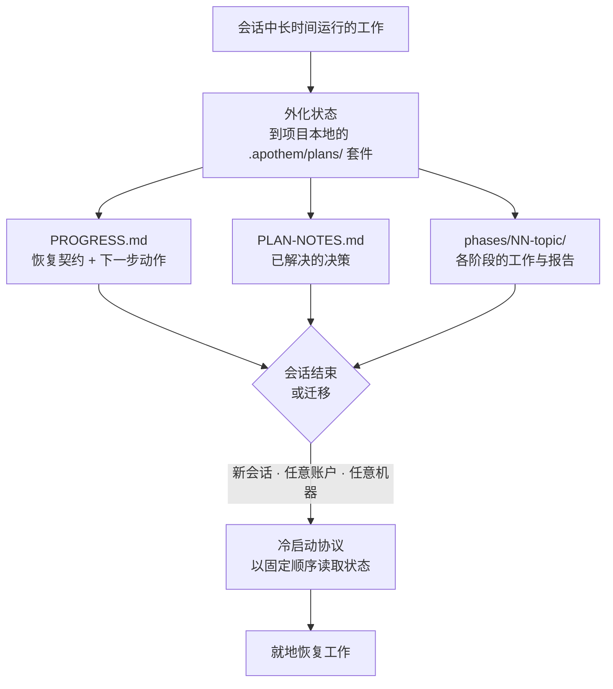

{/* SPDX-License-Identifier: MIT */}

绝大多数受辅助的编码工作都在一次对话中诞生、也在其中消亡。关闭聊天、切换机器，或者用另一个账户登录，你正在进行的工作线索就消失了——下一次会话从冷启动开始，对你已经做出的决策没有任何记忆。

Apothem 把这一点反转过来。对于长时间运行的多步骤工作，它会将其**完整的工作状态**外化到项目本地的 `.apothem/plans/` 套件（仍保留 `.plans/` 作为受支持的向后兼容回退）——这些文件存放在你的仓库里，而不是任何一处云端聊天历史的内部。状态才是持久的产物；会话则是可丢弃的。

## 核心理念

位于 `<project-root>/.apothem/plans/{suite}/` 的规划套件承载着两样东西，使一次会话变得可替换：

- **恢复契约。** `PROGRESS.md` 记录当前阶段与任务状态、精确的下一步动作、生效的约定、已经解决的决策，以及下一次会话必须读取的确切文件。
- **冷启动协议。** 新会话以固定顺序读取这些文件，并在做任何工作之前重新建立起完整的全貌——无需对话历史。

由于该状态位于你项目的文件中，指向同一项目的**任意账户或机器**上的新会话都会就地接续工作。没有任何东西被锁在某一份聊天记录之内。正是这一性质，使结构化的、大规模的、跨越多日的工作——大型语料、漫长迁移、大规模评审通查——能够跨越那些本会终结它的边界继续存活。

## 它究竟是什么

为使保证清晰，准确地表述如下：

- **它是**外化到文件中的状态，加上一套冷启动恢复协议。工作之所以能够恢复，是因为状态存活在你项目的文件中，独立于任何会话、账户或机器。
- **它不是**自动的跨账户同步服务。Apothem 不会自行在账户之间推送你的规划状态——文件以你项目文件本就移动的方式移动（版本控制、共享的 checkout、同步的目录）。Apothem 所保证的是：无论项目文件落到何处，新会话都能从中恢复。

## 为何这很重要

工作越长、越大，单一对话就越成为负担。一次跨越多日的大改造，或者一次横扫大型代码库的通查，都会比任何单一会话存活得更久——上下文窗口被压缩、会话超时、机器更换。Apothem 把项目自身的文件当作进行中工作的真实来源，从而使工作对会话、账户与机器这三重边界都具有韧性。

## 状态存放在何处

| 产物 | 位置 | 承载内容 |
|----------|----------|-------|
| 规划套件 | `<project-root>/.apothem/plans/{suite}/` | 进行中工作的一个自洽单元 |
| 恢复契约 | `<suite>/PROGRESS.md` | 阶段/任务状态、下一步动作、约定、关键文件清单 |
| 决策台账 | `<suite>/PLAN-NOTES.md` | 已解决的决策，永不重复询问 |
| 各阶段工作 | `<suite>/phases/NN-topic/` | 该阶段的任务及其报告 |

规划树由 Apothem 的标准 `.gitignore` 片段从版本控制中排除，因此规划状态默认保留在本地。若要有意地在机器或账户之间携带进行中的工作，请像移动任何其他项目文件一样移动 `.apothem/plans/` 套件（`.plans/` 仍作为回退保留）。

## 相关

- **[严肃度层级](/docs/concepts/seriousness-tiers)**——治理与状态外化的纪律如何随参与程度伸缩。
- **[命令流水线](/docs/pipeline)**——创建并推进规划套件的 `/plan` 各个阶段。

## Recommended Next Step

**阅读[严肃度层级](/docs/concepts/seriousness-tiers)**，了解外化纪律如何从一次快速实验一直伸缩到跨越边界、历时多日的工作。
