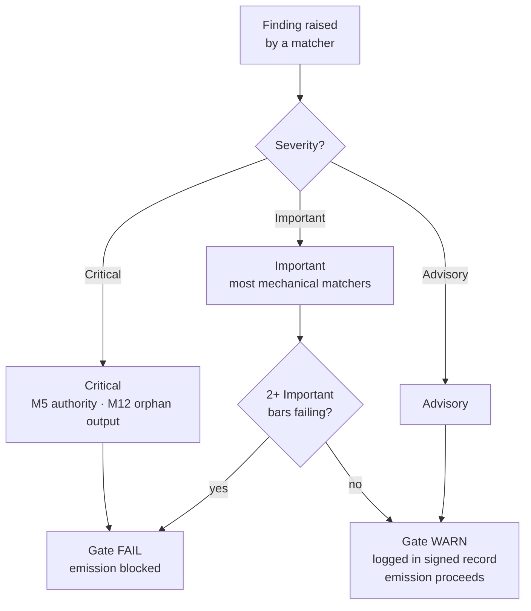

{/* SPDX-License-Identifier: MIT */}

## 十五项

| 项 | ID | 强制规定 | 检查类别 | 失败 → 行动 |
|---|---|---|---|---|
| 1 | M1 | 宿主项目无关性 | 推理式 | 修订以匹配宿主惯例 |
| 2 | M2 | 编辑纪律（披露登记册） | 机械式 | 添加披露标记 |
| 3 | M3 | 十大质量维度 | 推理式 | 在失败维度上修订 |
| 4 | M4 | 自我适用（存在已签署的闸门记录） | 机械式 | 记录已签署记录块 |
| 5 | M5 | 权威原则（不捏造身份／端点／密钥） | 机械式 | 转入询问 |
| 6 | M6 | 专业知识融入（浮现的缺口） | 推理式 | 浮现缺口；引述精炼 |
| 7 | M7 | 选项标注（推荐标记加理由依据） | 机械式 | 标注选项集 |
| 8 | M8 | 确定性（规定性散文中无含糊） | 机械式 | 将含糊提升为条件分支 |
| 9 | M9 | 视觉杠杆（结构性主题承载图示） | 推理式 | 创作／刷新图示 |
| 10 | M10 | 双向绑定（互惠反向指针闭合） | 机械式 | 闭合半边 |
| 11 | M11 | 敏捷冲刺（目标／待办／就绪定义／完成定义／评审／回顾） | 推理式 | 重构为冲刺 |
| 12 | M12 | 阶段报告与规范布局 | 机械式 | 创作汇总；迁移至规范布局 |
| 13 | M13 | 代码工艺（检查／格式化／类型检查；魔法数字；裸 except） | 机械式 | 按各语言代码工艺规则修订 |
| 14 | M14 | 系统性（声明上游／下游／同级／执行者） | 推理式 | 声明；在登记册中编入索引 |
| 15 | M15 | 生产就绪（测试 + 文档 + CHANGELOG + 合规提交 + CI 通过 + semver 稳定性） | 机械式 | 添加缺失的表面 |

## 严重性阶梯

| 严重性 | 对闸门的影响 |
|---|---|
| **关键** | 闸门 FAIL——无条件阻止发射 |
| **重要** | 当 2 项及以上重要项同时失败时，闸门 FAIL |
| **建议性** | 闸门 WARN——记录在已签署记录中；不阻止发射 |

大多数机械化部分的匹配器默认为**重要**。M5（权威——密钥、捏造的端点）和 M12（孤儿输出）为**关键**。



## 机械化部分的匹配器

机械化部分存放于 [`src/apothem/conformity/*_grep.py`](https://github.com/ahmed-g-gad/apothem/tree/main/src/apothem/conformity)，由 [`src/apothem/conformity/gate.py`](https://github.com/ahmed-g-gad/apothem/blob/main/src/apothem/conformity/gate.py) 编排。

| 匹配器 | 项 | 功能 |
|---|---|---|
| `hedging_grep.py` | M8 | 检测规定性散文中的含糊措辞 |
| `option_annotation_grep.py` | M7 | 验证选项集上的 `**Recommended**` 标记加理由依据 |
| `user_confirm_grep.py` | M5 | 阻止 `<USER-CONFIRM:…>` 占位符发射 |
| `binding_reciprocity_grep.py` | M10 | 检测 `## Bindings (§0.j five-direction)` 中的半边 |
| `orphan_output_grep.py` | M12 | 标记无消费者／无索引条目／无生产者归属的制品 |
| `bare_except_grep.py` | M13 | 检测无说明注释的 `except:` ／ `except Exception:` |
| `magic_number_grep.py` | M13 | 检测业务逻辑中的数字字面量 |
| `commented_out_code_grep.py` | M13 | 检测被注释掉的代码块 |
| `file_header_grep.py` | M13 | 验证单行 SPDX 许可头的存在 |
| `frontmatter_grep.py` | M14 | 验证下列四个权威指令目录上的必需前置字段 |
| `semver_stability_grep.py` | M15 | 检测无 MAJOR 版本号提升的破坏性公共 API 变更 |
| `production_ready_pr_grep.py` | M15 | 验证同一变更集纪律（测试 + 文档 + CHANGELOG） |
| `secret_leak_grep.py` | M15 | 检测硬编码的密钥／凭据 |
| `unpinned_action_grep.py` | M15 | 验证 GitHub Actions 锁定到 commit SHA |
| `always_on_budget_grep.py` | 预算上限 | 将常驻规则正文限制在 500 个实质性 token 以内 |

## 运行闸门

在已安装的harness上，闸门自动运行：Claude Code 的
`settings.json` 将其作为 `PreToolUse` 钩子接入，在每次
Write/Edit 之前调用 `~/.claude/.apothem/support/conformity/gate.py` 处的
物化副本。从源码检出中，模块形式驱动同一套代码：

```shell
# 单文件分发（模仿 PreToolUse 钩子）：
echo '{"tool_input": {"file_path": "path/to/file", "content": "..."}}' \
    | python -m apothem.conformity.gate --hook

# 跨仓库的组合扫描：
python -m apothem.conformity.gate --sweep src/ site/content/docs/ rules/
```

完整流程参见[运行合规闸门](/docs/usage/conformity-gate)。

## 参考

- [预发射闸门登记册](/docs/governance/pre-emission-gate-registry)——权威的项定义
- [对外合规登记册](/docs/governance/outward-conformity-registry)——M1–M15 详细语义
- [交叉强制规定](/docs/governance/cross-cutting-mandates)——强制规定的真相来源
- [性能纪律](https://github.com/ahmed-g-gad/apothem/blob/main/src/apothem/rules/performance-discipline.md)——各类别运行时预算
