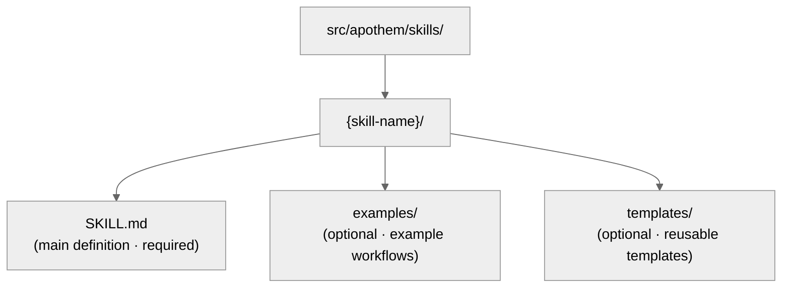

{/* SPDX-License-Identifier: MIT */}

本指南帮助开发者以 SOTA 质量标准维护和扩展 Apothem 生态。

## 快速参考：工件类型

Apothem 生态包含五种工件类型，每种都有特定的用途与前置元数据要求。

| 工件 | 路径 | 用途 | 何时创建 |
| -------- | ---- | ------- | -------------- |
| **规则** | `src/apothem/rules/*.md` | 行为戒律或操作指令 | 确立新的原则、政策或治理戒律时 |
| **命令** | `src/apothem/commands/*.md` | 用于复杂工作流的斜杠命令（`/command-name`） | 新的多步骤用户工作流 |
| **辅助器** | 辅助器目录（每文件一个 `*.md`） | 用于并行任务的持久化委托工作者定义 | 新的反复出现的专项任务（审计、探索、质量检查） |
| **技能** | `src/apothem/skills/{name}/SKILL.md` | 带有检测信号的可复用技法 | 新的可检测、可复用的技法模式 |
| **钩子** | `src/apothem/hooks/` + `settings.json` | 事件触发的验证或状态管理 | 新的生命周期事件或验证需求 |

## 工具适配器契约

工具的身份与能力事实位于
`src/apothem/lib/harness_registry.py`。只有当以下各个表面一致时，对某个工具的
变更才算完成：

| 表面 | 所需更新 |
| --- | --- |
| 注册表行 | 公开 ID、包键、入口点、作用域、输出格式、目标路径、文档路径、能力文件、标准固定、固定装置测试、package-data 键、模板源以及能力状态。 |
| 适配器包 | `__init__.py`、`install.py`、`update.py`、`uninstall.py`、`verify.py`；仅当该工具渲染原生配置文件时才添加 `materializer.py`。 |
| 传播清单 | 由清单支持的适配器的模板与集合路径。 |
| 能力 | `src/apothem/harnesses/<package>/capabilities.yml`，其中包含每项所需能力，以及对不支持或待发现状态的理由说明。 |
| 约定固定 | `STANDARD-CONVENTION-PIN.md`，包含厂商 URL、快照日期、规范文件名/模式、证据引用，以及不支持能力的理由。 |
| 测试 | 注册表对等性、适配器固定装置测试、黄金安装计划行、试运行/不写入行为、幂等性以及 package-data 覆盖。 |
| 文档 | 工具参考页、对比页、能力/MCP 说明，以及使用假占位符的示例。 |

项目作用域的适配器必须设置 `requires_project = True`，在生命周期方法上接受
`project: Path | None`，并在写入前拒绝缺失或不安全的项目根目录。用户作用域的
适配器必须将路径保持在该工具所记录的用户配置根目录之下。

## 黄金固定装置策略

`tests/fixtures/harness-golden-plans.json` 记录了全部十七个注册表工具的公开
安装计划形态：公开 ID、物化模式、源集合/模板路径，以及 `<ROOT>` 下归一化的
目标路径。当注册表、清单或模板目标行为发生有意更改时，请在与源变更相同的
提交中更新黄金固定装置，使差异显示行为增量。

## 写入前验证

共享的安装驱动在首次写入之前验证每个源与目标。它会拒绝缺失的清单源、目标
穿越、所选根目录之外的目标路径，以及符号链接跨越。试运行执行相同的验证，
并在不创建文件的情况下返回结构化的 `skipped` 或 `unchanged` 结果。

## 编辑与示例数据

配置文件诊断会对 token、secret、password、credential、API key、private key、
authorization、auth 以及 header 形态的字段进行编辑屏蔽。文档、固定装置、示例
与 JSON 片段使用 `example.invalid`、`Example User`、`example-user` 以及显而易见的
占位符，而非看起来像真实机密或个人账户的内容。

## 在你动笔之前：规范模式

**所有工件都必须遵循 `site/content/docs/reference/artifact-schema.mdx` 中的模式。**
这一点没有商量余地。

- 阅读 `site/content/docs/reference/artifact-schema.mdx` § “Schema” 中对应你工件类型的部分
- 复制必填字段
- 填写必填值
- 按需添加可选字段

## 前置元数据快速检查

每个工件的前置元数据都必须通过以下检查：

```yaml
✓ 有效的 YAML 语法（在可用处使用工具：`yamllint` 或 PowerShell `ConvertFrom-Yaml`）
✓ 所有必填字段齐备（按工件类型的模式）
✓ name: 使用 kebab-case
✓ version: 语义化 MAJOR.MINOR.PATCH
✓ updated: ISO 8601 日期（YYYY-MM-DD）
✓ description: 单行、非空
✓ scope: 有效枚举（always-on|path-filtered|other）
✓ portability: 有效枚举（`universal` | `universal-with-windows-caveats` | `unix-only` | `windows-only`）
✓ 字段名无拼写错误 —— 必须与规范模式完全一致
✓ 可选字段使用正确的枚举值
```

## 命名约定

### 工件名称（kebab-case）

- **规则：** `operational-mandates`、`clean-room-generation`、`context-management`
- **命令：** `plan-execute`、`plan-spec`、`plan-generate`
- **辅助器：** `codebase-explorer`、`convention-auditor`、`quality-gate`
- **技能：** `plan-suite`、`ecosystem-audit`

模式：小写、单词之间用连字符、无空格或下划线。

### 文件命名

- **规则：** `{name}.md`
- **命令：** `{name}.md`
- **辅助器：** `{name}.md`
- **技能：** 位于文件夹 `src/apothem/skills/{name}/SKILL.md` 之内（精确大小写：`SKILL.md`）
- **钩子：** 位于文件夹 `src/apothem/hooks/` 之内。所有事件处理器都是 Python。每个
  `settings.json` 钩子命令都使用 exec 形式（`python` 加 `args`）来调用
  `-m apothem.hooks.dispatch <event> [<message-name>]` 或
  `-m apothem.conformity.gate --hook`。`dispatch.py` 将 `SessionStart` 路由到
  `session_start_bootstrap.main()`，并将其他每个白名单事件路由到
  `emit_hook_context.main()`。`src/apothem/hooks/` 或 `scripts/` 下唯一允许的
  shell 垫片是四个定位器 + 引导文件（`find-python.{ps1,sh}`、`bootstrap.{ps1,sh}`）；
  任何其他 `.ps1` / `.sh` 文件都会使 `scripts/dev/validate_hooks.py` 卫生检查失败。

### 交叉引用

在引用其他工件时，使用精确名称：

- 规则：`"operational-mandates"`（name 字段值）
- 命令：`/plan-execute`（人类文档中带斜杠；代码中不带）
- 辅助器：`codebase-explorer`（name 字段值）
- 技能：`plan-suite`（name 字段值）

在散文中绝不使用文件路径或截断后的名称。

## 可移植性：Windows 与 Unix

每个工件都必须显式声明其可移植性状态。

### 通用（默认）

- 在 Windows、macOS 与 Linux 上行为相同
- 不作 shell 假设
- 路径使用正斜杠（`/`）
- 无硬编码的绝对路径
- 无 Windows 特定的 PowerShell 语法

```yaml
portability: "universal"
```

### 通用但带 Windows 注意事项

- 在 POSIX 主机间通用；命名的注意事项适用于内容中所声明的 Windows 平台变体
- 在内容中显式记录该注意事项
- 示例：“Win 10 之前的 Windows 不支持符号链接”

```yaml
portability: "universal-with-windows-caveats"
```

在标题之后立即以一条说明记录该注意事项。

### 仅 Unix / 仅 Windows

- 显式限制于一个平台
- 在 Apothem 中罕见 —— 大多数应当是通用的
- 仅在平台特定特性必不可少时使用

```yaml
portability: "unix-only"
```

在规则的第一节中记录原因。

## 作用域：始终生效与路径过滤

### 始终生效

规则随处适用。

```yaml
scope: "always-on"
```

### 路径过滤

规则基于文件路径有条件地适用。

```yaml
scope: "path-filtered"
pathFilter: "**/*.py, **/*.toml"
```

`pathFilter` 使用 glob 模式（与 `.gitignore` 相同的格式）。当某文件匹配该
过滤器时，规则被激活。

## 版本语义

每个工件都携带自己的语义化版本（`MAJOR.MINOR.PATCH`）：

- **PATCH** —— 拼写修正、格式化、链接刷新、仅注释的编辑。行为不变。
- **MINOR** —— 增量的非破坏性变更：新的可选章节、额外的反模式、新的可选前置元数据字段、新的示例。现有消费者无需更改即可继续工作。
- **MAJOR** —— 破坏性的模式或契约变更：删除的章节、重命名的字段、对现有指令行为的改动、需要下游工件适配的变更。

示例：

- `vX.Y.Z` → `vX.Y.(Z+1)`（PATCH：拼写修正）
- `vX.Y.Z` → `vX.(Y+1).0`（MINOR：新增反模式条目）
- `vX.Y.Z` → `v(X+1).0.0`（MAJOR：声明契约稳定）
- `vX.Y.Z` → `v(X+1).0.0`（MAJOR：移除必填前置元数据字段）

在每次改动行为的编辑中同时提升 `version` 与 `updated`。对于捆绑工件变更的
发布，在生态级的 `CHANGELOG.md` 中追加一条相匹配的记录。

## 何时编辑工件

### 规则

- 将 必填/可选 结构视为承重的 —— 重构它会波及每个依赖工件（需要 MAJOR 提升）。
- 随着理解的加深，精炼反模式、严肃度分级示例与引用（MINOR 提升）。
- 在相关的记忆主题文件中记录任何结构性变更的理由。

### 命令

- 参数形态是公开契约的一部分 —— 仅在明确意图下打破它，并将变更传播到每个调用方（MAJOR 提升）。
- 保持工作流步骤与返回契约紧凑且最新。
- 在内联处记录不显而易见的步骤排序。

### 辅助器

- 将 `disallowedTools` 保持为最小但充分；在其变更时记录理由。
- 随着辅助器角色的成熟精炼操作原则与返回契约（MINOR 提升）。
- 在内联处追踪能力变化，使调用方能够重新校准预期。

### 技能

- 保持流程步骤与示例与现实同步。
- 检测信号必须反映当前用法中真实的用户措辞。
- 一旦技能超过约 150 行就将其拆分（参见
  `auto-memory.md` § 主题文件管理）。

## 分步：添加新规则

### 1. 评估正交性

这条规则是否与现有规则重叠？在 `src/apothem/rules/` 中搜索相关内容。

如果重叠 >50%，请考虑扩展现有规则。参见
`persistent-conventions-vigilance.md` § 工件演化。

### 2. 撰写内容

遵循该结构：

- 标题：`# Rule: {Title}`
- 用途章节
- 义务 / 核心指令（编号、带链接）
- 严肃度分级表（始终必需）
- 反模式章节
- 强制执行章节

### 3. 创建前置元数据

使用 `site/content/docs/reference/artifact-schema.mdx` § Schema: Rules 中的模式。设置：

- `name:` kebab-case 标识符
- `version:` `"X.Y.Z"`（初始）
- `updated:` 今天的日期，ISO 8601 格式
- `scope:` `always-on` 或 `path-filtered`
- `portability:` `universal`（或在需要时带注意事项）
- `implements:` 列出该规则覆盖的 CM/TM/CP 戒律

示例：

```yaml
---
name: "my-new-rule"
description: "Brief one-liner"
pathFilter: ""
alwaysApply: true
---
```

### 4. 更新 CLAUDE.md

在 `§7.2 Rules` 注册表表格中添加条目：

```markdown
| My New Rule | `src/apothem/rules/my-new-rule.md` | Always-on | CM-5/CM-21 |
```

在表格内保持字母顺序。

### 5. 追加到 CHANGELOG.md

在下一个发布的 `### Added` 章节下添加一行，描述这条新规则。

### 6. 运行验证

调用 `ecosystem-audit` 技能以验证新规则，重点关注 rules 区域：

```text
Invoke the ecosystem-audit skill with --focus rules --fix
```

确认你的新规则没有报告错误。

## 分步：添加新命令

命令是诸如 `/plan-spec`、`/plan-execute`、`/security-audit` 等斜杠命令。

### 1. 确定角色

命令**绝不**意图由harness运行时孤立地调用。它们是用户触发的工作流。请问：

- 这是用户键入 `/command-name` 的工作流吗？
- 它是否编排多个步骤？
- 它是否可能超时或在执行中途需要用户输入？

如果其中任一答案为“否”，那它大概是一个技能，而非命令。

### 2. 创建文件

路径：`src/apothem/commands/{name}.md`

前置元数据（来自 `site/content/docs/reference/artifact-schema.mdx` § Schema: Commands）：

```yaml
---
name: "my-command"
version: "X.Y.Z"
updated: "2026-04-20"
description: "What this command does"
argument-hint: "[path/to/input] [--flag VALUE]"
disable-model-invocation: true
portability: "universal"
allowed-tools: "*"
---
```

对于命令始终设置 `disable-model-invocation: true`。

### 3. 撰写内容

结构：

- 标题：`# /{name} — Human-Readable Title`
- 角色章节（谁执行它）
- 高层级指令
- 带步骤的工作流章节
- 返回契约 / 输出格式

### 4. 更新 CLAUDE.md 与 CHANGELOG.md

在 `§7.1 Commands` 中加注册表行；在下一个发布的 `### Added` 章节下加 CHANGELOG 行。

### 5. 验证

调用 `ecosystem-audit` 技能，重点关注 commands：

```text
Invoke the ecosystem-audit skill with --focus commands --fix
```

## 分步：添加新辅助器

辅助器是用于并行工作的持久化委托工作者定义。

### 1. 识别模式

这个辅助器是否符合下列某个团队模式？

- 研究团队：只读、信息收集
- 审计团队：验证、一致性检查
- 实现团队：并行代码变更
- 质量团队：代码检查、测试、类型检查、安全
- 文档团队：文档更新
- 其他：专项任务

### 2. 创建文件

路径：

```text
src/apothem/agents/{name}.md
```

前置元数据：

```yaml
---
name: "my-helper"
version: "X.Y.Z"
updated: "2026-04-20"
description: "What this helper specializes in"
tools: "Read, Glob, Grep, Bash"
disallowedTools: "Write, Edit"
maxTurns: 15
effort: "high"
permissionMode: "default"
memory: false
portability: "universal"
---
```

### 3. 撰写内容

章节：

- 操作原则（只读、基于证据、二元裁定、详尽）
- 工作流（编号步骤）
- 返回契约（最大 token 数、结构、必填字段）

### 4. 更新 CLAUDE.md 与 CHANGELOG.md

在 `§7.3 Helpers` 中加注册表行；在下一个发布的 `### Added` 章节下加 CHANGELOG 行。

### 5. 测试

在真实场景中部署该辅助器，并验证其按文档所述工作。

## 分步：添加新技能

技能是可复用、可检测的技法。

### 1. 识别可复用性

在编写技能之前：

- 你是否见过这个问题/技法 3 次以上？
- 它是否可检测？（是否有用户请求模式标示它？）
- 你能否将其可复现地编码下来？

如果三者皆为“是”，则编写一个技能。

### 2. 创建结构



### 3. 撰写 SKILL.md

前置元数据：

```yaml
---
name: "skill-name"
version: "X.Y.Z"
updated: "2026-04-20"
description: "What this skill teaches"
archetype: "workflow-template"
userInvocable: true | false
disable-model-invocation: true | false
allowed-tools: "Read, Glob, Grep"
argument-hint: "[args]"               # optional; if userInvocable
effort: "max"                          # optional
---
```

内容结构：

- 用途
- 何时使用此技能
- 前置条件
- 分步流程
- 常见错误
- 示例

### 4. 更新 CLAUDE.md 与 CHANGELOG.md

在 `§7.5 Skills` 中加注册表行；在下一个发布的 `### Added` 章节下加 CHANGELOG 行。

### 5. 验证

调用 `ecosystem-audit` 技能，重点关注 skills：

```text
Invoke the ecosystem-audit skill with --focus skills --fix
```

## 提交前验证清单

- [ ] 前置元数据通过 YAML 语法检查
- [ ] 按模式所有必填字段齐备
- [ ] `name` 字段使用 kebab-case
- [ ] `version` 是语义化的（`MAJOR.MINOR.PATCH`），且在行为变更时已提升
- [ ] 对于你触及的任何工件，`updated` 与今天的日期一致
- [ ] `portability` 字段已设置且有效
- [ ] CHANGELOG.md 在下一个发布的章节下以合适的类别载有该变更
- [ ] 无计划内部引用（CM-7 合规）
- [ ] 交叉引用与其他工件一致
- [ ] 新工件已在 CLAUDE.md 注册表中登记
- [ ] 工件已测试（如适用）
- [ ] `ecosystem-audit` 技能运行无错误
- [ ] 内容遵循结构性约定（标题格式、章节等）

## 引用其他工件

使用这些精确约定：

### 引用规则

```markdown
See `src/apothem/rules/operational-mandates.md` or shorthand: the Operational Mandates rule.
In prose: ... per CM-1–10 (Operational Mandates rule) ...
```

### 引用命令

```markdown
See `/plan-execute` command. Or: Run `/plan-execute`.
In prose: The `/plan-execute` command handles phase execution.
```

### 引用辅助器

```markdown
Deploy the `codebase-explorer` delegated worker.
In prose: The codebase-explorer worker finds patterns.
```

### 引用技能

```markdown
Use the `plan-suite` skill.
In prose: The plan-suite skill provides the Master Plan Suite template.
```

### 引用 CLAUDE.md 章节

```markdown
See CLAUDE.md § 7.2 (Rules registry).
Or: Section 4 (Seriousness-Scaled Governance).
```

## 代码检查与格式

所有工件都使用：

- **Markdown：** GFM（GitHub 风味 Markdown）
- **YAML：** 符合 YAML 1.2
- **行尾：** LF（Unix 风格）
- **编码：** UTF-8
- **行宽：** 内容在 100 字符处软换行（无硬断行）

对 Python 文件使用 `Ruff` 格式化器 / 代码检查器。对 Markdown，使用
`prettier` 或同等工具。

## 生态审计：运行验证

两个互补的验证表面覆盖了生态：

**机器可检查（Python 验证器）** —— 在每次提交前运行：

```bash
python scripts/dev/validate_hooks.py       # Hook structure + Python-only hygiene
python scripts/dev/validate_ecosystem.py   # Full tree + frontmatter + delegated hook checks
python scripts/dev/chaos_pass.py           # Adversarial sweep across configured hooks
pytest tests                                    # Unit tests for the hook runtime
```

**由harness驱动** —— 用于交叉引用、叙述与约定审计：

```bash
/ecosystem-audit --focus all --fix
```

它会并行运行：

- **结构审计：** 注册表准确性、文件存在性、前置元数据有效性
- **工件审计：** 交叉引用、戒律覆盖、流水线排序
- **记忆审计：** 记忆文件声称与文件系统状态的对照

期望输出：两个表面均为 `PASS` 且零发现项。

如果报告了 `FINDINGS`：

- 审阅每个发现项的严重程度（Critical / Important / Advisory）
- 立即处理 Critical 项
- 为下一周期规划 Important 项
- 为下一次迭代考虑 Advisory 项

---

## 有问题？

请参考：

- 前置元数据模式：`site/content/docs/reference/artifact-schema.mdx`
- 工件生命周期：`src/apothem/rules/persistent-conventions-vigilance.md` § 工件演化
- 操作戒律：`src/apothem/rules/operational-mandates.md` CM-1–10
- 计划套件参考：`src/apothem/skills/plan-suite/master-template.md`
- 发布说明：`CHANGELOG.md`
