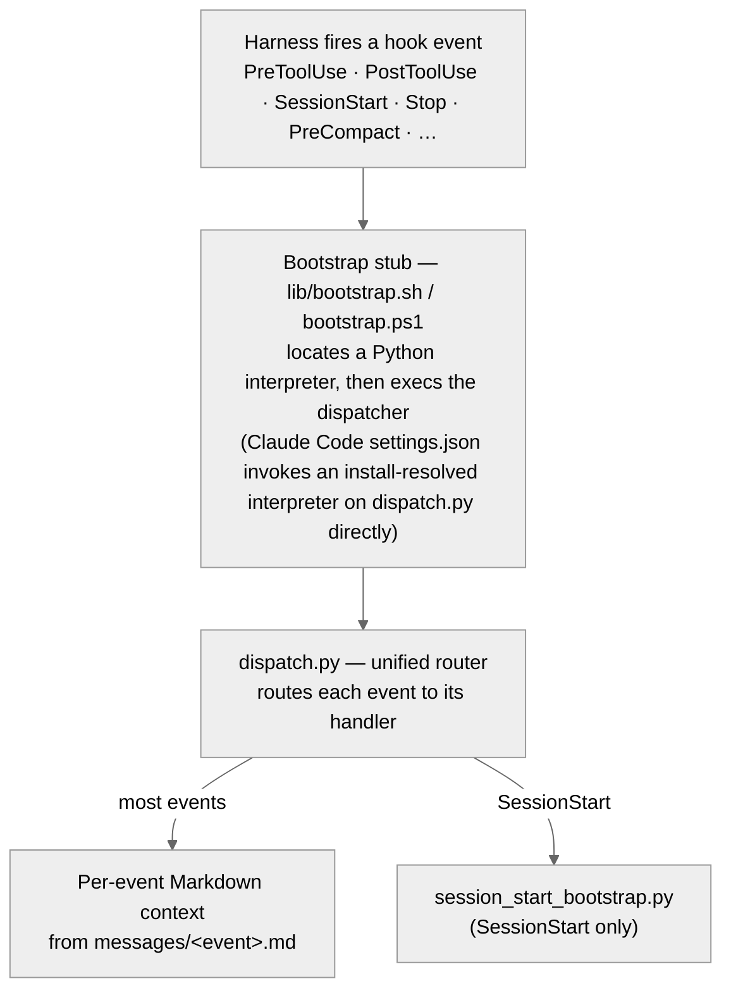

<!-- SPDX-License-Identifier: MIT -->

# hooks

> **Role.** The hook runtime. A unified Python dispatcher handles every
> harness hook event, emits per-event Markdown context, and runs the
> session-start bootstrap.

## Entry points

| File | Purpose |
|------|---------|
| `hooks.json` | The hook-registration source of truth: which event fires which handler. A handler that is not registered here does not run, whatever its module says. |
| `dispatch.py` | Unified Python entrypoint for all hook events — routes each event to its handler. |
| `emit_hook_context.py` | Emit structured JSON context for hook events. |
| `session_start_bootstrap.py` | Session-start bootstrap hook for the Apothem ecosystem. |
| `askuserquestion_validator.py` | Call-time `PreToolUse` validator for the `AskUserQuestion` tool's option payload — checks live option-marker well-formedness the committed-artifact matchers cannot see. |
| `proactive_compaction_tracker.py` | `PostToolUse` handler operationalizing the CM-19 proactive-compaction triggers — a per-session activity counter that emits the context-externalization advisory. |
| `session_end_gate.py` | `Stop` handler that rations the session-end protocol to one emission per session. `Stop` fires at every turn end, so emitting `messages/stop.md` verbatim each time re-asserted the whole mandate on every turn and never converged; the gate supplies the termination condition while the message file keeps owning the text. |
| `__init__.py` | Package marker. |

## `lib/` — dispatcher support

| File | Purpose |
|------|---------|
| `bootstrap.sh` / `bootstrap.ps1` | Shell bootstrap stubs that locate an interpreter (via the locators below) and `exec` the dispatcher. Shipped as the documented shell entry path; the Claude Code `settings.json` entries instead invoke an install-resolved absolute interpreter on `dispatch.py` directly. |
| `find-python.sh` / `find-python.ps1` | Python interpreter locators. |
| `find-pwsh.sh` / `find-pwsh.ps1` | PowerShell interpreter locators. |
| `events.py` | Single source of truth for the supported hook-event vocabulary. |
| `stdin_json.py` | The one canonical reader for a hook's stdin payload, so the read path cannot drift between handlers. |
| `log.py` | Shared logger factory for the hook scripts. |
| `resolve_root.py` | Project-root resolution for the Apothem ecosystem. |
| `__init__.py` | Package marker. |

## `messages/` — per-event context

Markdown context files emitted into the conversation for each hook event:

| File | Event |
|------|-------|
| `sessionstart.md` | SessionStart. |
| `stop.md` | Stop (session-end). Routed through `session_end_gate.py`, which emits this body at most once per session rather than on every turn end. |
| `precompact.md` / `postcompact.md` | PreCompact / PostCompact. |
| `pretooluse-write.md` / `pretooluse-write-header-guard.md` / `pretooluse-write-plan-guard.md` | PreToolUse Write / apply_patch — base context plus the authorship-header and plans-discipline guards. |
| `pretooluse-edit.md` / `pretooluse-edit-header-guard.md` | PreToolUse Edit — base context plus the authorship-header guard. |
| `pretooluse-notebookedit.md` | PreToolUse NotebookEdit. |
| `pretooluse-bash.md` / `pretooluse-bash-plan-guard.md` | PreToolUse Bash — base context plus the plans-discipline redirection guard. |
| `pretooluse-conformity.md` | PreToolUse conformity-gate context. |
| `pretooluse-dependency-guard.md` | PreToolUse Write / Edit — advisory flag on unpinned or untrusted dependency additions to manifests and lockfiles. |
| `pretooluse-eval-guard.md` | PreToolUse Write / Edit / Bash — advisory flag on dynamic evaluation of untrusted or model-derived input. |
| `pretooluse-askuserquestion-recommended.md` | PreToolUse AskUserQuestion — advisory `(Recommended)`-marker guard on rendered option sets. |
| `posttooluse-proactive-compaction.md` | PostToolUse — proactive-compaction tracker context (CM-19). |

## Conventions

- The Claude Code `settings.json` hook entries invoke an install-resolved absolute CPython interpreter on `dispatch.py` directly — the `${PYTHON_BIN}` placeholder is substituted at install time (per `apothem.lib.python_resolver`) so no entry runs a bare `python`. The shell bootstrap stubs (`bootstrap.sh` / `bootstrap.ps1`) are the documented shell entry path that locates an interpreter and hands off to `dispatch.py`; they are not the `settings.json` entry point.

## Operating in this folder

- **Fail-open is the dispatcher contract.** `dispatch.py::main` always exits 0; any uncaught exception is converted to a valid JSON failure envelope on stdout so the host harness never sees a raw traceback and never stalls. A handler that can raise past `main` is a contract breach — preserve the `# noqa: BLE001` intent-marker on the outermost boundary, and never widen the dispatcher's fail-open boundary.
- **The event vocabulary has one source of truth:** `lib/events.py` (`SUPPORTED_EVENTS`, `HOOK_SPECIFIC_OUTPUT_EVENTS`). Never hard-code an event-name list elsewhere; import from `events`.
- **Per-event timeout budgets bound runtime** (PreToolUse / PostToolUse / UserPromptSubmit / Notification tighter; SessionStart / PreCompact / PostCompact wider; Stop widest). A handler exceeding its event's budget is silently skipped by the runtime — keep handler work inside the budget; the per-event runtime benchmark is [`../benchmarks/bench_hooks.py`](../benchmarks/bench_hooks.py).
- **Adding an event:** extend `lib/events.py` first, then the dispatcher routing, then a `messages/<event>.md` context file. A new `messages/<event>.md` carries the markdown SPDX comment line and is registered in the table above in the same change.
- Validate a change with `python -m ruff check`, `python -m mypy` (cli + harnesses scope), and `python -m pytest`. Surface any unresolved decision as `TODO(clarify): ...` rather than guessing.

## Related

- [`conformity/gate.py`](../conformity/gate.py) — the conformity gate the PreToolUse Write/Edit hooks invoke.
- [`benchmarks/bench_hooks.py`](../benchmarks/bench_hooks.py) — the per-event hook-handler runtime benchmark.
