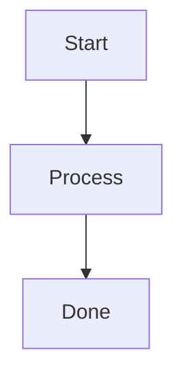
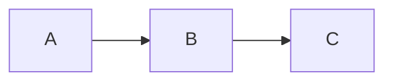

<!-- SPDX-License-Identifier: MIT -->

# Sample Artifact — Stale + Missing Verification

This fixture is the FAIL case for `diagram-staleness-grep`. Two
problems are present: the first diagram has no verified-date marker;
the second has a marker dated more than ninety days ago.

The grep flags both diagrams.
