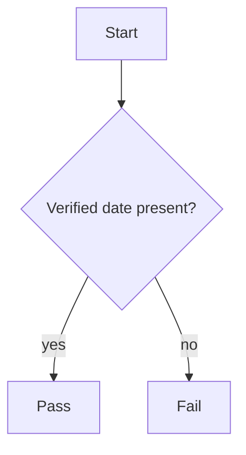

<!-- SPDX-License-Identifier: MIT -->

# Sample Artifact — Fresh Diagram

This fixture is the PASS case for `diagram-staleness-grep`. The
embedded Mermaid diagram carries a verified-date marker within the
freshness ceiling.

The diagram is current; the grep returns clean.
