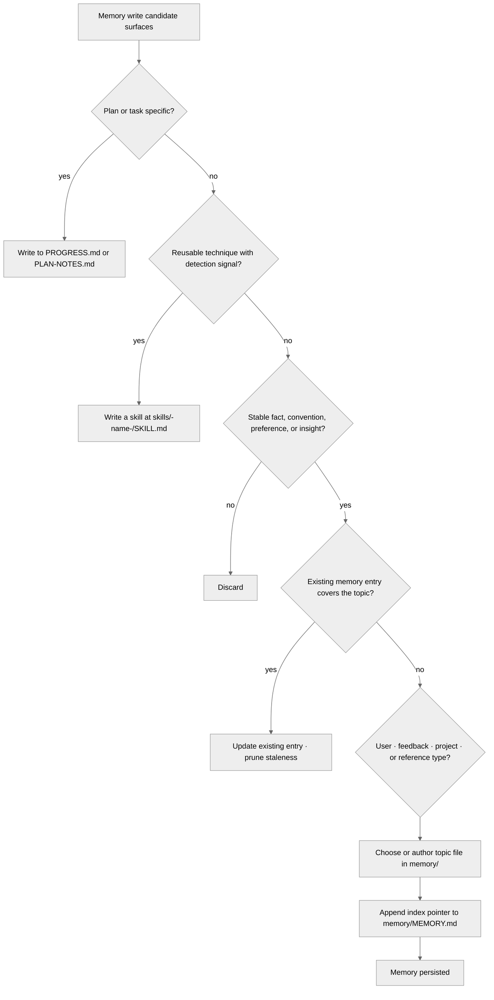

<!-- SPDX-License-Identifier: MIT -->

# Rule: Auto Memory — Topic Files & Lifecycle (Companion Sub-Rule)

## Purpose

Specify the topic-file management contract, ecosystem-specific memory hygiene, session-end evaluation procedure, decision tree, and anti-patterns delegated by the parent `rules/auto-memory.md` Companion Sub-Rule Anchors. This companion is path-filtered: it loads when the assistant edits any memory artifact (any file under `memory/**`, `projects/**/memory/**`, root-level `MEMORY.md`, or the global `promotion-ledger.md`), keeping the parent's always-on payload lean while preserving full convention fidelity at the demand-load surface. The parent rule remains the canonical home for the §1 Memory vs. Other State Files classification and §2 What NOT to Write bans; this companion carries the operational depth.

## Obligations

### 1. Ecosystem-Specific Memory Discipline

- **MEMORY.md as index:** MUST stay under 200 lines, used as a concise index pointing to topic files. **Overflow procedure:** when approaching 200 lines, identify groups of related entries (3+ on the same domain), promote each group to a new topic file, and replace the group in MEMORY.md with a single index pointer. MEMORY.md MUST NOT exceed 200 lines — entries beyond 200 are truncated by the loader and become invisible.
- **Topic files:** Kebab-case names reflecting the domain (e.g., `debugging.md`, `patterns.md`). Each self-contained.
- **Deduplication:** Before writing, check whether an existing entry covers the topic; update it rather than duplicate.
- **Staleness pruning:** When reading memory files, evaluate accuracy and remove entries referencing outdated versions, deleted files, or changed conventions.
- **Contradiction resolution:** Current project state and user instructions always win over memory entries; update or remove contradictions immediately.
- **Corruption resilience:** If MEMORY.md or a topic file is malformed (truncated, garbled, unparseable), re-derive its content from the other memory files and project state. MEMORY.md is an index — reconstruct from topic files on disk. Topic files are self-contained — reconstruct from project artifacts and CLAUDE.md. Log the corruption and notify the user.

### 2. Topic File Management

- **Naming:** Kebab-case, domain-reflective. File name should be the topic's natural label (e.g., `debugging.md`, `api-patterns.md`, `overhaul-log.md`). Avoid generic names (`notes.md`, `misc.md`).
- **Size target:** 50–150 lines per topic file. Under 50: consider merging into a related topic. Over 150: consider splitting by subtopic.
- **Split signal:** A topic file covers 3+ distinct subtopics with no shared context → split into separate files. Update MEMORY.md index.
- **Merge signal:** Two topic files have >50% overlapping content or are always consulted together → merge into one. Update MEMORY.md index.
- **Self-containment:** Each topic file must be independently useful. Minimize cross-references between topic files — prefer duplicating a key fact over creating a dependency chain.
- **MEMORY.md index discipline:** Every topic file must be listed in the Topic Files table. Orphan topic files (on disk but not indexed) are invisible and unmaintained — either index them or delete them.
- **Cross-project patterns:** Two memory tiers exist: project-specific (`<harness-root>/projects/{hash}/memory/`) and global (`<harness-root>/memory/`). Project memory is the default destination. At PUBLIC_LAUNCH seriousness, when the user reports or you recall (from global memory) that a pattern appears in another project, flag the current instance as an extraction candidate for user approval. On approval, move to global memory and remove the project-specific copy. Global memory follows the same MEMORY.md-as-index discipline. At lower seriousness levels, cross-project extraction requires explicit user request.
- **Promotion-ledger discipline:** Every promotion event between the project-specific and global tiers is recorded in `<harness-root>/memory/promotion-ledger.md` with the canonical four-field record schema — `source` (project-specific path being promoted) · `target` (global path post-promotion) · `date` (ISO 8601 `YYYY-MM-DD`) · `rationale` (one-sentence justification grounded in a concrete driver: cross-project recurrence count, architectural anchor, or convention universality). The ledger is the authoritative record; promotion events without a ledger row are convention violations. The same schema applies in reverse for the rare demotion case (global → project-specific) when the cross-project applicability assumption no longer holds.

### 3. Session-End Evaluation

Context-management §2.5 and the Stop hook delegate session-end memory evaluation to this rule. At session end:

- **Scan for write candidates:** Review decisions, corrections, confirmed patterns, and user preferences from the session. Apply the parent rule's §1 decision rule: plan/task-specific → skip (goes to PROGRESS.md). Reusable technique → skip (goes to skill). Stable fact/convention/preference/insight → memory candidate.
- **Deduplicate:** Check existing memory files for each candidate. If already covered, update if stale; skip if current.
- **Write or skip:** At EXPLORING, write only if user explicitly requested. At PERSONAL_USE+, write confirmed patterns and preferences. At SHARED+, also write architectural decisions and debugging insights.
- **Prune:** At SHARED+, remove any entries contradicted or made stale by this session's work.

### 4. Decision Tree

### 5. Anti-Patterns

- **DON'T** write speculative conclusions from reading a single file — **BECAUSE** unverified entries pollute memory.
- **DON'T** duplicate CLAUDE.md content in memory — **BECAUSE** contradictions emerge as CLAUDE.md evolves.
- **DON'T** use memory as a task tracker — **BECAUSE** PROGRESS.md and PLAN-NOTES.md serve that purpose.
- **DON'T** store ephemeral facts (branch names, PR numbers, temporary URLs) — **BECAUSE** they will be stale by next session.

## Enforcement

Path-filtered (the four glob patterns in this rule's `pathFilter` field — `**/memory/**`, `**/MEMORY.md`, `**/projects/**/memory/**`, `**/promotion-ledger.md`), always-on at every seriousness level when in scope. Demand-loaded companion to `rules/auto-memory.md`. The parent rule carries the §1 Memory vs. Other State Files classification table, the §2 What NOT to Write bans, and the Seriousness Scaling table; this companion carries the topic-file management contract, ecosystem-specific hygiene, session-end evaluation procedure, decision tree, and anti-patterns. Together they constitute the canonical specification for memory lifecycle.

## Bindings (§0.j five-direction)

- **Drives →** ● Every topic-file naming, sizing, splitting, merging decision under any project's `memory/` tree. ● The MEMORY.md index discipline (under-200-lines invariant; orphan-topic prevention). ● Every promotion / demotion event between the project-specific and global memory tiers (the four-field ledger schema at §2). ● The session-end memory evaluation procedure that the Stop hook fires.
- **Satisfies →** ● CM-26 (Auto Memory Lifecycle — rule-delegated mandate; this companion is the path-filtered subset). ● the rules registry row "Auto Memory" (the canonical specification splits across the parent and this companion). ● `rules/auto-memory.md` Companion Sub-Rule Anchors (the parent rule's pointers to this companion's full specification).
- **Established by ↑** ● `rules/auto-memory.md` (parent-rule anchors). ● CM-26 inline definition. ● the artifact directories (memory paths declared there).
- **Gated by ←** ● The path-filter (`**/memory/**`, `**/MEMORY.md`, `**/projects/**/memory/**`, `**/promotion-ledger.md`) — this rule demand-loads only on memory-artifact touches. ● `rules/auto-memory.md` always-on baseline (parent rule's anchors must be live for the companion to demand-load coherently).
- **Cross-bound with ↔** ↔ `rules/auto-memory.md` (parent rule; this companion's content is delegated through the parent's Companion Sub-Rule Anchors). ↔ `rules/context-management.md` (the §2.5 phase-exit protocol delegates memory evaluation to the parent rule, which delegates the procedure here). ↔ `rules/persistent-conventions-vigilance.md` (memory feeds gap-detection per §4 of the conventions rule; gap-detection writes to memory). ↔ `hooks/messages/stop.md` (the Stop hook context that operationalizes the §3 session-end evaluation). ↔ `memory/promotion-ledger.md` (the global memory's promotion-ledger anchor declared at §2).
