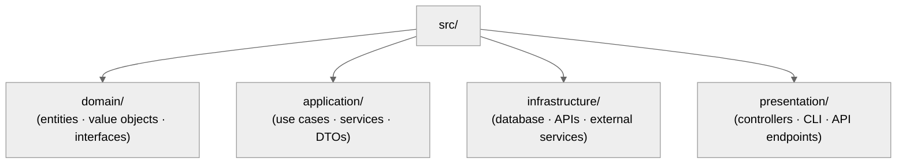
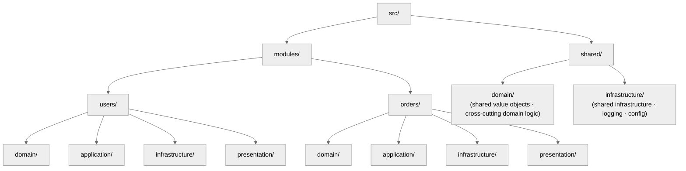

<!-- SPDX-License-Identifier: MIT -->

# Rule: Clean Architecture Layer Discipline

## Purpose

Enforce strict separation between the Domain, Application, Infrastructure, and Presentation layers — protecting the domain core from external concerns to guarantee testability, scalability, and maintainability.

## Obligations

### 1. The Four Canonical Layers

Every non-trivial project MUST be organized into four distinct layers under strict dependency rules:

| Layer | Contains | Depends On | Never Depends On |
| ----- | -------- | ---------- | ---------------- |
| **Domain** | Entities, value objects, domain events, repository interfaces, domain services, business rules, validation logic | Nothing (pure, self-contained) | Application, Infrastructure, Presentation |
| **Application** | Use cases, application services, DTOs, command/query handlers, orchestration logic, ports (interfaces) | Domain only | Infrastructure, Presentation |
| **Infrastructure** | Database adapters, API clients, file system, message queues, cache implementations, ORM configurations, external service integrations | Domain, Application (implements their interfaces) | Presentation |
| **Presentation** | Controllers, views, API endpoints, CLI handlers, serializers, middleware, request/response mapping | Application (via ports/interfaces) | Domain directly, Infrastructure directly |

**The Dependency Rule.** Dependencies point inward only. Domain is innermost; Presentation outermost. Infrastructure sits beside Presentation — neither depends on the other.

### 2. Layer Boundary Enforcement

**2.1 — Import Discipline:**

- Domain files MUST NOT import from Application, Infrastructure, or Presentation.
- Application files MUST NOT import from Infrastructure or Presentation.
- Cross-layer communication flows through interfaces (ports) defined in inner layers and implemented by outer layers.

**2.2 — Interface Segregation at Boundaries:**

- Every cross-layer dependency MUST be mediated by an interface / protocol / abstract class defined in the consuming (inner) layer.
- Infrastructure implements Domain repository interfaces and Application port interfaces.
- Presentation consumes Application services through defined ports — never reaching into Domain or Infrastructure directly. **Exception:** Domain value objects (e.g., `Money`, `UserId`) received through Application DTOs MAY be referenced in Presentation for display / serialization — but Presentation MUST NOT invoke Domain services or business logic.

**2.3 — Dependency Injection:**

- Outer-layer implementations are injected into inner-layer interfaces at the composition root (application startup).
- No inner layer constructs or references a concrete outer-layer implementation.
- Injection configuration is the composition root's responsibility, not the individual layers'.
- For the Python materialization (`Protocol`, `ABC`, composition-root patterns), see `rules/code-craft-python.md` §1 DIP.

### 3. Directory Structure Patterns

Recommended directory layouts (adapt to language/framework conventions):

**Flat Module Pattern (small-medium projects):**

**Domain-Driven Module Pattern (large projects):**

### 4. Language-Specific Layer Materializations

The universal layer patterns materialize through language-native idioms. Use the appropriate abstraction mechanism for your language (Python: `Protocol`; TypeScript/Java/Go: `interface`; Rust: `trait`; Swift: `protocol`) and data modeling tools (Python: `dataclasses`/Pydantic; TypeScript: Zod/classes; Java: records/Jackson; Go: structs/tags; Rust: `serde`/structs; Swift: Codable/structs).

**4.1 — Dependency Inversion:**

Domain and Application layers define interfaces using the language's abstraction mechanism. Infrastructure provides concrete implementations. The composition root wires implementations to interface-typed parameters. No inner layer ever imports a concrete outer class.

**4.2 — Domain Purity:**

- Zero external dependencies in Domain — no ORM imports, no framework imports, no I/O. Pure data structures, value objects, and business logic.
- Domain entities MUST NOT use persistence-layer models directly.
- Domain exceptions inherit from a domain-level base, never from a framework exception.

**4.3 — Application as Orchestrator:**

- Application services accept and return DTOs, never persistence entities.
- Use cases call domain logic plus repository interfaces — no direct database or HTTP calls.
- Application defines the ports (interfaces) Infrastructure implements.

**4.4 — Infrastructure Adapters:**

- Every external dependency (database, API, message queue, cache) is wrapped in an adapter implementing a Domain or Application interface.
- Adapters are the sole location for library-specific code, and are independently testable via integration tests.

**4.5 — Thin Presentation:**

- Controllers / handlers translate transport requests into Application DTOs and responses back to transport format — zero business logic.
- Validation and serialization happen at the boundary.

### 5. Testing Implications

Layer separation directly enables testability:

- **Domain tests:** Pure unit tests — no mocking needed, no I/O, no framework dependencies.
- **Application tests:** Unit tests with mocked interfaces. Test use case orchestration, not infrastructure details.
- **Infrastructure tests:** Integration tests against real external systems. Test adapter correctness.
- **Presentation tests:** Transport-layer tests (HTTP, CLI, gRPC). Test request-response mapping, not business logic.
- **End-to-End tests:** Full stack through Presentation to Infrastructure. Verify integration.

### 6. When to Apply

**6.1 — Full Layer Separation (Mandatory):**

- Projects with 3+ modules or bounded contexts.
- Projects at SHARED+ seriousness level.
- Projects involving database access, external APIs, or multiple presentation channels.
- Projects expected to grow beyond initial scope.

**6.2 — Simplified Separation (Acceptable):**

- Small, single-purpose scripts or utilities (EXPLORING seriousness).
- Domain + Infrastructure two-layer split when Application layer would be trivially pass-through.
- Microservices where the bounded context is small enough that a flat structure suffices.

**6.3 — When NOT to Force Layers:**

- Throwaway scripts, one-off data transformations, proof-of-concept prototypes.
- Projects where the overhead of layer separation exceeds the project's expected lifetime.
- When the user explicitly requests a simpler structure — document the trade-off and proceed.

## Seriousness Scaling

| Level | Layer Discipline |
| ----- | ---------------- |
| EXPLORING | Awareness only — suggest separation when beneficial, do not enforce |
| PERSONAL_USE | Recommend separation for non-trivial projects. Verify dependency direction on code review |
| SHARED | Mandatory for projects with 3+ modules. Layer violations are findings in `/plan-review`. Import discipline enforced |
| PUBLIC_LAUNCH | Full enforcement. Layer violations block execution. Architecture verification in quality gates. Lint rules for import boundaries recommended |

## Anti-Patterns

- **DON'T** let Domain depend on Infrastructure — **BECAUSE** the domain becomes untestable without spinning up databases, APIs, and external services.
- **DON'T** put business logic in controllers/handlers — **BECAUSE** it couples domain rules to the presentation channel and makes them unreusable across CLI, API, and event-driven interfaces.
- **DON'T** use ORM entities as domain entities — **BECAUSE** ORM concerns (lazy loading, column mapping, migration) leak into the domain and corrupt its purity.
- **DON'T** skip the Application layer and call Infrastructure from Presentation — **BECAUSE** it scatters orchestration logic and makes use cases invisible.
- **DON'T** create god services that span multiple layers — **BECAUSE** they violate the dependency rule and create tight coupling that resists change.
- **DON'T** enforce layers on trivial projects — **BECAUSE** premature architecture adds complexity without proportional benefit.
- **DON'T** import concrete Infrastructure classes inside Domain or Application layers — **BECAUSE** it inverts the dependency rule. Use interfaces/protocols and inject at the composition root.

## Enforcement

Path-filtered (`**/src/**`, `**/lib/**`, `**/app/**`, `**/packages/**`), scaling per the table above. Implements CM-27. Canonical specification for clean architecture layer discipline.

## Bindings (§0.j five-direction)

- **Drives →** ● Every non-trivial multi-module project's directory layout (§3 Directory Structure Patterns — flat-module vs. domain-driven-module). ● Every cross-layer dependency check (§2.1 Import Discipline; §2.2 Interface Segregation at Boundaries). ● Every composition-root pattern in dependency injection (§2.3). ◐ The Senior Software Architect role's language-agnostic layer discipline declared at `rules/cognitive-identity.md` §1 (Python-language materialization routes through `rules/code-craft-python.md`).
- **Satisfies →** ● CM-27 (Clean Architecture Layers — rule-delegated mandate). ● the rules registry row "Clean Architecture".
- **Established by ↑** ● CM-27. ● `rules/cognitive-identity.md` (the Senior Software Architect role declares clean-architecture as structural law, not guideline).
- **Gated by ←** ● The path-filter (`**/src/**`, `**/lib/**`, `**/app/**`, `**/packages/**`) — this rule activates only on matching artifact touches. ● `rules/cognitive-identity.md` Senior Software Architect role declaration.
- **Cross-bound with ↔** ↔ `rules/code-craft-python.md` (Python-language materialization of the layer discipline; §1 DIP cross-references this rule's §2.3 dependency-injection discussion). ↔ `rules/cognitive-identity.md` (the cognitive-identity rule declares the Senior Software Architect role this rule operationalizes). ↔ `rules/clean-room-generation.md` (clean-room generation produces layer-correct artifacts; §2 Writing Protocol respects layer boundaries). ↔ `rules/operational-mandates.md` (CM-27 layer discipline lives there).
