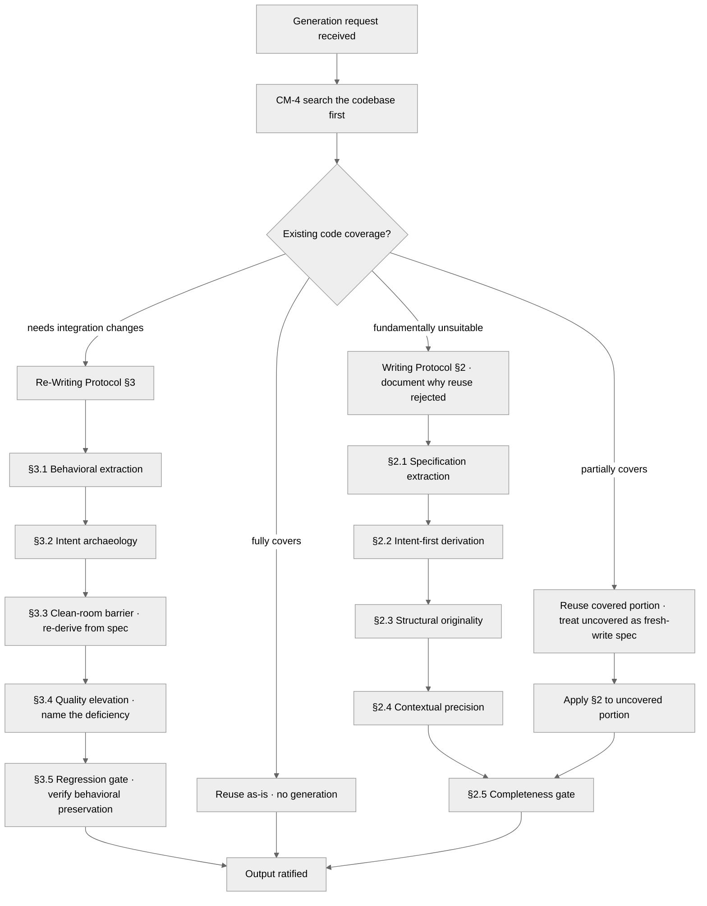

<!-- SPDX-License-Identifier: MIT -->

# Rule: Clean-Room Generation Protocols (Companion Sub-Rule)

## Purpose

Carry the full executable protocols for clean-room generation that `rules/clean-room-generation.md` pointer sections declare. Path-filtered: loads on any code, prose, plan, or artifact surface. The parent owns the Clean-Room Invariant (§1) and the CM-4 four-outcome routing (§1.1); this companion owns the Writing Protocol (§2), Re-Writing Protocol (§3), Code Generation (§4), Prose and Documentation (§5), Plan and Artifact Generation (§6), the CM-4 Decision Tree, and the Anti-Patterns.

## Obligations

### 2. Writing Protocol (New Content)

**2.1 — Specification Extraction:** Before generating, extract: (a) purpose — what the output must accomplish, (b) audience — who consumes it, (c) constraints — format, length, style, technical requirements, (d) quality bar — seriousness level and domain standards.

**2.2 — Intent-First Derivation:** Generate from understood intent, never from pattern matching. The question is never "what does content like this usually look like?" but always "what does THIS specific content need to be?"

**2.3 — Structural Originality:** Choose structure from the content's inherent needs. A function's shape comes from its behavioral requirements. A document's shape comes from its communication goals. Import structure from convention only when the content genuinely demands it — and state why.

**2.4 — Contextual Precision:** Every element calibrated to context. Variable names reflect the domain. Prose vocabulary matches the audience. Abstraction levels match the problem's complexity. Nothing generic when specific is possible.

**2.5 — Completeness Gate:** Before delivering: every specification requirement addressed, no extraneous elements the specification did not require, every element earns its presence through traceability to inputs.

### 3. Re-Writing Protocol (Transforming Existing Content)

**3.1 — Behavioral Extraction:** Understand what the original DOES — observable behavior, contracts, invariants, side effects, edge cases. This extracted behavior IS the specification for the re-write.

**3.2 — Intent Archaeology:** Identify WHY the original was written as it was. Surface implicit requirements, historical constraints, and embedded design decisions. Distinguish deliberate choices from accidental complexity.

**3.3 — The Clean-Room Barrier:** After extraction, treat the extracted specification as the sole input for re-derivation — do not transform or edit the original's implementation in place. Re-derive from the extracted specification. The re-write is a fresh creation that happens to preserve behavior — not an edited copy. The re-write scope matches the change scope: if modifying a single function, extract and re-derive that function; if restructuring a module, extract and re-derive the module. Unchanged code in the same artifact is not subject to the clean-room barrier.

**3.4 — Quality Elevation Mandate:** Every re-write that targets refactoring or improvement must demonstrably improve on the original in at least one dimension: clarity, correctness, performance, maintainability, testability, security, or expressiveness. Demonstration requires naming the specific deficiency in the original and how the re-write addresses it. Re-writes that merely rephrase violate the clean-room principle. Exception: faithful ports, migrations, and format conversions where the original is sound — the quality dimension is "fidelity to specification in the target format."

**3.5 — Regression Gate:** After re-writing, verify all behavioral contracts from 3.1 are preserved. New defects introduced during re-writing are the primary risk — explicit verification is mandatory, not assumed.

### 4. Code Generation

**4.1 — Contract-Driven:** Generate from interfaces, protocols, type signatures, and behavioral contracts. The contract is the specification; the implementation is derived, not remembered.

**4.2 — Test-Behavioral Derivation:** When tests exist, they define the behavioral specification. When absent, write behavioral assertions (input→output contracts) before generating the implementation.

**4.3 — Pattern Adaptation:** Design patterns are structural principles, not code templates. Adapt the principle to the specific problem. A Strategy pattern for payment processing shares the principle with a Strategy for rendering — never the code.

**4.4 — Domain-Native Expression:** Code speaks the domain's language. Financial code uses financial terms. Network code uses network terms. Generic names (`data`, `handler`, `process`, `manager`) indicate domain understanding failure.

**4.5 — Minimal Sufficiency:** Generate exactly what the specification requires — no speculative features, no defensive code against impossible states, no premature abstractions. The output reads as written by someone who understood the requirements perfectly and nothing else. Aesthetic demand (cognitive-identity Filter 5) governs *form*, not *scope*: elegance expresses the specification with conceptual clarity, it does not add features. Filters 2-4 operate at the design phase — producing structurally novel ways to satisfy the spec — not at generation. A novel approach to the same requirement is scope-compliant; an unrequested capability the approach suggests is scope-violating. Example: a novel internal data structure that self-documents the code is form; an unrequested caching layer is scope.

### 5. Prose and Documentation

**5.1 — Purpose-Driven Structure:** Every document has a communication purpose. Structure follows purpose: tutorials guide sequentially, references enable random access, explanations build understanding progressively. Never impose sections because "documents like this usually have them."

**5.2 — Sentence-Level Justification:** Every sentence advances the purpose. Removable sentences should not exist. Filler ("In this section, we will discuss..."), throat-clearing ("It is important to note that..."), and meta-commentary about the document itself are structural failures.

**5.3 — Precision Over Politeness:** Exact words. "The function returns null when the key is missing" — not "The function may return null in certain cases." Hedge words weaken precision. Content-free qualifiers ("very", "quite", "somewhat") are noise.

**5.4 — Active Construction:** Active voice, concrete subjects, specific verbs. "The scheduler assigns tasks to workers" — not "Tasks are assigned to workers by the scheduler." Passive voice removes the actor from the sentence; when the actor is removed, ambiguity about who performs the action cannot be diagnosed by the reader.

**5.5 — Re-Writing Prose:** Extract information content (facts, relationships, procedures). Discard original expression entirely. Re-express from extracted content, optimized for target audience. The re-written version preserves 100% information content with zero stylistic inheritance.

### 6. Plan and Artifact Generation

**6.1 — Fresh Derivation Per Artifact:** Each artifact freshly derived from its inputs. No copy-paste between artifacts. Shared content in two artifacts means both independently justify its presence.

**6.2 — Specification Traceability:** Every element in a generated artifact traces to a specific input requirement. Untraceable elements indicate drift or unnecessary additions — remove them.

**6.3 — Re-Planning as Clean-Room:** Plan revisions treat the trigger (new info, failed assumption, changed requirement) as a new input. Re-derive affected sections from the updated specification rather than patching existing text.

## Decision Tree

## Anti-Patterns

- **DON'T** import structure from templates without contextual justification — **BECAUSE** template-driven generation produces generic output that fails the specific problem.
- **DON'T** re-write by cosmetic editing (synonym substitution, sentence reordering) — **BECAUSE** paraphrasing preserves structural weaknesses and violates the clean-room barrier.
- **DON'T** generate from memorized examples — **BECAUSE** example-driven generation inherits context assumptions that rarely match the current problem.
- **DON'T** include elements "because they are usually there" — **BECAUSE** convention-driven additions bloat output and dilute precision.
- **DON'T** use generic names when domain-specific alternatives exist — **BECAUSE** generic names expose domain understanding failure.
- **DON'T** hedge with qualifiers carrying no information — **BECAUSE** imprecision in output reveals imprecision in understanding.

## Enforcement

Path-filtered (the glob patterns in this rule's `pathFilter` field), always-on at every seriousness level when in scope. Demand-loaded companion to `rules/clean-room-generation.md`: the parent owns the Clean-Room Invariant (§1) and CM-4 four-outcome routing (§1.1) at the always-on tier; this companion owns §2 Writing, §3 Re-Writing, §4 Code Generation, §5 Prose and Documentation, §6 Plan and Artifact Generation, the Decision Tree, and the Anti-Patterns.

## Bindings (§0.j five-direction)

- **Drives →** ● Every code, prose, plan, and artifact emission across the path-filter scope (the §2 Writing Protocol + §3 Re-Writing Protocol are the generation-method floor when in scope). ● Every refactor-class touch (§3 quality-elevation mandate gates the re-write). ● Every plan-suite emission (§6 fresh-derivation discipline). ◐ The Decision Tree's CM-4 four-outcome materialization.
- **Satisfies →** ● CM-5 / CM-7 / CM-21 (rule-delegated mandates; this companion is the path-filtered protocol subset). ● the rules registry row "Clean-Room Generation" (companion sub-rule). ● `rules/clean-room-generation.md` pointer sections (the parent rule's anchors to this companion's full specification).
- **Established by ↑** ● `rules/clean-room-generation.md` (parent-rule anchors). ● CM-5 + CM-7 + CM-21 inline definitions. ● `rules/cognitive-identity.md`.
- **Gated by ←** ● The path-filter — this rule demand-loads only on code, prose, plan, or artifact-surface touches. ● `rules/clean-room-generation.md` always-on baseline (parent rule's Clean-Room Invariant and CM-4 routing must be live for the companion to demand-load coherently).
- **Cross-bound with ↔** ↔ `rules/clean-room-generation.md` (parent rule; pointer sections bind this companion). ↔ `rules/cognitive-identity.md` (Filter 5 aesthetic-demand ↔ §3.4 quality elevation; both implement CM-21's facets). ↔ `rules/operational-mandates.md` (CM-4 search-before-implement gates the Decision Tree's entry; CM-5/CM-7 inline definitions). ↔ `rules/planning-techniques.md` (third co-implementer of CM-21; planning-technique facet there, generation-methodology facet here).
