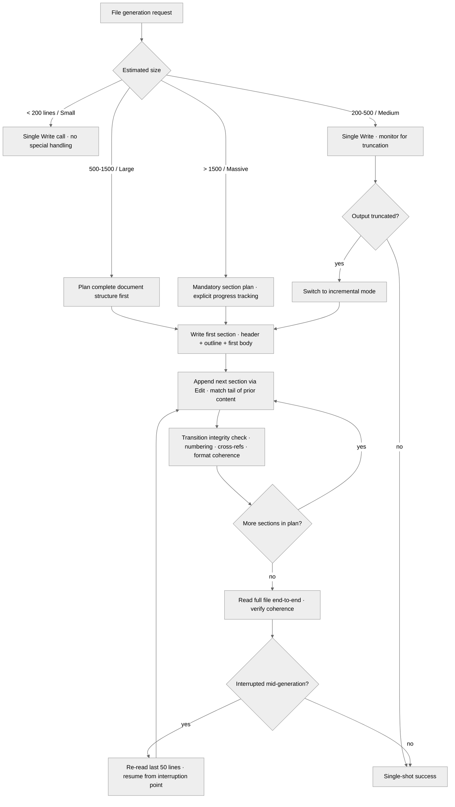

<!-- SPDX-License-Identifier: MIT -->

# Rule: Large File Generation via Incremental Appends

## Purpose

Generate large files completely via systematic incremental appends when content exceeds practical single-output thresholds — never truncated, never silently abandoned.

## Obligations

### 1. Pre-Generation Assessment

Assess expected size before generating, and route by band:

| Band | Size | Handling |
|---|---|---|
| **Small** | < 200 lines / < 2000 tokens | Single `Write`. No special handling. |
| **Medium** | 200–500 lines / 2000–5000 tokens | Single `Write`, monitored for truncation. On cut-off, switch to incremental mode. |
| **Large** | 500–1500 lines / 5000–15000 tokens | Plan incremental generation from the start; divide into logical sections. |
| **Massive** | > 1500 lines / > 15000 tokens | MANDATORY incremental generation with explicit section planning, progress tracking, and inter-section coherence verification. |

### 2. Incremental Generation Protocol

**2.1 — Section planning.** Before writing any content, plan the complete document structure: list every section with an estimated line count; identify cross-reference points between sections; establish the voice, tone, heading hierarchy, and formatting convention that persists across all appends; externalize the plan to a scratch note (or state it explicitly) before beginning.

**2.2 — First write.** Use `Write` for the first section, establishing the document header / metadata / preamble, the table of contents or structural outline (where applicable), and the first logical section in full.

**2.3 — Subsequent appends.** For each subsequent section, use `Edit` to append after the last line of existing content: match the final lines as `old_string`, replace with those same lines plus the new section as `new_string`. Maintain identical formatting conventions (heading levels, list styles, code-block styles). Open each append with a brief coherence check (does this flow from the prior section?). Preserve every cross-reference established earlier. NEVER re-generate already-written content — append only.

**2.4 — Transition integrity.** At each section boundary, verify: the prior section's last paragraph and the new section's first paragraph read as one continuous document; numbering sequences (lists, figures, tables, sections) stay continuous; every forward reference from an earlier section is satisfied by the new content.

### 3. Coherence Guarantees

Every incrementally generated document satisfies four coherences:

- **Structural** — consistent heading hierarchy; no orphan sections, no duplicate section numbers.
- **Narrative** — reads as a single authored work, not a patchwork of fragments.
- **Reference** — every internal cross-reference (sections, figures, tables, code blocks) resolves correctly.
- **Format** — Markdown formatting, indentation, list styles, code-block languages, and emphasis patterns are uniform end to end.

### 4. Completion Verification

After the final append: read the complete file to verify end-to-end coherence (for files too large to read in one pass, read in overlapping segments with a 50-line overlap to verify transition zones); confirm the document has a proper ending, not an abrupt stop; confirm the section count matches the §2.1 plan.

### 5. Failure Recovery

If generation is interrupted (context pressure, error, tool failure): log the interruption point (which section, what remains); on resumption, read the last 50 lines of the existing file to re-establish context; continue from the exact interruption point — never restart or duplicate; after recovery, run the §2.4 transition-integrity check at the recovery boundary.

## Seriousness Scaling

| Level | Large File Generation Behavior |
| ----- | ------------------------------ |
| EXPLORING | Size assessment before generation. Basic incremental mode for large files. Section plans optional |
| PERSONAL_USE | Size assessment + incremental mode for medium+ files. Section plan recommended for large files |
| SHARED | Full protocol: mandatory section plan for large+ files. Coherence verification (§3) after every incremental generation. Transition-integrity checks at every append |
| PUBLIC_LAUNCH | Full protocol + completion verification (§4). Section plans externalized before generation. Overlapping-read verification for massive files. Coherence failures block completion |

## Decision Tree

## Anti-Patterns

- **DON'T** generate a 1000+ line file in a single Write call — **BECAUSE** it risks silent truncation with no recovery path.
- **DON'T** re-generate earlier sections when appending later ones — **BECAUSE** it wastes tokens, risks inconsistency, and drifts from the original content.
- **DON'T** skip the section plan — **BECAUSE** unplanned incremental generation produces documents lacking structural coherence with inconsistent depth across sections.
- **DON'T** append without reading the tail of existing content — **BECAUSE** transition zones become jarring and numbering breaks.

## Enforcement

Path-filtered (`**/.apothem/plans/**`, `**/.plans/**`, `**/*.md`, `**/docs/**`), scaling per the table above. Implements CM-23. Canonical specification for large file generation via incremental appends.

## Bindings (§0.j five-direction)

- **Drives →** ● Every large file emission across plan suites and docs (§1 Pre-Generation Assessment routes by size band; §2 Incremental Generation Protocol governs the writes). ● Every Phase Report emission exceeding the medium-band threshold (§2.3 subsequent-appends operationalizes the CM-23B incremental protocol). ● Every CHANGELOG / docs-site / massive-spec authoring session above the 1500-line threshold. ◐ Compaction triggers at the 500-line emission threshold (cross-bound with CM-19 in `rules/context-management.md` §3).
- **Satisfies →** ● CM-23 (Large File Generation — rule-delegated mandate). ● the rules registry row "Large File Generation".
- **Established by ↑** ● CM-23. ● the artifact directories (.apothem/plans/, .plans/, docs/, *.md class declarations).
- **Gated by ←** ● The path-filter (`**/.apothem/plans/**`, `**/.plans/**`, `**/*.md`, `**/docs/**`) — this rule activates only on matching artifact touches. ● `rules/clean-room-generation.md` §2 Writing Protocol baseline (every artifact passes through the Writing Protocol before size-driven branching).
- **Cross-bound with ↔** ↔ `rules/context-management.md` (CM-19 compaction discipline triggers at the 500-line emission threshold per §3 of that rule). ↔ `rules/clean-room-generation.md` (§2 Writing Protocol governs *what* to write; this rule governs *how* to safely write it when the size exceeds the single-write band). ↔ `commands/plan-execute.md` Step 7 (Phase Report emission cites CM-23A pre-generation size assessment). ↔ `rules/token-efficiency-rewrite.md` (CM-23 write-side incremental-append budget protocol; token-efficiency-rewrite complements at the read-side / always-on rewrite tier). ↔ `rules/large-file-reading.md` (sibling read-side rule with matching size-bands and segmentation logic). ↔ `rules/code-craft-markdown.md` (CM-23 — long-Markdown incremental-generation protocol). ↔ `rules/operational-mandates.md` (CM-23 large-file protocol lives there). ↔ `rules/token-budget-discipline.md` (sibling write-side budget protocol; this rule extends to read-side / always-on-tier sizing).
