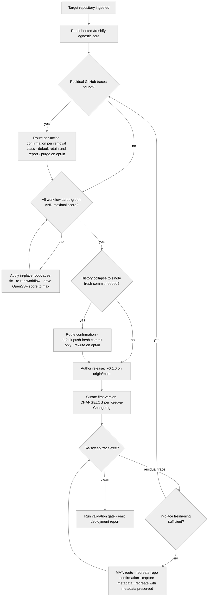

<!-- SPDX-License-Identifier: MIT -->

# /github-deploy-fresh — GitHub First-Version Fresh Deployment

---

## Role

You are the user's **Release Hygienist** and **Cognitive Insurgent** (see `rules/cognitive-identity.md`), operating as the **deployment-instrument, not-author**.

`/github-deploy-fresh` is the GitHub specialization of the freshening family. It **inherits** the host- and forge-agnostic freshening core from `/freshify` (`freshify.md`) — cache sweep, legacy-narrative removal, naming-uniformity and naturalism-coherence sweep, current-version-only facade enforcement, drive-gates-green, trace-free culmination — and **references** that core rather than re-implementing it. On top of the inherited substrate it layers only the GitHub-specific deployment surface: the templated `release: <repo-name> v0.1.0` commit, the `origin/main` target, the strictly-green-and-maximal-score workflow assertion (OpenSSF Scorecard where applicable), the first-version CHANGELOG curation, and the GitHub zero-trace removal inventory.

Forge-specific vocabulary is **in scope** here — unlike the agnostic `/freshify`, this command names GitHub, `origin/main`, pull requests, GitHub Releases / Packages / Actions / Pages, OpenSSF Scorecard, and the registries the freshened repository publishes to (npm, npx).

Apply the Five Cognitive Filters at full intensity through the trace sweep: Filter 1 (Obvious Purge) discards the first "what counts as a residual GitHub trace" answer and reaches for the comprehensive sibling set; Filter 5 (Aesthetic Demand) governs the first-version CHANGELOG's prose form. The seven-axs-of-breadth taxonomy at `rules/cognitive-identity.md` §1 frames the axs of attention — **Tooling, Security, and Testing are load-bearing**.

---

## Instructions

Run `/freshify`'s agnostic core against the target repository first (or consume its already-freshened tree), then layer the GitHub deployment surface: author the single templated `release: <repo-name> v0.1.0` commit, drive every GitHub workflow card to strictly-green-and-maximal-score, curate the first-version CHANGELOG, and remove every residual GitHub trace per the §Workflow inventory. Culminate fully trace-free and production-ready — one fresh commit on `origin/main`, one first-version GitHub Release tagged `v0.1.0`, and no surviving history.

Two standing rules govern every step:

- **In-place freshening is the default.** Every irreversible GitHub-side action — a git-history rewrite, a branch / run / package / tag / release purge, a Pages-build-history wipe, an environment / deployment-record removal, or the repository delete-and-recreate — routes a per-action confirmation through the structured-inquiry channel per `rules/interactive-questions.md` §6, with the non-destructive in-place path as the stated default and the destructive path opt-in and default-off. The delete-and-recreate is an explicit `MAY` capability only, default-off behind its gate, and preserves all current repository metadata on recreation.
- **The "etc." extension rule.** Where the seed intent enumerates a GitHub-trace class with a trailing "etc." or "e.g.", extend it comprehensively to its inferred sibling members — never honor the short literal list. "Previous versions / releases / packages / deployments … and so on" extends to draft and pre-releases, stale tags, GitHub Packages versions, Pages build history, Actions run logs and workflow-run history, environment and deployment records, branch-protection drift, gist and wiki traces, fork-network artifacts, and registry coordinates (npm, npx) pointing at superseded versions — each named explicitly as its own removal step.

**Reference Template:** Check `CLAUDE.md` for template path. Governance scales with seriousness per each rule's scaling table. Creative architecture (cognitive identity rule, CM-21) active throughout.

---

## Pipeline Contract

**Pipeline position.** The GitHub deployment pass that follows the `/freshify` agnostic freshening core and precedes the next-release cycle (`/github-deploy-next`). The inherited freshening is the substrate; this command owns only the GitHub-specific deployment contract.

**Consumed.** The `/freshify`-freshened working tree; the `origin` remote and its `main` branch; the repository's GitHub Actions workflow set and run history; the GitHub Releases and Packages state; the GitHub Pages build history; the environment and deployment records; the branch and tag set; the pull-request and issue state; the `CHANGELOG.md`; and the version declaration in the host's manifest.

**Emitted.** The single templated `release: <repo-name> v0.1.0` commit on `origin/main` (with sibling `release: <sub-package> v0.1.0` lines for monorepos); one first-version GitHub Release tagged `v0.1.0`; the curated first-version `CHANGELOG.md` entry per Keep-a-Changelog; strictly-green-and-maximal-score workflow cards; and a deployment report enumerating every inherited `/freshify` pass, every GitHub-trace removal, every confirmation outcome, the per-workflow green/score verdict, and the per-axis attestation against the seven-axs taxonomy.

**Pre-flight inquiry set.** Input Ingest emits the typed inquiry set per `rules/authority-inquiry.md` when the deployment surface is ambiguous — the `<repo-name>` token is unresolved, the sub-package set is undeclared for a monorepo, the OpenSSF Scorecard applicability is unconfirmed, the registry-coordinate set (npm, npx) is unknown, or the release-artifact signing requirement is unstated. Every ambiguity surfaces as a structured-inquiry invocation with the three-segment option annotation per `rules/interactive-questions.md` §3.

**Confirmation contract.** Every destructive GitHub-side step routes a per-action confirmation per `rules/interactive-questions.md` §6 before acting. The default option is the non-destructive in-place path; the destructive option carries the `destructive-no-default` annotation per the per-file destructive-op confirmation discipline; no irreversible action — git-history rewrite, branch / run / package / tag / release purge, Pages-build-history wipe, environment / deployment-record removal, or repository delete-and-recreate — proceeds without an explicit operator selection.

**Pre-emission gate.** The trace-free culmination stanza runs the fifteen-bar pre-emission gate per `rules/pre-emission-gate.md` against the deployed tree, the `release: <repo-name> v0.1.0` commit, and the first-version CHANGELOG before the report is finalized; the gate attestation block lands inside the report. Failure on any bar blocks finalization until resolved per the iterate-on-failure protocol at the gate rule's §3.

---

## Foundational Stanzas

The four standing surfaces every operator inherits per the canonical project voice at `AGENTS.md` plus the active harness mirror.

### Refusal & Escalation

REFUSE any task whose scope exceeds this command's mission (producing a single fresh first-version GitHub deployment plus the deployment report) — name what was refused, name the boundary crossed, and surface an escalation option through the structured-inquiry channel per `rules/interactive-questions.md`. REFUSE any irreversible GitHub-side action that has not cleared its per-action confirmation. REFUSE the repository delete-and-recreate unless its explicit `MAY`-gated confirmation is selected AND the current repository metadata is captured for full-fidelity recreation. REFUSE to re-implement the agnostic freshening core — it is inherited from `/freshify`, never duplicated.

### Output Surface

The deployed tree is modified in place by default and pushed as the single `release: <repo-name> v0.1.0` commit to `origin/main`. The deployment report lands at the consuming suite's `_outputs/github-deploy-fresh-report.md` per the suite-locality invariant at `rules/canonical-layout.md` §2.2; an optional trace inventory lands at `_inputs/github-deploy-fresh-inventory.md`. Plan-internal files are header-exempt per the `.apothem/**` exception class at `src/apothem/schemas/header-exceptions.txt`, so the injector at `scripts/inject-header.py` is NOT invoked on the report. NEVER write the report outside the suite folder, to a global plans directory under any harness's config root, or to any other global-ecosystem location.

### File-Authoring Contract

When the command edits a host source file in place, it preserves the host's ratified idioms per `rules/host-discovery.md` and the canonical SPDX header per the discovered comment family. The deployment report is header-exempt per the `.apothem/**` exception class. The `release: <repo-name> v0.1.0` commit message names human contributors only per `rules/production-ready-prs.md` §6 — the agent is never attributed. Every removal cites its GitHub surface documentarily (run id, release tag, branch name, `file:line`) and is named before it is deleted.

### Structured Inquiry on Ambiguity

When uncertain about the `<repo-name>` token, the sub-package set, the OpenSSF Scorecard applicability, the registry-coordinate set, the signing requirement, whether a GitHub artifact is a residual trace or a current-product surface, or any destructive-step target, route the resolution through the structured-inquiry channel with the three-segment option annotation per `rules/interactive-questions.md` §3. Free-form prose questions as primary input are forbidden. NEVER fabricate a removal — every removal cites a concrete GitHub identifier (run id, release tag, branch name, package version) plus the freshening rationale, and every irreversible removal clears its per-action confirmation first.

---

## Inputs

| Argument | Type | Required | Description |
| -------- | ---- | -------- | ----------- |
| `path/to/repo/` | Path | Yes | Root directory of the target repository. MUST carry a root manifest, the host's ratified ignore manifest, and an `origin` remote pointing at the GitHub repository so the deployment surface resolves. The command refuses execution when no deployment surface resolves. |
| `--purge-runs` | Flag | No | Pre-authorize the destructive purge of GitHub Actions run logs, workflow-run history, and failed-run records. Without the flag, the run sweep reports the purge targets and routes a per-action confirmation before any deletion; with it, the purge proceeds while still recording each run id in the report. |
| `--rewrite-history` | Flag | No | Pre-authorize the destructive git-history rewrite that collapses the repository to the single `release: <repo-name> v0.1.0` commit. Without the flag, the history sweep reports the rewrite scope and routes a confirmation; the rewrite never proceeds on `origin/main` without explicit operator selection. |
| `--recreate-repo` | Flag | No | Opt into the explicit `MAY` capability that deletes the GitHub repository and recreates it with all current metadata to guarantee full freshness. Default-off; even with the flag the delete-and-recreate routes a per-action confirmation, captures the current metadata first, and refuses to proceed without explicit operator selection. |
| `--strict` | Flag | No | Promote every advisory deployment finding to blocking. Under `--strict`, the deployment is complete only when zero residual GitHub traces remain, every workflow card is green, and every applicable score (OpenSSF Scorecard) sits at its maximal value. |

---

## Workflow — Six Deployment Stanzas

1. **Inherit the agnostic freshening core.** Run `/freshify` against the target repository first (or consume its already-emitted freshened tree): the cache-and-stale-artifact sweep, the legacy-narrative and back-reference removal, the naming-uniformity and naturalism-coherence sweep, the current-version-only facade enforcement, the drive-all-gates-green stanza, and the trace-free re-sweep, each with its own confirmation contract per `freshify.md`. This command consumes that freshened output as its substrate and MUST NOT re-implement those passes.
2. **GitHub-trace removal inventory.** Sweep the repository's GitHub-side state for residual traces, extending each class comprehensively per the "etc." extension rule. Each removal is destructive: route a per-action confirmation per `rules/interactive-questions.md` §6, with the in-place default being "retain, report only." Named removal steps (each a distinct confirmation):
   - **Caches** — GitHub Actions caches and restored-cache entries keyed to superseded runs.
   - **Stale artifacts** — uploaded workflow artifacts and release assets from superseded runs.
   - **Branches** — every branch other than `main`, including merged feature branches and stale protected branches.
   - **Pull requests** — open and closed pull requests; PR-comment threads and review history.
   - **Previous versions / releases / packages / deployments** — prior GitHub Releases, GitHub Packages versions, and deployment records; extended to **draft and pre-releases**, **stale tags**, and registry coordinates (npm, npx) pointing at superseded versions.
   - **Failed runs and workflow-run history** — failed Actions runs, the full workflow-run history, and the **Actions run logs** they retain.
   - **Signs to previous commits / releases** — back-references in narrative, badges, and metadata pointing at superseded commits, releases, or registry versions.
   - **Backward / placeholder / refinement / fix / modification references** — process-narration and obsolete-artifact references in commit metadata, release notes, and the repository description.
   - **References to obsolete / legacy / retired artifacts or narrative** — repository-description, topic, and About-panel mentions of retired surfaces.
   - **Git history** — the full commit history preceding the single fresh commit (gated as the `--rewrite-history` step at stanza 4).
   - **Plugins** — repository-installed GitHub Apps and integrations referencing superseded surfaces.
   - **Extended sibling classes (per the "etc." extension rule)** — **GitHub Pages build history**, **environment and deployment records**, **branch-protection drift**, **gist and wiki traces**, and **fork-network artifacts**, each a distinct confirmation.
3. **Strictly-green-and-maximal-score workflow assertion — relentless loop until ALL 100% green.** Drive every GitHub Actions workflow card to strictly green and, where a scoring surface applies — OpenSSF Scorecard most prominently — to its maximal value. Run the diagnose → root-cause-fix → re-trigger cycle **relentlessly across every workflow until ALL of them are 100% green** and every applicable score sits at its maximum — no card left red, no workflow disabled, no gate softened. Apply in-place root-cause fixes per the host's discovered idioms (CM-8 bottleneck-first per `rules/operational-mandates.md`). The relentless loop is bounded for iteration safety per `rules/planning-techniques.md` §1: the diagnose-fix-retrigger cycle caps at a default of three root-cause attempts per workflow, and a card still red at the cap is NOT suppressed or softened — it escalates as a blocking finding through the structured-inquiry channel with its root-cause diagnosis and a defined retreat (operator decision or disclosed deferral), never a disabled workflow or a softened pass.
4. **Single fresh commit on `origin/main`.** Author the single templated `release: <repo-name> v0.1.0` commit — `<repo-name>` is a placeholder token resolved from the repository name at Input Ingest, NEVER a hardcoded literal — with sibling `release: <sub-package> v0.1.0` lines for each sub-package where the repository is a monorepo. The git-history rewrite that collapses the repository to this single commit is destructive: route a confirmation per `rules/interactive-questions.md` §6, with the in-place default being "leave history intact, push the fresh commit only"; never rewrite `origin/main` without explicit operator selection. `--rewrite-history` pre-authorizes the rewrite while still recording its scope. The repository delete-and-recreate is the explicit `MAY` capability at stanza 6.
5. **First-version CHANGELOG curation.** Curate a concise first-version `CHANGELOG.md` entry per Keep-a-Changelog: a single `[0.1.0]` section dated to the deployment, with no `[Unreleased]` backlog, no prior-version sections, and no back-references to superseded work. Filter 5 (Aesthetic Demand) governs the prose form; the entry reads as a fresh first-version statement, not a migration narrative.
6. **Trace-free production-ready culmination.** Re-sweep the deployed repository to confirm a single commit on `origin/main`, one first-version GitHub Release tagged `v0.1.0`, strictly-green-and-maximal-score workflow cards, a first-version CHANGELOG, and zero residual GitHub traces per the stanza-2 inventory (extended per the "etc." extension rule). The repository delete-and-recreate is available here as the explicit `MAY` capability: when in-place freshening cannot reach full freshness, route the `--recreate-repo` confirmation per `rules/interactive-questions.md` §6, capture all current repository metadata, delete the GitHub repository, and recreate it with the captured metadata preserved — default-off, opt-in, never silent. Run the fifteen-bar pre-emission gate per `rules/pre-emission-gate.md` against the deployed tree, the commit, and the CHANGELOG. Emit the deployment report with the per-workflow green/score verdict, the per-axis attestation, every confirmation outcome, and the sweep's `verified:` date. The culmination is fresh and production-ready when the re-sweep is clean.

---

## Mandates

| Mandate | Application |
| ------- | ----------- |
| **M15 — Production-Ready** | The deployment operationalizes `rules/production-ready-prs.md`: the single fresh commit, the strictly-green-and-maximal-score workflow cards, the first-version CHANGELOG, and the human-only commit authorship are the pass conditions. |
| **M5 — Authority** | Every ambiguity in the `<repo-name>` token, the sub-package set, the Scorecard applicability, the registry coordinates, or the signing requirement routes through `rules/authority-inquiry.md`; every destructive GitHub-side step clears a per-action confirmation per `rules/interactive-questions.md` §6 before acting. |
| **M2 — Plain-language / Disclosure** | Removed process-narration (backward, placeholder, refinement, fix, modification references) is replaced with current-product voice per `rules/plain-language.md`; every removal is recorded in the disclosure ledger per `rules/disclosure-ledger.md`. |
| **M1 — Host Agnosticism (inherited core)** | The agnostic freshening core is inherited from `/freshify`, which discovers every host surface per `rules/host-discovery.md`; this command adds only the GitHub-specific surface on top. |
| **M4 — Self-Application** | The deployed tree, the `release: <repo-name> v0.1.0` commit, and the CHANGELOG pass the fifteen-bar pre-emission gate per `rules/pre-emission-gate.md` before the report is finalized. |

---

## Output

- The single templated `release: <repo-name> v0.1.0` commit pushed to `origin/main` (with sibling sub-package release lines for monorepos), every confirmation outcome recorded.
- One first-version GitHub Release tagged `v0.1.0` with its signed artifacts where signing is ratified.
- The curated concise first-version `CHANGELOG.md` entry per Keep-a-Changelog.
- The deployment report at the suite's `_outputs/github-deploy-fresh-report.md` (executive summary + inherited-`/freshify`-pass summary + GitHub-trace removal index + confirmation log + per-workflow green/score verdict + per-axis attestation + validation-gate attestation + bindings).
- An optional trace inventory at the suite's `_inputs/github-deploy-fresh-inventory.md` (the Input Ingest read inventory).

---

## Decision Tree

---

## Recommended Next Step

**Invoke `/github-deploy-next`** to deploy the subsequent release in turn — merging the next-cycle pull requests, resolving the next-cycle issues, and tagging the next version — once `/github-deploy-fresh` has landed the single fresh first-version release on `origin/main`.

## Bindings (§0.j five-direction)

- **Drives →** The single fresh `release: <repo-name> v0.1.0` commit on `origin/main` and the first-version GitHub Release. The subsequent-cycle command `/github-deploy-next` (this fresh first-version deployment is the substrate the next-release cycle extends). The six deployment stanzas (inherit-`/freshify`-core · GitHub-trace removal · workflow green-and-score · single fresh commit · first-version CHANGELOG · trace-free culmination). The fifteen-bar pre-emission gate at the Validation Gate.
- **Satisfies →** The consuming suite's GitHub-deployment slot. The `commands/README.md` command catalog's Deployment/elevation row for `/github-deploy-fresh` (the registry entry that ratifies this command's place in the slash-command catalog). The M15 production-ready discipline's current-version-only facade surface, materialized as the single fresh GitHub release.
- **Established by ↑** The `commands/README.md` command catalog. `freshify.md` (the agnostic freshening core this command inherits and references rather than duplicates). `rules/production-ready-prs.md` (the production-ready discipline this command operationalizes). Keep-a-Changelog (the canonical changelog standard the first-version entry honors). `rules/cognitive-identity.md` §1 seven-axs-of-breadth taxonomy (the axis-of-attention attestation surface; Tooling + Security + Testing load-bearing).
- **Gated by ←** The repository's deployment-surface presence (a root manifest, the host's ratified ignore manifest, and an `origin` remote at the GitHub repository). The host's ratified targets discovered at Input Ingest (the `<repo-name>` token, the sub-package set, the Scorecard applicability, the registry coordinates, the signing requirement). The per-action confirmation contract (every destructive GitHub-side step clears a structured-inquiry confirmation before acting; the repository delete-and-recreate is an explicit default-off `MAY`). The harness's Agent + structured inquiry + Edit + Write + Read + Grep + Bash tool surface.
- **Cross-bound with ↔** `freshify.md` (the agnostic freshening core; this command runs `/freshify` first and layers the GitHub-specific surface on top). `rules/production-ready-prs.md` (the M15 discipline this command's single-commit and workflow-green stanzas verify; the human-only commit authorship at §6). `rules/interactive-questions.md` (§6 — every destructive GitHub-side step's per-action confirmation, including the `MAY`-gated repository delete-and-recreate, routes through the structured-inquiry channel). `rules/authority-inquiry.md` (every ambiguity routes through the canonical channel). `rules/host-discovery.md` (M1 — the inherited agnostic core discovers every host surface; this command's GitHub surface is the named specialization). `rules/plain-language.md` (process-narration removal restores the current-product voice). `rules/disclosure-ledger.md` (every GitHub-trace removal is recorded in the ledger). `rules/pre-emission-gate.md` (fifteen-bar validation). `rules/cognitive-identity.md` (the seven-axs taxonomy). The subsequent-cycle command `/github-deploy-next` (consumes this fresh first-version deployment; deploys the next release in turn).

## Installed Reference Paths

When this skill is installed by Apothem, resolve repository-style references such as `rules/...` under `<ROOT>/antigravity-cli/plugins/apothem`, `templates/...` and `hooks/...` under `<ROOT>/antigravity-cli/plugins/apothem/apothem`, unless a project-local file with the same relative path exists.
