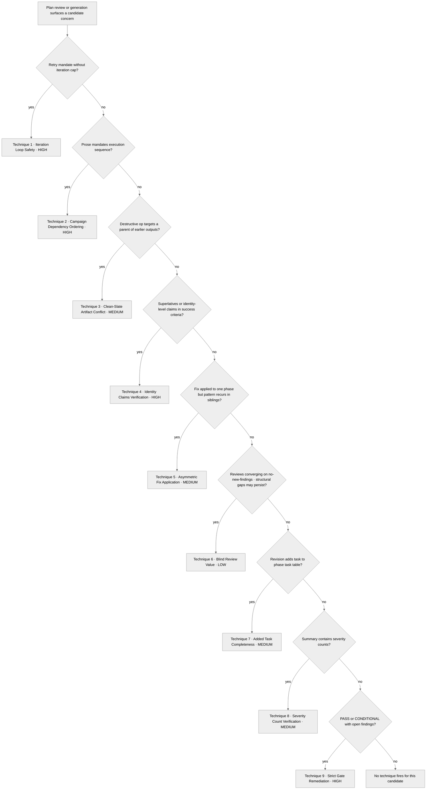

<!-- SPDX-License-Identifier: MIT -->

# Rule: Planning Techniques Compendium

## Purpose

Consolidate nine planning review techniques into one reference. Each technique pairs a **Detect** signal (what surfaces it), a **Procedure** (the verification steps), and an **Anti-pattern** (the failure it guards against). Apply the matching technique on detection during plan generation, review, audit, and execution per the Seriousness-Scaling table and the §Decision Tree.

## Obligations

### 1. Iteration Loop Safety

**Detect:** Plan-text patterns that mandate retry without naming a cap — "iterate until X passes", "re-run until gate met", "retry until success", "loop until convergence". Any retry mandate that names the success criterion but omits a maximum attempt count is in scope.
**Procedure:** Verify three elements: (a) gate criterion — what must be met, (b) iteration cap — max attempts (e.g., 3), (c) retreat strategy — what happens if cap exhausted. The retreat must produce a usable outcome, not dead-end.
**Anti-pattern:** Risk mitigations that restate the problem ("Mitigation: iterate until passed") are circular — flag immediately.

**Failure-and-new-fact loop (standing discipline, inherited by any command):** On a failure or a newly-surfaced fact, run four steps regardless of which command is active. (i) **Classify** the failure as transient (environment, contention, flake) or hard (a genuine defect in the plan, the target, or the approach). (ii) **Respond by class** — retry a transient failure within the cap above; drive a hard failure to its root cause and switch strategy rather than patching around the symptom. (iii) **Revise the live plan** so the plan-text reflects the new fact rather than carrying a stale mandate. (iv) **Verify before finalizing** — no failure is closed and no new fact is absorbed until it is checked against the verification floor of `rules/session-closure.md` §1c. This loop governs the plan-artifact's own convergence; per-agent dispatch retry is a distinct model owned by `rules/agent-orchestration-patterns.md`.

### 2. Campaign Dependency Ordering

**Detect:** Prose phrases like "X then Y then Z ordering", "must complete before", explicit campaign sequencing mandates.
**Procedure:** (a) Extract prose-mandated execution sequence, (b) encode as strict prerequisite chain in dependency graph, (c) verify bidirectionally — topological order matches prose, (d) for each "Parallelizable with" declaration, confirm no sequential mandate exists.
**Anti-pattern:** Deriving dependencies only from data-flow analysis misses semantic ordering constraints imposed by experimental design.

### 3. Clean-Slate Artifact Conflict

**Detect:** "delete", "empty", "wipe", or "clean slate" applied to a directory.
**Procedure:** (a) Build artifact-path map — every phase's output paths, (b) for each destructive directory op, check if target is parent of any earlier artifact path, (c) resolve by relocating artifacts or narrowing wipe scope, (d) re-verify after resolution.
**Anti-pattern:** Directory-scope wipes vs. file-scope outputs — the abstraction-level mismatch makes conflicts invisible to dependency analysis.

### 4. Identity Claims Verification

**Detect:** Superlatives ("highest", "fastest"), quantitative thresholds ("within 1%"), ordering assertions ("A always beats B") in success criteria.
**Procedure:** (a) Extract all identity-level claims, (b) trace each to a specific pilot/validation task measuring the exact metric, (c) if none exists, add one to pilot phase, (d) ensure it gates downstream phases — no proceed on failure.
**Anti-pattern:** Absorbing identity claims into success criteria without creating testable gate tasks leaves claims unverified until full-scale execution.

### 5. Asymmetric Fix Application

**Detect:** A revision fixes a finding in one phase but structurally similar phases share the same pattern.
**Procedure:** (a) When applying a fix, identify all structurally similar phases, (b) apply the same fix to all of them, (c) verify propagation is complete — count affected phases before and after.
**Anti-pattern:** Fixing only the cited phase when the pattern recurs across multiple phases creates inconsistency.

### 6. Blind Review Value

**Detect:** Incremental reviews converging on "no new findings" while structural gaps may persist.
**Procedure:** (a) Conduct a blind re-audit without reading prior review results, (b) use novel audit dimensions not covered in prior reviews, (c) compare blind findings against prior findings to identify gaps.
**Anti-pattern:** Incremental reviews anchor on prior findings — blind reviews break this anchoring bias.

### 7. Added Task Completeness

**Detect:** A revision adds a new task to a phase's task table.
**Procedure:** (a) Navigate to the phase's Verification section, (b) add a corresponding checklist item verifying the new task's acceptance criteria, (c) treat task-table and verification-section as atomic pair — never update one without the other, (d) after all revisions, verify task-count vs. verification-item-count parity.
**Anti-pattern:** Adding a task without updating verification creates a silent gap between acceptance criteria and phase verification.

### 8. Severity Count Verification

**Detect:** Summary text containing severity breakdowns (e.g., "2 MEDIUM, 3 LOW").
**Procedure:** (a) After writing any summary with severity counts, navigate to the detailed findings table, (b) count entries by severity directly from the table, (c) compare against summary — the table is authoritative, (d) when synthesizing from multiple sources, reconcile categorization boundaries before tallying.
**Anti-pattern:** Manually estimating severity counts from memory during synthesis introduces arithmetic errors that persist across reviews.

### 9. Strict Gate Remediation

**Detect:** Findings registries, scorecards, or handoff manifests that use PASS / CONDITIONAL language while one or more findings still have `status=open`.
**Procedure:** (a) Count open findings from the registry, (b) require each finding to carry a concrete Fix Action and Remediation Class, (c) route mechanical findings to immediate fix, judgment findings to structured inquiry, and out-of-scope items to `*-maintenance`, (d) re-audit the touched loci, (e) block terminal handoff until open count is zero or every residual is explicitly operator-waived with rationale.
**Anti-pattern:** Treating CONDITIONAL as a pass while open findings remain turns review into reporting-only ceremony and pushes unresolved defects into execution.

**Severity ranking:** Techniques 1, 2, 4, and 9 are HIGH; 3, 5, 7, and 8 are MEDIUM; 6 is LOW.

## Seriousness Scaling

| Level | Techniques Application |
| ----- | ---------------------- |
| EXPLORING | Optional, on explicit user request — pipeline operates at reduced rigor by default |
| PERSONAL_USE | Apply techniques 1 and 4 (iteration safety, identity claims). Others on detection |
| SHARED | Apply all techniques on detection. Techniques 1, 2, 4, and 9 mandatory during `/plan-review` and `/plan-audit` |
| PUBLIC_LAUNCH | All techniques mandatory. Blind Review (technique 6) required for every review cycle |

## Decision Tree

## Anti-Patterns

- **DON'T** apply techniques only to the flagged finding — **BECAUSE** structurally similar phases share the same vulnerability (technique 5: Asymmetric Fix Application).
- **DON'T** treat iteration caps as optional guardrails — **BECAUSE** unbounded retry loops consume phases without producing usable outcomes (technique 1: Iteration Loop Safety).
- **DON'T** derive dependencies only from data-flow analysis — **BECAUSE** semantic ordering constraints from experimental design are invisible to data-flow (technique 2: Campaign Dependency Ordering).
- **DON'T** add tasks without updating the corresponding verification section — **BECAUSE** task-table and verification-section are an atomic pair; gaps between them create silent acceptance-criteria holes (technique 7: Added Task Completeness).
- **DON'T** hand off with open findings hidden behind a CONDITIONAL scorecard — **BECAUSE** terminal gates are about unresolved defects, not only score labels (technique 9: Strict Gate Remediation).

## Enforcement

Path-filtered (`**/.apothem/plans/**`, `**/.plans/**`, `**/commands/plan-*.md`), scaling per the table above. Implements CM-20 (Pipeline Orchestration), CM-21 (Creative Quality). Canonical specification for planning review techniques.

## Bindings (§0.j five-direction)

- **Drives →** ● Every plan-pipeline review and audit surface (the nine techniques apply during `/plan-review` and `/plan-audit` cycles per the command contracts). ● Every plan revision's structural sweep (the asymmetric-fix-application technique fires when revisions land). ● Every plan-generate emission's identity-claims verification (technique 4 gates pilot-phase task creation). ● Every zero-open-finding terminal handoff (technique 9 blocks unresolved findings). ◐ The blind re-audit cadence at PUBLIC_LAUNCH (technique 6 mandatory at the highest seriousness tier).
- **Satisfies →** ● CM-20 (Pipeline Orchestration) + CM-21 (Creative Quality — planning-technique facet per §7.2 facet delineation). ● the rules registry row "Planning Techniques".
- **Established by ↑** ● CM-20 + CM-21. ● `rules/cognitive-identity.md` Cognitive Identity (Filter 2-4 ↔ ideation-techniques; this rule's nine techniques are the planning facet of the same creative discipline).
- **Gated by ←** ● The path-filter (`**/.apothem/plans/**`, `**/.plans/**`, `**/commands/plan-*.md`) — this rule activates only on plan-pipeline artifact touches. ● `rules/cognitive-identity.md` Filter 1 + Filter 5 always-on baseline.
- **Cross-bound with ↔** ↔ `rules/cognitive-identity.md` (the cognitive-filter sequence and the nine-technique catalog are sibling facets of CM-21). ↔ `rules/clean-room-generation.md` (third co-implementer of CM-21; planning-technique facet here, generation-methodology facet there). ↔ `commands/plan-review.md` + `commands/plan-audit.md` (review/audit workflows operationalize the nine techniques). ↔ `commands/plan-generate.md` + `commands/plan-execute.md` (techniques 1-4 fire during generate; techniques 5-9 fire during execute/review handoffs). ↔ `rules/clean-room-generation-protocols.md` (third co-implementer of CM-21; planning-technique facet there, generation-methodology facet here). ↔ `rules/cognitive-identity-techniques.md` (the nine planning techniques are the planning facet of CM-21; §1 Filter 2-4 ↔ ideation-techniques here ↔ planning-techniques there). ↔ `rules/operational-mandates.md` (CM-20/CM-21 planning techniques live there). ↔ `rules/session-closure.md` (§9 — element (b)'s plan-open-items condition binds every session close that touched a plan; the residual explain-or-waive obligation is sourced there, not re-specified here). ↔ `rules/session-closure-scaling.md` (§9 — the plan-open-items explain-or-waive obligation the §3 plan-touching residual detail applies at the session-close scale; the parent binds it under its own `↔` line as the source of element (b)'s plan-touching condition).
