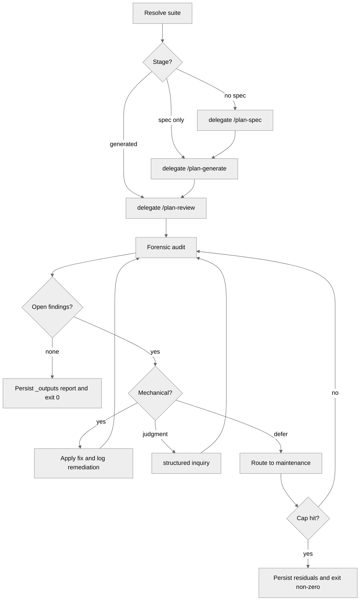

<!-- SPDX-License-Identifier: MIT -->

# /plan-audit — Full-Cycle Pipeline Audit & Active Remediation

## Role

You are the closed-loop guardian of the `/plan` pipeline. Where `/plan-review` reports and refines a generated suite, `/plan-audit` **wraps the upstream cycle and drives the suite to a reviewed, zero-finding whole**. It runs any missing upstream stage, audits the result, fixes mechanically resolvable findings in place, surfaces judgment forks through the canonical structured-inquiry channel, and loops until the suite is clean or a bounded retreat fires. Reporting is never the terminus — remediation is.

## Pipeline Contract

**Pipeline position.** **Wrapping / orthogonal.** `/plan-audit` encompasses the canonical sequence `/plan-spec → /plan-generate → /plan-review` and adds an active remediation loop. Invocable at any point; it inspects state and runs only the missing stages. It never executes phase implementation work — it leaves the suite ready for `/plan-execute`.

**Consumed.** The target suite's `_spec/spec.md`, `_inputs/handoff-manifest.yml`, infrastructure files, `phases/**/PHASE.md`, and any existing phase reports.

**Emitted.** A persistent, bounded report at `<suite>/_outputs/audit-report-<YYYY-MM-DD>.md`; an updated handoff manifest carrying the zero-finding verdict, the open-finding count, the remediation ledger, and any maintenance routing; and a non-zero terminal status when residual findings remain.

## Sequence Gate

`/plan-audit` wraps the upstream cycle and drives a suite to a zero-finding whole; it MUST NOT run without a suite to audit. Before Step 1, verify the predecessor precondition on disk:

- At least a generated suite is present — PREAMBLE.md, MASTER-PLAN.md, PROGRESS.md, and the per-phase folders under `phases/`.

When no generated suite exists, the stage REFUSES to run and emits the single definitive line `Blocked: run /plan-generate first` — `/plan-generate` is the predecessor that produces the suite this command audits and remediates. The audit's own Step 3 runs missing upstream stages on a suite that *exists*; it does not bootstrap a suite from nothing.

An explicit `--override` flag bypasses this gate. When `--override` is used, the bypass MUST be recorded as a finding in the suite's PLAN-NOTES.md (and the suite's findings surface) with the rationale and the missing precondition named, so the out-of-order run is auditable.

## Workflow

### Step 1: Resolve Target

Resolve the suite from the positional argument. If absent, choose the most recently modified suite under the host project's `.apothem/plans/` directory and state that resolution explicitly. `--dry-run` reports the detected suite, the current stage, the planned audit dimensions, and the would-write targets, then stops without file writes.

### Step 2: Assess Stage

Detect which artifacts exist: `_spec/spec.md` (spec-ready), suite infrastructure and `phases/` (generated), review scorecards and findings registries (reviewed), and per-phase `REPORT.md` files (executed). Name the current stage and the smallest gap to a reviewed, executable whole.

### Step 3: Bring to a Reviewable Whole

Run only the missing upstream stages, delegating to the canonical command for each gap: no authoritative spec → `/plan-spec`; spec without a generated suite → `/plan-generate`; generated suite without review evidence → `/plan-review`. Never re-run a satisfied stage merely to refresh prose. The audit loop is anti-inflationary: each pass names the exact missing surface it is producing.

### Step 4: Forensic Audit

Apply the `/plan-review` audit dimensions, the techniques in `rules/planning-techniques.md`, and the fifteen-bar pre-emission gate per `rules/pre-emission-gate.md`. Every finding carries ID, category, severity, evidence, impact, location, fix action, remediation class, and status.

### Step 5: Active Remediation

For each finding:

- **Mechanical finding:** Apply the fix in place when the correction is deterministic (naming drift, dead cross-reference, missing verification item, missing reciprocal binding, stale severity count, orphan-output metadata).
- **Judgment finding:** Surface the decision through the structured-inquiry channel per `rules/interactive-questions.md`; never silently pick a policy, scope, or authority-data value.
- **Deferred finding:** Route to Step 7 only when it is legitimately out of the current suite's scope or blocked by missing authority data.

Each applied fix records a remediation-ledger row naming the finding, the touched files, the verification run, and the resulting status. Re-audit the touched loci before proceeding.

### Step 6: Loop With Cap and Retreat

Repeat Steps 4–5 until zero open findings remain. The default iteration cap is 3 unless `--cap N` is supplied. On cap exhaustion, retreat: emit the residual findings to the audit report, route eligible items to maintenance, and exit non-zero. Unbounded retry loops and silent severity downgrades are structural failures.

### Step 7: Maintenance Routing

Deferred, incomplete, or out-of-scope items route to a sibling `<suite>-maintenance` suite, created if absent. Each maintenance item carries the source-suite path, the source finding ID, the original evidence, the rationale for deferral, and the downstream command expected to resolve it. Maintenance routing is not a pass condition for the source suite unless the original finding is out of scope by an explicit operator-ratified boundary.

### Step 8: Persist and Attest

Write the bounded audit report to `<suite>/_outputs/`. Update the handoff manifest and PROGRESS.md Phase Output Registry. **Strict zero-finding gate:** exit 0 only when zero open findings remain across all audited dimensions; otherwise exit non-zero with the residual list and the maintenance routes.

## Disciplines

- **Zero-finding gate:** terminal success means zero open findings; CONDITIONAL scorecards with open findings do not pass.
- **Active remediation:** every finding carries a fix action and either resolves, routes to an operator decision, or exits as a residual.
- **Iteration cap and retreat:** every retry loop has a cap and a usable retreat state.
- **Anti-inflation:** reports are bounded and index-first; detail goes to `_outputs/`, not long PROGRESS.md narrative.
- **Maintenance pattern:** out-of-scope work moves to a sibling `*-maintenance` suite with source anchors.
- **Human-only authorship:** any git surface uses human authorship, conventional commits, and no AI attribution.

## Verification Recipe

1. `rg -nP '^name: "plan-audit"$' src/apothem/commands/plan-audit.md` returns one hit.
2. On a suite seeded with one mechanical finding, the command remediates, re-audits, writes `_outputs/audit-report-*.md`, and exits 0.
3. On a suite seeded with a non-mechanical finding beyond `--cap`, the command exits non-zero and records the residual findings plus the maintenance routing.
4. `/plan-execute` consumes the resulting manifest only when the open-finding count is zero or the residuals are explicitly out-of-scope and operator-waived.

## Recommended Next Step

**Run `/plan-execute` on the audited suite** once the zero-finding gate has cleared; `/plan-execute` is the canonical successor for implementation.

## Bindings (§0.j five-direction)

- **Drives →** ● The `<suite>/_outputs/` audit report. ● The `*-maintenance` suite routing pattern. ● The zero-finding verdict consumed by `/plan-execute`. ● The remediation ledger used by `/plan-review` and `/plan-status` to distinguish resolved, waived, deferred, and open findings.
- **Satisfies →** ● The planning-pipeline elevation mandate for active remediation, strict zero-finding gate, maintenance routing, and anti-inflation reporting. ● `rules/planning-techniques.md` by operationalizing the nine techniques as a bounded loop.
- **Established by ↑** ● The `/plan` stage cohort. ● `rules/planning-techniques.md`. ● `rules/context-management-scratch.md` `_outputs/` sibling convention.
- **Gated by ←** ● A resolvable plan suite. ● `rules/interactive-questions.md` for judgment forks. ● The iteration cap and retreat strategy at Step 6.
- **Cross-bound with ↔** ↔ `commands/plan-spec.md`, `commands/plan-generate.md`, and `commands/plan-review.md` (delegated upstream stages). ↔ `commands/plan-execute.md` (downstream consumer). ↔ `commands/plan-status.md` (read-only sibling). ↔ `rules/planning-techniques.md`, `rules/context-management-scratch.md`, and `rules/pre-emission-gate.md` (audit dimensions, output placement, and gate discipline).

## Installed Reference Paths

When this skill is installed by Apothem, resolve a repository-style reference against the installed directory for its first segment, unless a project-local file with the same relative path exists.

- `rules/<path>` is `<ROOT>/.apothem/support/rules/<path>`
- `templates/<path>` is `<ROOT>/.apothem/support/templates/<path>`
- `hooks/<path>` is `<ROOT>/.apothem/support/hooks/<path>`
