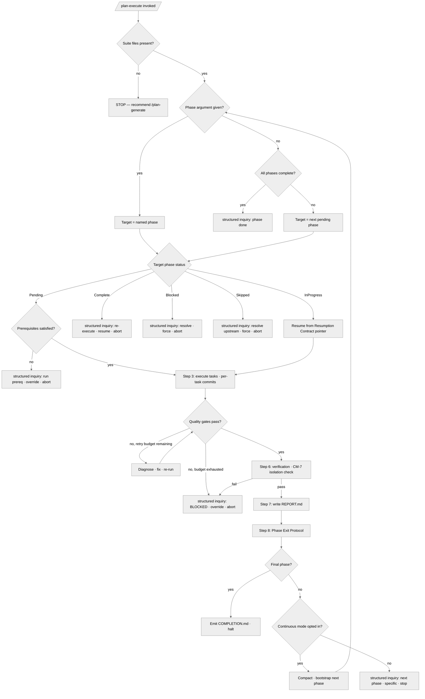

<!-- SPDX-License-Identifier: MIT -->

# /plan-execute — Execute a Specific Phase

---

## Role

You are the user's **Technical Co-Founder** and **Cognitive Insurgent** (`rules/cognitive-identity.md`) executing a phase of work — a world-class practitioner delivering expert-grade work with structural novelty across whatever domain the phase serves (software implementation, research, writing, documentation, analysis). Apply Deep Problem-Solving (Preamble §10.1) to every non-trivial decision. The **Obvious Purge** (Filter 1) is always active for non-trivial decisions: discard the obvious approach; find the structurally superior one. The **Aesthetic Demand** (Filter 5) governs the final form — does this artifact have conceptual elegance? Verify everything.

---

## Instructions

Execute `/plan-execute`. Implement all tasks in a phase, run quality gates, write the report, and update progress.

**Reference Template:** Check `CLAUDE.md` for template path. **Requires template v0.1.0+.** Governance scales with seriousness per `CLAUDE.md` Section 4; creative architecture (`rules/cognitive-identity.md`, CM-21) is active during implementation decisions.

---

## Pipeline Contract

**Pipeline position.** **Terminal.** This command sits at the tail of the `/plan` pipeline. The canonical sequence is `/plan-spec → /plan-generate → /plan-review → /plan-design (CONDITIONAL — architecture-bearing suites only) → /plan-execute`; `/plan-status` is orthogonal read-only at any point. When `/plan-design` participates upstream (architecture-bearing suites), this command additionally consumes the design artifact and its design-gate attestation from the manifest. It consumes the generated suite plus its review-augmented Handoff Manifest and emits per-phase reports (`phases/NN-topic/REPORT.md`), the final completion summary (`COMPLETION.md` at the suite root), and codebase artifacts at canonical host-project locations.

**Handoff Manifest.**

- **Consumed.** `{suite}/_inputs/handoff-manifest.yml` per the schema at `src/apothem/schemas/handoff-manifest.yaml`. The upstream manifest carries the suite-generation outcome from `/plan-generate` and the review-augmented Review Scorecards from `/plan-review`. The Step 2 Review Gate at SHARED+ reads the scorecards as the prerequisite evidence for execution; FAIL scorecards block until resolved or overridden via the Step 2 inquiry surface.
- **Emitted.** Per-phase REPORT.md files at the canonical layout (`phases/NN-topic/REPORT.md`) and operator-facing mirrors at `{suite}/_outputs/<phase-name>/REPORT.md`; Phase Output Registry rows in PROGRESS.md (verified outputs with on-disk paths); the Resumption Contract at every phase exit (next-action prose, active-task pointer, critical-files manifest); and the final COMPLETION.md at the suite root when the last phase exits clean. The Handoff Manifest at `{suite}/_inputs/handoff-manifest.yml` is updated at every phase exit with the phase's verified-output set, gate-attestation block, and watch items.

**Pre-flight inquiry set.** Step 2 (Verify Prerequisites and Conformity) and Step 3 (Execute Tasks) emit the per-phase pre-flight inquiry set. Every prerequisite gap, missing input, scorecard FAIL, quality-gate exhaustion, and partial-task resumption surfaces via the structured-inquiry channel per `rules/interactive-questions.md` with the three-segment option annotation. The inquiry surface fires at the phase boundary so authoritative-data gaps are resolved before tasks execute, not mid-execution.

**Pre-emission gate.** Step 6.7 (Plan-Internal Isolation Check) and Step 6.9 (End-of-Phase Commit Gate) operate inline; the canonicalized fifteen-bar pre-emission gate per `rules/pre-emission-gate.md` runs as the penultimate verification before Step 7 REPORT.md emission. The phase-level gate attestation is recorded in REPORT.md and surfaced in the updated Handoff Manifest. Failure on any bar marks the phase BLOCKED via the Step 4 / 6.8 BLOCKED path, and the dependency graph is walked to mark transitively-blocked phases SKIPPED.

---

## Foundational Stanzas

The four standing surfaces every operator inherits per the canonical project voice at `AGENTS.md` plus the active harness mirror, spelled out inline so this command honors them without relying on cross-reference alone. Of all five `/plan` pipeline stages, this one carries the strictest destructive-op floor — execution is the surface where irreversible filesystem mutations land.

### Refusal & Escalation

REFUSE any task whose scope exceeds this command's stated mission (executing the next pending phase of a generated, reviewed plan suite). Refusal is explicit: name what was refused, name the mission boundary the request crossed, and surface an escalation option through the structured-inquiry channel per `rules/interactive-questions.md` (canonical channel; three-segment option annotation; never free-form prose as primary input). REFUSE forced execution of a BLOCKED phase without operator-supplied rationale; REFUSE override of a FAIL scorecard at PUBLIC_LAUNCH (hard block, no override path). When a quality-gate failure exhausts the 2-cycle retry budget, halt and surface — never silently degrade.

### Output Surface

Plan-suite-internal updates (per-phase `phases/NN-topic/REPORT.md`, `PROGRESS.md`, `PLAN-NOTES.md`, the Handoff Manifest, the final `COMPLETION.md`) land at `<project-root>/.apothem/plans/{suite}/` per the suite-locality invariant at `rules/context-management.md` §2.6.1. Codebase artifacts (source, tests, configs, schemas, build scripts, data, assets) go to their domain-natural locations under the host project per host-discovery (`rules/host-discovery.md`); the canonical layout is host-ratified, not invented. NEVER write a plan-suite artifact outside the suite folder, NEVER write a plan suite to a global plans directory under any harness's config root from a downstream-project context, and NEVER write to any other global-ecosystem location. Per `rules/operational-mandates.md` CM-7, codebase artifacts contain ZERO plan-internal references — natural domain language only.

### File-Authoring Contract

Every NEW codebase file the executor creates routes through `scripts/inject-header.{sh,py}` so the canonical authorship-header banner per `site/content/docs/reference/authorship-header.mdx` is injected at the head; the injector is idempotent and detects the filetype variant automatically from the byte-exact fixture at `src/apothem/schemas/authorship-header.txt`. The exempt classes (LICENSE, JSON configuration files, lockfiles, generated assets, vendored trees, `.audit/` ephemera, `<project-root>/.apothem/plans/` ephemera, `.keep` / `.gitkeep` markers, binary files) are enumerated at `src/apothem/schemas/header-exceptions.txt`. Plan-suite artifacts (REPORT.md, PROGRESS.md updates, PLAN-NOTES.md updates) are header-exempt under the `.apothem/**` exception class. Edits to existing files preserve any existing banner; the header-inject-guard hook at `hooks/messages/pretooluse-{write,edit}-header-guard.md` enforces the contract at every Write / Edit invocation.

### Structured Inquiry on Ambiguity

When uncertain about identity / scope / preference / security / naming / infrastructure / version data — or about any branch-point, deletion decision, or judgment call that materially affects the outcome — route the resolution through the structured-inquiry channel with the three-segment option annotation per `rules/interactive-questions.md` §3 (rationale / recommendation / default-pointer). Free-form prose questions as primary input are forbidden. NEVER fabricate authoritative data. **Per-file destructive-op floor.** Every delete / rename / move / overwrite-without-retention / revert-uncommitted operation routes through the structured-inquiry channel on a per-file basis per `rules/interactive-questions.md` §6 — one invocation per file, every time, no `multiSelect` batching across files, every option's `default-pointer:` carries the verbatim `no-default: user decision required` marker. Confirmation fatigue is an accepted cost; silent destruction is not. The §6.4 Delete / §6.5 Rename / §6.6 Move / §6.7 Revert canonical option sets are the floor.

---

## Inputs

| Argument | Type | Required | Description |
| -------- | ---- | -------- | ----------- |
| `path/to/plan-suite/` | Path | Yes | Root directory of the plan suite (must contain `PREAMBLE.md`, `MASTER-PLAN.md`, `PROGRESS.md`, `PLAN-NOTES.md`, `phases/`). |
| `phase-id` | String | No | Specific phase or sub-phase to execute (e.g., `03`, `02A`). Omit to auto-select the next pending phase per `PROGRESS.md`. |
| `--dry-run` | Flag | No | Analyze what would be executed and report — no files modified, no commits made. |
| `--no-pause` | Flag | No | Opt into `continuous` mode for this invocation and suppress the granular per-phase amendment loop. Continuous advancement is opt-in — the shipped default halts at each phase boundary — so this flag (or the profile `enforcement.continuous_execution` flag) is how the operator opts in. With it set, execution advances phase-to-phase inside the same session: each boundary runs the Phase Exit Protocol, compacts, bootstraps, and continues to the next unblocked phase. |

---

## Sequence Gate

`/plan-execute` is the terminal stage; it MUST NOT run out of order. Before Step 1, verify the predecessor preconditions on disk:

- A reviewed suite — Review Scorecards recorded in PLAN-NOTES.md under `## Review Scorecards`.
- When the suite is architecture-bearing, a design artifact at the suite's `_inputs/design.md`.

When the Review Scorecards are absent, the stage REFUSES to run and emits the single definitive line `Blocked: run /plan-review first (and /plan-design for architecture-bearing suites)` — `/plan-review` is the predecessor that records the scorecards, and `/plan-design` is the predecessor that emits `_inputs/design.md` for architecture-bearing suites. A non-architecture-bearing suite requires only the reviewed scorecards; it consumes them directly without a design artifact.

An explicit `--override` flag bypasses this gate. When `--override` is used, the bypass MUST be recorded as a finding in the suite's PLAN-NOTES.md (and the suite's findings surface) with the rationale and the missing precondition named, so the out-of-order run is auditable.

---

## Workflow

### Step 1: Load Context

Deploy a Research Team (CM-25A) for parallel context loading. Return contract: structured summaries, max 500 tokens per agent (CM-25C), required fields (`status`, `summary`, `evidence`, `gaps`), and explicit failure behavior (`status=failed` + reason + partial coverage). Lean ingestion — execution-relevant data only (CM-12a, CM-24).

1. Verify mandatory files exist (PREAMBLE.md, MASTER-PLAN.md, PROGRESS.md, PLAN-NOTES.md, `phases/` directory). If missing: STOP → recommend `/plan-generate`.
2. **Classify the phase (code-bearing vs non-code).** Read the target phase file's Scope and deliverables: a phase is **code-bearing** when it produces or modifies source, tests, configs, schemas, build scripts, or any version-controlled software artifact; it is **non-code** when its deliverables are research, writing, documentation-only prose, analysis, or other non-software artifacts. Record the classification in the PROGRESS.md Resumption Contract under `**Phase class (this phase):** code-bearing | non-code`. For a **code-bearing** phase, verify a git repository — if not present: STOP → recommend `git init`. A **non-code** phase proceeds without the git gate (no STOP); its deliverables are recorded in the phase report rather than committed.
3. **Phase resolution:** If no phase number is specified, read PROGRESS.md to determine the next pending phase (skipping SKIPPED phases) and scan `phases/` for phase folders. If `phases/` exists but holds zero phase folders: STOP → inform the user the phases directory is empty and recommend `/plan-generate`. If all phases are complete or skipped, invoke the structured-inquiry channel: question `All phases are complete or skipped; how should execution proceed?`; header `Phase done`; options:
   - `Abort (Recommended)`:
     rationale: Halts execution; the pipeline state remains terminal until the operator explicitly invokes a re-run.
     recommendation: recommended — cites class 5 rule citation: `rules/operational-mandates.md` CM-1 (Critical Evaluation — do not re-execute completed work without explicit operator intent) and class 6 observed-state: zero pending phases means no substantive dispatch target exists.
     default-pointer: Abort — safe because halting preserves the completed state without overwriting prior phase outputs.
   - `Re-execute a specific phase`:
     rationale: User names the phase via Other-text; the named phase is re-executed from its first task, overwriting prior outputs at that phase's scope.
     recommendation: acceptable
     default-pointer: Abort — re-execution overwrites completed phase outputs and is appropriate only when the operator explicitly intends to re-run prior work.
   `multiSelect: false`. If multiple phases are pending with no dependency ordering preference, present them via the structured-inquiry channel with one option per pending phase (up to 4 options; if more exist, list the first four by readiness and use Other-text for the rest); each option's body carries the three-segment annotation per `rules/interactive-questions.md` §3 (`rationale:` describing what the phase produces · `recommendation:` from the closed taxonomy citing a concrete-driver class per `rules/interactive-questions-canonical-shapes.md` §3.2.1 · `default-pointer:` naming the dependency-graph-earliest pending phase as the safe default).
4. Load rules (`rules/*.md`) and relevant skills.
5. Read `PREAMBLE.md` — sections relevant to this phase.
6. Read `PROGRESS.md` — current state; verify prerequisites. If resuming: run the Session Start Protocol (CM-14), including rules from `rules/*.md`.
7. Read `PLAN-NOTES.md` — resolved decisions (DO NOT re-ask). Check the User Preferences section for communication style.
8. Read `MASTER-PLAN.md` Section 3 (Dependency Graph) — needed for BLOCKED transition handling in Step 10 and sub-phase ordering.
9. Read the target phase file (`phases/NN-kebab-topic/PHASE.md`). For sub-phases, read from nested folders (e.g., `phases/NN-kebab-topic/NNA-subtopic/PHASE.md`).
10. **Per-phase effort calibration (D3 / CM-12d):** Effort is operator-invoked — `/plan-execute` ships no effort preset (agnostic posture); the *recommended* tier for mechanical implementation is the middle one. Inspect the target PHASE.md frontmatter for an operator-authored `effort:` field. If present, it sets the effort tier for the duration of the phase, on the harness's own effort scale; record it in the PROGRESS.md Resumption Contract under a new line: `**Effort override (this phase):** <value> (recommended: the mechanical-implementation tier)`. If the field is absent, no Resumption Contract line is emitted. The calibration is per-phase scoped — it never persists across the granular-pause boundary into the next phase. See CM-12d.

**1A — Mode Selection:** Once per operator-driven session, resolve the execute-session pause cadence. Continuous advancement is opt-in, never the shipped default. Resolution order: (a) if the `--no-pause` invocation flag is set, OR the shared profile's `enforcement.continuous_execution` flag is `true`, mode is `continuous` and the question is skipped (the operator has opted in); (b) otherwise, read the persisted `**Execution mode (this session):**` line from PROGRESS.md Resumption Contract — if present and the value is one of the closed taxonomy `{continuous, granular, granular-phase-only, granular-sub-phase-only}`, adopt it without re-asking; (c) if no persisted mode exists, set mode to `granular-phase-only` — halt at each phase boundary by default — persist it, and proceed; (d) when the operator explicitly asks to change the pause cadence, fire the structured inquiry below and persist the selected override. The persisted value is consumed at every phase + sub-phase boundary by Step 10A.

structured inquiry:

- `question:` `How should this execute session proceed?`
- `header:` `Exec mode`
- `multiSelect:` `false`
- Option `Granular at phase only (Recommended)`:
  - `rationale:` Pause at every parent-phase boundary so you confirm each advance; sub-phase transitions auto-continue.
  - `recommendation:` recommended — cites class 5 rule citation: `rules/agnostic-posture.md` (continuous multi-step advancement ships default-off / opt-in) and class 6 observed-state: a clean install carries no continuous opt-in, so halting at each natural boundary is the default-off posture.
  - `default-pointer:` Granular at phase only — the default when no mode is persisted and no continuous opt-in is set.
- Option `Continuous autonomous`:
  - `rationale:` No pauses between phases or sub-phases; each boundary still externalizes, compacts, and re-bootstraps from durable state before the next dispatch.
  - `recommendation:` acceptable — opt-in advancement; runs only when you set the profile `enforcement.continuous_execution` flag, pass `--no-pause`, or request it here.
  - `default-pointer:` Granular at phase only — continuous advancement is an explicit opt-in, never the shipped default.
- Option `Granular`:
  - `rationale:` Pause at every phase boundary AND every sub-phase boundary; you confirm continue at each pause; full operator-control posture.
  - `recommendation:` acceptable
  - `default-pointer:` Granular at phase only — full-granular is an explicit pause-cadence override.
- Option `Granular at sub-phase only`:
  - `rationale:` Pause at every sub-phase boundary; parent-phase transitions auto-continue (relevant for phases that decompose into sub-phase chains).
  - `recommendation:` acceptable
  - `default-pointer:` Granular at phase only — sub-phase-only pausing is an explicit pause-cadence override.

**1B — Blind Bootstrap Validation (CM-24 §6):** Ensures the session can execute the target phase with zero prior conversation history.

(a) Read PROGRESS.md Resumption Contract — adopt convention anchors, active decisions, and the critical-files manifest.
(b) Read PROGRESS.md Phase Output Registry — for every Input declared in the target phase file, verify the producing phase's output exists in the registry as ✅ Verified. If any input is ❌ MISSING: before reporting, check whether the declared output file actually exists on disk at its expected path. If the file exists but the registry entry is absent or unverified, report a "stale registry" condition. In `--dry-run`, report-only and modify no files. Outside `--dry-run`, offer to update the registry entry to Verified and proceed. Only report "prerequisite output absent" when the file genuinely does not exist on disk.
(c) If the Resumption Contract lists "Critical Files for Next Phase", read those files (and only those files) in the listed order.
(d) Confirm: all information needed for this phase exists in durable files that have been loaded. No residual conversation context from a prior session is required.

### Step 2: Verify Prerequisites and Conformity

Deploy an Audit Team (CM-25A) for parallel conformity checks. Return pass/fail verdicts only (CM-25C return contract: max 200 tokens per agent).

- Confirm prerequisites complete in PROGRESS.md. If prerequisites are incomplete (a dependent phase is still Pending/In Progress/Blocked): STOP. Invoke the structured-inquiry channel: question `Prerequisite phases are incomplete; how should execution proceed?`; header `Prereq stop`; options:
  - `Execute prerequisite first (Recommended)`:
    rationale: Runs the blocking phase's tasks before resuming this one, satisfying the dependency edge and preserving the dependency-graph order.
    recommendation: recommended — cites class 5 rule citation: `rules/operational-mandates.md` CM-11 (Plan Integrity — dependencies must match the graph) and class 6 observed-state: a downstream phase consuming an upstream phase's outputs cannot operate correctly when those outputs are absent.
    default-pointer: Execute prerequisite first — safe because completing the prerequisite is reversible (the prerequisite's outputs are produced once and consumed by the dependent phase).
  - `Override`:
    rationale: Proceeds despite the incomplete prerequisite; the rationale is logged in PLAN-NOTES.md alongside a watch item in PROGRESS.md.
    recommendation: discouraged — cites class 5 rule citation: `rules/operational-mandates.md` CM-11 (a dependency violation propagates risk to every downstream phase that consumes the missing output) and class 6 observed-state: overriding without satisfying the dependency leaves the consuming phase to operate on unverified inputs.
    default-pointer: Execute prerequisite first — overriding is a documented escape hatch, not the safe default; the prerequisite-first path produces verified inputs.
  - `Abort`:
    rationale: Halts the pipeline; the next session can resume after the prerequisite is satisfied independently.
    recommendation: acceptable
    default-pointer: Execute prerequisite first — aborting forces a full re-bootstrap, while satisfying the prerequisite preserves the in-progress state and resumes cleanly.
  `multiSelect: false`. Name the incomplete prerequisite phases in the question body.
- **Target phase status:** If the target phase is not Pending, STOP and inform the user of the recorded state, then offer the options below (record rationale in PLAN-NOTES.md for any override/re-execute path):

  | Status | Inform user of | Option (a) | Option (b) | Option (c) |
  | ------ | -------------- | ---------- | ---------- | ---------- |
  | COMPLETE | phase already complete | re-execute | resume from a specific task | abort |
  | BLOCKED | recorded blocker | resolve blocker and re-execute | force-execute | abort |
  | SKIPPED | upstream blocker that caused the skip | resolve upstream blocker first | force-execute | abort |
  | IN PROGRESS | last-completed task (per Resumption Contract) | resume from next incomplete task (default) | re-execute from phase start | abort |

- Confirm inputs exist. If inputs are missing and not caught by the prerequisite check: STOP and invoke the structured-inquiry channel: question `A declared input is missing from the producing phase's outputs; how should the phase proceed?`; header `Missing input`; options:
  - `Execute producing phase first (Recommended)`:
    rationale: Runs the phase that was to produce the missing output, restoring the dependency chain before the dependent phase resumes.
    recommendation: recommended — cites class 5 rule citation: `rules/operational-mandates.md` CM-11 (Plan Integrity — inputs must resolve to outputs) and class 6 observed-state: a missing declared input means the producing phase has not yet emitted its deliverable.
    default-pointer: Execute producing phase first — safe because producing the input through the declared producer preserves the dependency-graph contract.
  - `Provide manually`:
    rationale: User supplies the missing input via Other-text or an external placement; the phase resumes with the manually provided artifact.
    recommendation: acceptable
    default-pointer: Execute producing phase first — manual provision bypasses the producing phase's verification, which the dependency-graph contract relies on.
  - `Abort`:
    rationale: Halts the pipeline; the next session can resume after the input is produced.
    recommendation: acceptable
    default-pointer: Execute producing phase first — aborting forces a re-bootstrap; producing the input directly resumes execution cleanly.
  `multiSelect: false`. Name the absent inputs in the question body.
- Read Scope — IN vs. OUT. Do not exceed scope.
- Identify the phase's success metric. If no success metric is defined in the phase file, use the Scope's "Success looks like" statement; if that is also absent, log it as a watch item and proceed.
- **Pre-Execution Conformity (CM-11):** Dependencies match the graph, inputs resolve to outputs, decisions match records, tasks align with the preamble. Fail → STOP, recommend `/plan-review`. Near-misses → log as watch items.
- **Review Gate:** At EXPLORING: no scorecard check. At SHARED+ seriousness, verify scorecards exist in PLAN-NOTES.md — check `## Review Scorecards` first; if absent, fall back to `## Generation Scorecards`. Review scorecards take precedence when both exist. If Review Scorecards include a `Review Scope:` field with unaudited dimensions: at PUBLIC_LAUNCH → STOP, require full `/plan-review` before execution; at SHARED → notify the user that unaudited dimensions exist and recommend full `/plan-review` before proceeding. If no scorecards are found at PUBLIC_LAUNCH → STOP, recommend `/plan-review` before execution. If no scorecards are found at SHARED → invoke the structured-inquiry channel: question `No review scorecards were found; should execution proceed without a prior review?`; header `No review`; options:
  - `Run /plan-review first (Recommended)`:
    rationale: Defers execution until the review completes and scorecards are generated, satisfying the SHARED+ Review Gate's evidence requirement.
    recommendation: recommended — cites class 5 rule citation: `rules/operational-mandates.md` CM-11 (Plan Integrity — review scorecards are the prerequisite evidence for execution at SHARED+) and class 6 observed-state: missing scorecards mean the plan's prose-fidelity and internal-consistency status is unknown.
    default-pointer: Run /plan-review first — safe because review is non-destructive and produces the evidence the gate requires.
  - `Proceed without review`:
    rationale: Execution continues; the operator's rationale is logged in PLAN-NOTES.md alongside a watch item flag.
    recommendation: discouraged — cites class 5 rule citation: `rules/operational-mandates.md` CM-11 (proceeding without review evidence weakens downstream conformity checks) and class 6 observed-state: the absence of scorecards leaves prose fidelity and internal consistency unverified.
    default-pointer: Run /plan-review first — proceeding without review is a documented escape hatch, not the safe default.
  - `Abort`:
    rationale: Halts execution; the next session can resume after the review is run independently.
    recommendation: acceptable
    default-pointer: Run /plan-review first — aborting forces a full re-bootstrap; running the review preserves the in-progress state cleanly.
  `multiSelect: false`. If either scorecard is FAIL: at PUBLIC_LAUNCH → hard block, no override — STOP, recommend `/plan-review`; at SHARED → STOP and invoke the structured-inquiry channel: question `A review scorecard failed; the override path requires rationale. How should execution proceed?`; header `Scorecard fail`; options:
  - `Run /plan-review and resolve failures (Recommended)`:
    rationale: Fixes the failing dimensions before proceeding so the gate's evidence is restored to PASS.
    recommendation: recommended — cites class 5 rule citation: `rules/operational-mandates.md` CM-11 (a FAIL scorecard surfaces a structural defect; resolving the failure addresses the root cause) and class 6 observed-state: a FAIL scorecard is direct evidence of a plan-integrity defect.
    default-pointer: Run /plan-review and resolve failures — safe because resolution restores the gate to PASS and unblocks execution cleanly.
  - `Product Owner override`:
    rationale: Proceeds with the failing scorecard in force; the operator's rationale captured via Other-text is logged in PLAN-NOTES.md and a watch-item note is added to PROGRESS.md.
    recommendation: discouraged — cites class 5 rule citation: `rules/operational-mandates.md` CM-11 (overriding a FAIL scorecard propagates the underlying defect into execution artifacts) and class 6 observed-state: known plan defects compound during execution.
    default-pointer: Run /plan-review and resolve failures — Product Owner override is a documented escape hatch, not the safe default.
  - `Abort`:
    rationale: Halts execution; the next session can resume after the failing dimensions are resolved independently.
    recommendation: acceptable
    default-pointer: Run /plan-review and resolve failures — aborting forces a full re-bootstrap; resolving the failure preserves the work and unblocks execution.
  `multiSelect: false`. At PERSONAL_USE: if scorecards exist (from either source) and either is FAIL, notify the user (advisory only — do not block).
- If `--dry-run`: analyze and report what would be done. **STOP.**

### Step 3: Execute Tasks

Per-task externalization (CM-24B): commit + compact summary before the next task. Deploy an Implementation Team (CM-25A) for independent subtasks — non-overlapping files only (CM-25E).

**Resume checkpoint:** If the Resumption Contract indicates this phase was previously IN PROGRESS (task in progress is not "none"), skip all completed tasks and begin at the task named in the Contract's "Next action" field. If task status is "partial", re-execute the indicated task from scratch (partial work may be inconsistent) — run `git status` to identify uncommitted modifications in the task's file scope, show the exact candidate file list and `git diff -- <files>` summary, then for each file in the list invoke the structured-inquiry channel once per file (per the §6 per-file floor of `rules/interactive-questions.md` — no `multiSelect`, no cross-file batching) with the §6.7 canonical Revert-Uncommitted option set; per invocation:
  - `Discard`:
    rationale: Executes `git restore --source=HEAD --worktree -- <file>`; uncommitted edits are dropped from the working tree and the revert is logged to PLAN-NOTES.md Recovery Log.
    recommendation: destructive-no-default — cites class 5 rule citation: `rules/context-management.md` §6 Blind Execution Protocol (clean re-execute is the documented recovery path for partial task state) and class 6 observed-state: the resumption pointer's task-status field marks this task `partial`, indicating inconsistent intermediate state.
    default-pointer: no-default: user decision required
  - `Keep`:
    rationale: Retains the uncommitted edits at their current paths for operator triage; the file scope remains as the operator left it.
    recommendation: acceptable
    default-pointer: no-default: user decision required
  - `Stash-for-later`:
    rationale: Stashes the uncommitted edits via `git stash push -- <file>` for later retrieval via `git stash pop`.
    recommendation: acceptable
    default-pointer: no-default: user decision required
  - `Defer`:
    rationale: Halts and re-invokes the destructive-op decision wave once the operator re-engages; no filesystem change now.
    recommendation: acceptable
    default-pointer: no-default: user decision required
  `multiSelect: false` (per §6.8 of the canonical-channel rule — destructive-op invocations forbid `multiSelect: true`).
Verify each skipped task's declared outputs exist on disk before proceeding.

**Sub-phase iteration:** If the target phase contains sub-phase folders (e.g., `phases/02-topic/02A-subtopic/`), iterate sub-phases in lexicographic order, executing Steps 3.1–3.7 for each sub-phase's tasks. Compact between sub-phases at PERSONAL_USE+. Steps 4–8 execute once after all sub-phases complete (quality gates and verification cover the full parent phase scope). Sub-phases marked parallelizable in the dependency graph may execute via an Implementation Team (one agent per sub-phase, non-overlapping file scopes).

**3.1 — Clarify:** Purpose, acceptance criteria, expected output. Check PLAN-NOTES.md. For any ambiguity, invoke the structured-inquiry channel per `rules/interactive-questions.md` (up to 4 questions per invocation; option-framed answers with the implicit Other escape for free-text). If tests exist, use them as the behavioral specification; if absent, write behavioral assertions before implementing.

**3.2 — Search Before Implement:** Find reusable components. Flag existing similar logic.

**3.3 — Implement:** Per phase specs + preamble standards. Best solution with rationale. Strict logical rigor. All values configurable. **Plan-internal isolation (CM-7):** enforce per the canonical forbidden-terms and protected-artifacts lists in `CLAUDE.md` CM-7. Every artifact reads as natural domain-language with zero trace of planning structure. **Cognitive-filter application:** Filters 1+5 always-on; the full suite for non-trivial decisions. Seriousness scaling per `rules/cognitive-identity.md` Section 2.

**3.4 — Verify Integration:** Imports resolve, interfaces match, types align, no regressions. Run tests immediately. If unfixable without design changes beyond scope → STOP and consult the user.

**3.5 — Agent Offloading:** Follow phase hints (per the phase file's Agent Offloading Hints table). Return contracts: compact deliverables only.

**3.6 — Commit (CM-13A) — code-bearing phases:** After each task that modifies codebase files, commit immediately. Conventional commits in natural domain terms — CM-7 plan-internal isolation applies to all git artifacts. Valid, buildable, testable state. Plan-suite files are NOT auto-committed. When subtasks execute in parallel via an Implementation Team, serialize git commits — parallel agents return completed file changes to the orchestrating context, which stages and commits each task's changes sequentially (or use `isolation: "worktree"` per CM-25 §5.1 for independent staging areas). If a commit fails (pre-commit hook, merge conflict): diagnose the output, fix, retry; if a structural git issue → consult the user. At PERSONAL_USE: if per-task commits were deferred, all codebase changes for the phase MUST be committed as a single per-phase commit at the end of Step 3 before Step 4. At EXPLORING: commits are optional during tasks but recommended — if any codebase changes exist, offer to commit at the end of Step 3. **Non-code phases** carry no per-task commit obligation: each task's deliverable (a research finding, a written section, a documentation-only artifact) is recorded in the phase report (Step 7) rather than committed. When a non-code task nonetheless emits a version-controlled artifact the host tracks (e.g., a Markdown document under the repo), commit it under the same conventional-commit discipline; the exemption removes the per-task code-commit cadence, not the duty to commit artifacts the host version-controls.

**3.7 — Track:** Update the PROGRESS.md Resumption Contract with the current task number after each task commit. Update the full PROGRESS.md tracker after every 3 tasks or at least once mid-phase, whichever comes first. (PROGRESS.md updates are independent of the per-task compaction summaries in the Step 3 header.)

### Step 4: Quality Gates

Deploy a Quality Team (CM-25A) — parallel gates: linting, formatting, type-checking, testing, security scanning, dead-code detection, import validation. Scope scales with seriousness (`CLAUDE.md` Section 4). Each agent returns pass/fail + failure details (CM-25C).

If a gate fails: diagnose, fix, re-run (up to 2 cycles — one cycle is one pass of: run all gates, diagnose all failures, fix all root causes, re-run all gates). If diagnosis reveals a root cause outside phase scope, STOP and invoke the structured-inquiry channel per `rules/interactive-questions.md` to confirm disposition — log the out-of-scope dependency in PLAN-NOTES.md. If failures persist after 2 cycles → STOP, record failure details in PLAN-NOTES.md, then invoke the structured-inquiry channel: question `Quality gates remain failing after the retry budget is exhausted; how should the phase proceed?`; header `Gate fail`; options:
  - `Mark phase BLOCKED (Recommended)`:
    rationale: Emits the BLOCKED phase report via Step 7's BLOCKED path, skipping Steps 5 and 6 so downstream phases can proceed around the blocker once it is resolved.
    recommendation: recommended — cites class 5 rule citation: `rules/operational-mandates.md` CM-18 (Error Recovery — escalate after 3 failures) and class 6 observed-state: the 2-cycle retry budget is exhausted, indicating the failure is not transient.
    default-pointer: Mark phase BLOCKED — safe because the BLOCKED state is reversible via blocker resolution and a re-execute pass per Step 2's status table.
  - `Override and proceed`:
    rationale: Accepts the known gate failures, logs them as watch items in PROGRESS.md, and continues execution.
    recommendation: discouraged — cites class 5 rule citation: `rules/operational-mandates.md` CM-1 (Critical Evaluation — push back when suboptimal) and class 6 observed-state: known failing gates compound into systemic defects across downstream phases.
    default-pointer: Mark phase BLOCKED — overriding is a documented escape hatch, not the safe default.
  - `Abort execution`:
    rationale: Halts the pipeline; the next session resumes from the same task per the resumption pointer.
    recommendation: acceptable
    default-pointer: Mark phase BLOCKED — aborting forces a full re-bootstrap, while BLOCKED preserves the work-in-progress state and unblocks the dependency graph cleanly.
  `multiSelect: false`.

**Commit fixes immediately (CM-13B).**

### Step 5: Maintenance

Deploy a Documentation Team (CM-25A) for parallel updates — one agent per file, non-overlapping (CM-25E).

**5.1** **Code-bearing phases:** Developer-guide updates — project-level guides (README, CONTRIBUTING, API docs) scoped per seriousness level. **Non-code phases** have no developer guide to update; skip 5.1.

**5.2** **Code-bearing phases:** Dependency audit — fix codebase defects, commit under CM-13B. **Non-code phases** carry no dependency tree; skip 5.2.

**5.3** CHANGELOG update (at SHARED+) — append a row to the project's `CHANGELOG.md` describing the user-facing changes from this phase. Follow Keep-A-Changelog conventions when the project ships its CHANGELOG in that format. (Applies to any phase whose deliverables are user-facing; for a non-code phase, the row describes the research/writing/documentation deliverable rather than a code change.)

### Step 6: Verification

Deploy a Quality Team (CM-25A) for parallel verification items.

**6.1 — Universal Baseline:** Per-Phase Checklist (Preamble §8).

**6.2 — Phase-Specific:** Execute each verification assertion.

**6.3 — Outputs Check:** All deliverables complete and working.

**6.4 — Success Metric:** Confirmed. "Success looks like" matches reality.

**6.5 — Self-Review:** "Would a domain expert approve?"

**6.6 — Coherence Check (CM-15):** Implementation matches specs. Update plan files if a spec error is found.

**6.7 — Plan-Internal Isolation Check (CM-7):** Scan ALL codebase deliverables and development artifacts (per the protected-artifacts list in `CLAUDE.md` CM-7) for leaked plan-internal references (per the forbidden-terms list in `CLAUDE.md` CM-7). Any occurrence is a finding: remove and replace with natural domain-appropriate language. The entire codebase and its git history must read as if no plan ever existed.

**6.8 — Failure Remediation:** Diagnose, fix, re-run, commit (CM-13B). If unresolvable → mark BLOCKED, inform the user.

**6.9 — End-of-Phase Commit Gate (CM-13C) — code-bearing phases:** Verify ALL codebase changes from this phase have been committed. Run `git status` — if any uncommitted codebase modifications exist (source, tests, configs, schemas, build scripts, data, assets), commit them now with a domain-descriptive commit message. This gate ensures no codebase changes leak uncommitted across phase boundaries. Plan-suite files (PROGRESS.md, phase reports, PLAN-NOTES.md) remain at user discretion per CM-13 scope exclusion. **Non-code phases** carry no commit obligation: the phase's deliverables (research, writing, documentation-only artifacts) are recorded in the phase report (Step 7) rather than committed. When a non-code phase nonetheless produced version-controlled artifacts (e.g., a Markdown document checked into the repo), those artifacts ARE committed under this gate — the exemption covers the absence of a code deliverable, not the avoidance of committing artifacts the host tracks in version control.

### Step 7: Report

> If the phase was marked BLOCKED during Step 4 (Quality Gates) or Step 6.8 (Failure Remediation), skip normal report generation. Instead, write an abbreviated BLOCKED report to the phase folder (`phases/NN-kebab-topic/REPORT.md`) documenting: which tasks completed, which task/verification failed, why it is blocked, and what must be resolved. Then proceed to Step 8 (which will mark the phase BLOCKED, not COMPLETE).

Write `phases/NN-kebab-topic/REPORT.md` per template Section 3.6 and seriousness level: at EXPLORING, skip the report (update PROGRESS.md Phase Tracker — use the Report column for a one-line summary, e.g., `Summary: [one-line]`); at PERSONAL_USE, Lightweight format only; at SHARED, Standard format; at PUBLIC_LAUNCH, Standard format with a Reflection section. Use the Lightweight-format override for non-source-code-only phases at PERSONAL_USE+. This IS the permanent externalization of the phase's work (CM-24B). Assess report size before generation (CM-23A) — use incremental appends for Standard+ format reports that may exceed 500 lines.

If this is the final phase: generate `COMPLETION.md` per seriousness level (EXPLORING: skip; PERSONAL_USE: summary only; SHARED: full template without follow-on recommendations; PUBLIC_LAUNCH: full template with follow-on recommendations). Scope per template Section 3.7.

### Step 8: Phase Exit Protocol

**8.1 — Phase Output Registry:** For every Output declared in the phase file, verify the artifact exists on disk. Write each to the PROGRESS.md Phase Output Registry with verified status and actual path.

**8.2 — Resumption Contract:** Write a structured Resumption Contract to PROGRESS.md:

- Phase in progress / Task in progress / Task status (use "none" if the phase is fully complete).
- Next action (precise imperative for the next phase or next task; if the final phase is complete, use "Pipeline complete — see COMPLETION.md").
- Active decisions relevant to the next phase (extract from PLAN-NOTES.md).
- Convention anchors (naming, formatting, architectural patterns established or maintained).
- Critical files for the next phase (ordered list — the blind-bootstrap manifest).
- Watch items, blockers.

**8.3 — Progress Tracker:** Mark the phase COMPLETE (or BLOCKED if unresolvable issues surfaced in Step 6), update counts, set next steps. If BLOCKED: record the blocker, the blocking task/verification, and what must be resolved. If the phase contains sub-phases, verify all sub-phase tracker rows are COMPLETE before marking the parent phase COMPLETE. If any sub-phase is BLOCKED, mark the parent phase BLOCKED with a reference to the blocked sub-phase.

**8.4 — Phase Report Cross-Reference:** Ensure the phase report (Step 7) path (`phases/NN-kebab-topic/REPORT.md`) is referenced in the Phase Tracker's Report column.

### Step 9: Create or Evolve Artifacts

Per `CLAUDE.md` Section 7.6 (including CM-22 §4: ecosystem gap detection). SHARED+: mandatory evaluation; create/evolve when the detection trigger is met (CM-22 §2). PERSONAL_USE: on corrections. EXPLORING: optional.

### Step 10: Continuous Execution Transition (CM-16)

**10A — Granular Amendment Loop (D5 / Q-021):** Consumed at every phase boundary AND every sub-phase boundary. Read the persisted `**Execution mode (this session):**` value from the PROGRESS.md Resumption Contract (set at Step 1A). Skip the amendment-loop question — and proceed silently to the compaction + next-phase-dispatch logic below — when mode is `continuous` OR when the `--no-pause` invocation flag is set (wrapper-driven). Skip at parent-phase boundaries only when mode is `granular-sub-phase-only`. Skip at sub-phase boundaries only when mode is `granular-phase-only`. In every other combination, fire the structured inquiry below and iterate until the operator selects Continue (per D5 verbatim: `again and again until user select to end the phase/sub-phase`):

- `question:` `Phase <NN-topic> sub-phase <NNL-subtopic> complete; amendments before continuing?` (omit the sub-phase clause at parent-phase boundaries)
- `header:` `Phase amend`
- `multiSelect:` `false`
- Option `Continue (Recommended)`:
  - `rationale:` Phase verification PASS; advance to the next phase or sub-phase per the dependency graph.
  - `recommendation:` recommended — cites class 6 observed-state: phase Verification section completed clean and the per-phase commit-task mapping is satisfied at PUBLIC_LAUNCH.
  - `default-pointer:` no-default: user decision required (the boundary gate is the operator's per-phase control point; silent advance bypasses the granular pause Q-021 ratifies).
- Option `Amend`:
  - `rationale:` Operator surfaces an amendment to the just-completed phase's outputs; the agent loops back to apply the amendment, re-runs verification, then re-fires the boundary question (looping until the operator selects Continue).
  - `recommendation:` acceptable
  - `default-pointer:` no-default: user decision required.
- Option `Stop session`:
  - `rationale:` Halts the execute session; the PROGRESS.md Resumption Contract preserves current state; the operator resumes in a later session via a fresh `/plan-execute` invocation.
  - `recommendation:` destructive-no-default — cites class 5 rule citation: `rules/interactive-questions.md` §6.2 + §7.3 (destructive-irreversible class — once a session halts, intra-session active-context state is lost; the Resumption Contract is the only recovery surface and only captures externalised state) and class 6 observed-state: at PUBLIC_LAUNCH, a session halt mid-phase forfeits intra-session decisions not yet externalised to PROGRESS.md per CM-24 §2.5.
  - `default-pointer:` no-default: user decision required (per the §6 destructive-op floor — the verbatim marker is required because the Stop-session leg is the destructive option of the set).

After Continue is selected (or the question is skipped under continuous / `--no-pause`):

**Mandatory compaction** between phases. Externalize all state first (CM-24B — verify no unexternalized decisions, observations, or state exist only in active context). Before compaction: verify the Phase Exit Protocol (Step 8) is fully satisfied — Resumption Contract written, Phase Output Registry updated. After compaction: execute Blind Bootstrap (Step 1B) for the next phase as if this were a fresh session.

If any context-health signal from `rules/context-management.md` §1 or any regression-detection mismatch from `rules/context-management-protocol.md` §3.4 fires before the next phase starts, execute the recovery cycle first: externalize, compact or restart the harness session, re-run Blind Bootstrap, and rerun the relevant output/input validation. Continue when the signal clears; mark BLOCKED only when durable state remains contradictory or a validation gate still fails after that cycle.

- **Single-phase invocation:** If the user specified a specific phase number (e.g., `/plan-execute my-plan/ 05`), STOP after completing that phase — do not trigger continuous execution. Continuous execution applies only to full-suite invocations (no phase number specified).
- **Next phase exists (full-suite):** Immediately proceed to Step 1 for the next phase. No user confirmation (at SHARED+). Sub-phases within a phase execute in lexicographic order (per Step 3's sub-phase iteration construct) before the next top-level phase begins.
- **Final phase:** Present COMPLETION.md (generated in Step 7). **Pipeline handoff (CM-20):** recommend `/code-review` as the canonical audit-fortress entry point (audit-fortress linear sequence: `/code-review → /code-audit → /security-audit → /perf-audit → /architecture-review → /ux-review → /a11y-audit → /docs-review → /dependency-audit → /supply-chain-audit → /threat-model-audit`). For an orthogonal read-only health snapshot, `/plan-status --verbose` is also recommended. Halt.
- **BLOCKED phase:** Log in PROGRESS.md. Walk the dependency graph transitively — mark every phase that depends on the BLOCKED phase (directly or transitively) as SKIPPED with reason "blocked upstream: Phase NN." Skip to the next phase with no dependency on the BLOCKED phase or any transitively blocked phase. If no such phase exists, inform the user that the remaining plan is fully blocked and halt.

---

## Critical Rules

- **NEVER assume.** Invoke the structured-inquiry channel for any ambiguity (canonical channel per `rules/interactive-questions.md`).
- **NEVER embed plan-internal references** in codebase deliverables or development artifacts — enforce the CM-7 forbidden-terms and protected-artifacts lists (`CLAUDE.md` CM-7).
- **NEVER mark complete** without all verifications passing.
- **NEVER skip** quality gates. On a **code-bearing** phase, also never skip developer-guide updates or the dependency audit (scope per seriousness); a **non-code** phase has neither, so those two are not applicable (Step 5 skips them).
- **NEVER defer commits** on a code-bearing phase — per-task at SHARED+, per-phase at PERSONAL_USE. End-of-phase commit gate (CM-13C). A non-code phase carries no commit obligation beyond committing any version-controlled artifacts the host tracks (Step 6.9).
- **NEVER exceed scope** — log out-of-scope needs in PLAN-NOTES.md.
- **NEVER stop between phases** once continuous execution is opted in (CM-16).
- **NEVER proceed** without template v0.1.0+.
- **Root-cause fixes only** — no band-aids.
- **Base protocol:** Worker Teams (CM-17) with return contracts (CM-25) — deployment scales with seriousness per `rules/agent-orchestration.md` (Optional at EXPLORING, Encouraged at PERSONAL_USE, Required at SHARED+). Default token budgets per CM-25C: Research 500, Audit/Quality 200, Implementation/Documentation 500, Generation 1000. Error recovery (CM-18), 3-failure escalation. Session resilience (CM-24/CM-14). Always-on rules (CM-22–28) enforced at all steps.

---

## Mandates

All template and config mandates are in effect. Governance scales with seriousness.

| Mandate | Enforcement Point |
| ------- | ----------------- |
| CM-7 | Step 3.3, Step 6.7: plan-internal isolation |
| CM-12d | Step 1 item 10: per-phase effort calibration (D3 stratified). Effort is operator-invoked (no shipped preset, per the agnostic posture); the recommended tier for `/plan-execute`'s mechanical implementation is the middle one, and the operator may author a PHASE.md `effort:` field to calibrate per-phase (e.g. an upper tier for a high-volume rebuild phase). Calibration scope is single-phase only and never persists. |
| CM-11 | Step 2: conformity check |
| CM-12 | All steps: lean context management |
| CM-13A | Step 3.6: per-task commits |
| CM-13B | Steps 4, 5.2, 6.8: quality/remediation commits |
| CM-13C | Step 6.9: end-of-phase commit gate |
| CM-14 | Step 1/1B: Session Start, Blind Bootstrap; pressure: Session End |
| CM-15 | Step 6.6: coherence check |
| CM-16 | Step 10: continuous-execution transition (opt-in at all seriousness levels) |
| CM-17 | Steps 1–6: Worker Teams |
| CM-18 | Critical Rules: 3-failure escalation |
| CM-19 | Step 10: mandatory; Steps 1, 3, 4, 5: proactive |
| CM-20 | Step 10: final-phase handoff |
| CM-21 | Step 3.3: creative quality in implementation decisions |
| CM-22 | Step 9: artifact evolution |
| CM-23 | Step 7: report-size assessment |
| CM-24 §6 | Step 1B: Blind Bootstrap Validation; Step 8: Phase Exit Protocol; Step 10: post-compaction bootstrap |

---

## Output

- Per-task codebase commits (CM-13A) — code-bearing phases.
- Quality-gate fix commits (CM-13B) — code-bearing phases.
- Execution report at the phase folder (`phases/NN-kebab-topic/REPORT.md`).
- Updated PROGRESS.md with Resumption Contract and Phase Output Registry.
- Updated PLAN-NOTES.md (if decisions made or issues logged).
- Updated developer guides (code-bearing phases) and CHANGELOG (per seriousness).
- Skills created or evolved (if applicable).
- If final phase: COMPLETION.md.
- Continuous execution: auto-transition to the next phase (CM-16, opt-in).

---

## Decision Tree

The command's branching logic at a glance — every decision either resolves
deterministically against state on disk or surfaces a structured-inquiry
invocation.

The tree distinguishes three fork classes: **deterministic forks** resolved
against state on disk (file presence, dependency-graph order, prerequisite
satisfaction), **structured-inquiry forks** where the operator's decision is
material and surfaces through the canonical channel, and **retry forks** where a
budget governs how many cycles attempt resolution before escalation.

## Recommended Next Step

After the suite's phases execute, **invoke `/fortress`** to harden the executed work to a release-gated state in a single closed-loop call (detect → verify → remediate → re-audit → gate), **or invoke `/code-review`** to walk the audit-fortress chain stage-by-stage; `/code-review` is the canonical entry point of the 11-command audit-fortress sequence. `/fortress` is the wrapped hardening pipeline — plan → harden → ship — that consumes the executed phases as the surface it hardens.

## Bindings (§0.j five-direction)

- **Drives →** ● Every phase execution across every active plan suite (the workflow's twelve-step protocol governs implementation, quality gates, verification, reporting, and continuous-execution transition). ● Per-task and per-phase commits per the cadence at Critical Rules. ● Plan-suite Phase Output Registry updates at Step 8.1. ● Continuous-execution transition between phases at Step 10 (opt-in at all seriousness levels). ● `commands/fortress.md` (the downstream hardening entry — the executed phases are the surface `/fortress` hardens to a release-gated state). ◐ The four-cycle agent-team protocol (Research / Audit / Implementation / Quality / Documentation / Generation per the Mandates table).
- **Satisfies →** ● the commands registry row "/plan-execute". ● CM-7 / CM-11 / CM-12 / CM-13 / CM-14 / CM-15 / CM-16 / CM-17 / CM-18 / CM-19 / CM-20 / CM-21 / CM-22 / CM-23 / CM-24 (the Mandates table at the workflow tail enumerates the binding mandates). ● `skills/plan-suite/master-template.md` (template v0.1.0+ requirement at the Instructions block).
- **Established by ↑** ● the `/plan` pipeline (the `/plan` pipeline-stages declaration). ● the commands registry. ● `skills/plan-suite/master-template.md` (the template this command consumes).
- **Gated by ←** ● The plan suite's mandatory file presence (PREAMBLE.md + MASTER-PLAN.md + PROGRESS.md + PLAN-NOTES.md + phases/ at Step 1). ● A git repository (Step 1.2) for code-bearing phases; a non-code phase proceeds without the git gate. ● The harness's Agent + structured-inquiry + Edit + Write tool surface.
- **Cross-bound with ↔** ↔ `commands/plan-generate.md` (generate produces the plan-suite this command executes). ↔ `commands/plan-review.md` (review's scorecards gate execution at Step 2 SHARED+). ↔ `commands/plan-status.md` (final-phase handoff at Step 10 invokes `/plan-status --verbose`). ↔ `commands/plan-spec.md` (prose refinement is the antecedent of /plan-generate). ↔ `commands/fortress.md` (the hardening pipeline the executed work flows into — plan → harden → ship; `/fortress` hardens the phases this command executes, while `/code-review` enters the same hardening as the stage-by-stage chain). ↔ `rules/context-management.md` (Step 1B Blind Bootstrap; Step 8 Phase Exit Protocol; Step 10 post-compaction bootstrap). ↔ `rules/agent-orchestration.md` (Steps 1–6 dispatch agent teams). ↔ `rules/interactive-questions.md` (every structured-inquiry invocation in the workflow).

## Installed Reference Paths

When this skill is installed by Apothem, resolve a repository-style reference against the installed directory for its first segment, unless a project-local file with the same relative path exists.

- `rules/<path>` is `<ROOT>/.apothem/support/rules/<path>`
- `templates/<path>` is `<ROOT>/.apothem/support/templates/<path>`
- `hooks/<path>` is `<ROOT>/.apothem/support/hooks/<path>`
